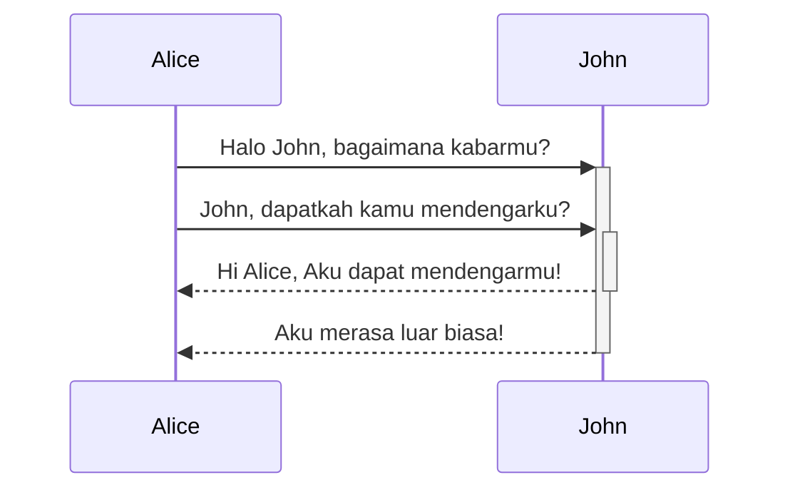

Obsidian adalah aplikasi mencatat dan basis pengetahuan berbasis Mardown.

Sekarang kami mendukung format-format di bawah ini:

---

### Link internal

```md
Menautkan ke halaman: [[Link internal]].
```

Menautkan ke halaman: [[Link internal]].

---

### Sematan

Semat file lain (baca lebih lanjut tentang [[Semat file]]). Ini bagian sematan:

```md
![[Obsidian#Apa itu Obsidian]]
```

![[Obsidian#Apa itu Obsidian]]

---

### Judul

```md
# Ini judul 1
## Ini judul 2
### Ini judul 3
#### Ini judul 4
##### Ini judul 5
###### Ini judul 6
```

# Ini judul 1
## Ini judul 2
### Ini judul 3
#### Ini judul 4
##### Ini judul 5
###### Ini judul 6

---

### Penekanan

```md
*Teks ini akan menjadi miring*
_Teks ini juga menjadi miring_
```

*Teks ini akan menjadi miring*
_Teks ini juga menjadi miring_

```md
**Teks ini akan menjadi tebal**
__Teks ini juga menjadi tebal__
```

**Teks ini akan menjadi tebal**
__Teks ini juga menjadi tebal__

```md
_Anda **dapat** mengkombinasikannya_
```

_Anda **dapat** mengkombinasikannya_

---

### Daftar

```md
- Item 1
- Item 2
  - Item 2a
  - Item 2b

1. Item 1
1. Item 2
1. Item 3
   1. Item 3a
   1. Item 3b
```

- Item 1
- Item 2
	- Item 2a
	- Item 2b

1. Item 1
1. Item 2
1. Item 3
	1. Item 3a
	1. Item 3b

--- 

### Gambar

```md

```


#### Ubah ukuran gambar

Contoh di bawah mengubah ukuran gambar di atas menjadi lebar 100 piksel:

```md

```


---

### Link

#### Link eksternal

Gaya link Mardown dapat digunakan untuk merujuk ke objek eksternal, seperti halaman web, atau halaman internal atau gambar.

```md
http://obsidian.md - automatic!
[Obsidian](http://obsidian.md)
```

http://obsidian.md - automatic!
[Obsidian](http://obsidian.md)

#### Link URI Obsidian

[[Menggunakan URI Obsidian|Link URI Obsidian]] dapat digunakan untuk membuka catatan di Obsidian dari vault Obsidian lain atau program lain.

Contoh, Anda dapat link ke file dalam vault seperti ini (perhatikan [[Menggunakan URI Obsidian#Pengodean|perlunya pengodean]]):

```md
[Link ke catatan](obsidian://open?path=D:%2Fpath%2Fto%2Ffile.md)
```

[Link ke catatan](obsidian://open?path=D:%2Fpath%2Fto%2Ffile.md)

Anda juga dapat link ke catatan dengan nama vault dan nama file sebagai ganti jalur:

```md
[Link ke catatan](obsidian://open?vault=MainVault&file=MyNote.md)
```

[Link ke catatan](obsidian://open?vault=MainVault&file=MyNote.md)

#### Pengeluaran

Jika ada spasi dalam url, mereka dapat dikeluarkan dengan menggunakan `%20` sebagai spasi, seperti:

```md
[Opsi ekspor](Pasted%20image)
```

[Opsi ekspor](Pasted%20image)

Atau Anda dapat mengurung target dalam `<>`, seperti:

```md
[Demo slide](<Slides Demo>)
```

[Demo slide](<Slides Demo>)

---

### Blockquote

```md
> Human beings face ever more complex and urgent problems, and their effectiveness in dealing with these problems is a matter that is critical to the stability and continued progress of society.

\- Doug Engelbart, 1961
```

> Manusia semakin menghadapi masalah kompleks dan urgen, dan keefektifan mereka dalam menghadapi masalah ini adalah masalah kritis terhadap stabilitas dan kontinuitas kemajuan masyarakat.

\- Doug Engelbart, 1961

---

### teks kode

```md
Text inside `backticks` on a line will be formatted like code.
```

Teks dalam `backtick` dalam teks akan diformat seperti kode.

---

### Blok kode

Sorot sintaks didukung dengan bahasa yang dispesifikan setelah set backtick. Kami menggunakan prismjs untuk penyorotan sintaks, daftar bahasa yang didukung dapat dilihat [di situs mereka](https://prismjs.com/#supported-languages)

<pre><code>```js
function fancyAlert(arg) {
  if(arg) {
    $.facebox({div:'#foo'})
  }
}
```</code></pre>

```js
function fancyAlert(arg) {
  if(arg) {
    $.facebox({div:'#foo'})
  }
}
```
    
	
```md
    Teks yang diinden dengan tab diformat seperti ini, dan juga akan terlihat seperti blok kode di pratinjau.
```

	Teks yang diinden dengan tab diformat seperti ini, dan juga akan terlihat seperti blok kode di pratinjau.
    
---

### Daftar tugas

```md
- [x] #tag, [link](), **pemformatan** didukung
- [x] daftar sintaks dibutuhkan (daftar terurut dan tidak terurut didukung)
- [x] ini item selesai
- [ ] ini item belum selesai
- [ ] tugas dapat di klik di pratinjau untuk dicentang
```

- [x] #tag, [link](), **pemformatan** didukung
- [x] daftar sintaks dibutuhkan (daftar terurut dan tidak terurut didukung)
- [x] ini item selesai
- [ ] ini item belum selesai
- [ ] tugas dapat di klik di pratinjau untuk dicentang

---

### Tabel

Anda dapat membuat tabel dengan menyusun daftar kata dan membagi mereka dengan tanda hubung `-` (untuk baris pertama), dan memisahkan setiap kolom dengan pipa `|`:


```md
Judul Pertama | Judul Kedua
------------ | ------------
Kontent dari sel 1 | Konten dari sel 2
Kontent di kolom pertama | Konten di kolom kedua
```

Judul Pertama | Judul Kedua
------------ | ------------
Kontent dari sel 1 | Konten dari sel 2
Kontent di kolom pertama | Konten di kolom kedua

---

```md
Tabel dapat diratakan dengan tanda titik dua | Contoh lain dengan judul panjang
:----------------|-------------:
karena `:` | ini akan diratakan dua sisi
```

Tabel dapat diratakan dengan tanda titik dua | Contoh lain dengan judul panjang
:----------------|-------------:
karena `:` | ini akan diratakan dua sisi

Jika Anda menaruh link di tabel, mereka berfungsi, tetapi jika Anda menggunakan link berpipa, pipa harus dikeluarkan dengan `\` untuk mencegah ia dibaca sebagai elemen tabel.

```md
Judul Pertama | Judul Kedua
------------ | ------------
[[Format catatan Anda\|Pemformatan]]	|  [[Pintasan keyboard\|pintasan]]	
```

Judul Pertama | Judul Kedua
------------ | ------------
[[Format catatan Anda\|Pemformatan]]	|  [[Pintasan keyboard\|pintasan]]	

---

### Coretan

```md
Setiap kata yang dibungkus dengan dua tilde (seperti ~~ini~~) akan terlihat dicoret.
```

Setiap kata yang dibungkus dengan dua tilde (seperti ~~ini~~) akan terlihat dicoret.

---

### Penyorotan

```md
Gunakan dua tanda sama-dengan untuk ==sorot teks==.
```

Gunakan dua tanda sama-dengan untuk ==sorot teks==.

---

### Catatan kaki

```md
Ini catatan kaki sederhana,[^1] dan ini yang lebih panjang.[^bignote]

[^1]: bermakna!

[^bignote]: Ini dengan beberapa paragraf dan kode.

    Inden paragraf untuk mengikutkan mereka dalam catatan kaki.

    `{ kode saya }`

    Tambahkan paragraf sebanyak Anda suka.
```

Ini catatan kaki sederhana,[^1] dan ini yang lebih panjang.[^bignote]

[^1]: bermakna!

[^bignote]: Ini dengan beberapa paragraf dan kode.

    Inden paragraf untuk mengikutkan mereka dalam catatan kaki.

    `{ kode saya }`

    Tambahkan paragraf sebanyak Anda suka.
	
```md
You can also use inline footnotes. ^[notice that the carat goes outside of the brackets on this one.]
```

Anda dapat gunakan catatan kaki dalam teks ^[perhatikan bahwa tanda carat berada di luar tanda kurung ini.]

### Matematika

```md
$$\begin{vmatrix}a & b\\
c & d
\end{vmatrix}=ad-bc$$
```

$$\begin{vmatrix}a & b\\
c & d
\end{vmatrix}=ad-bc$$

Anda juga dapat memasukan rumus dalam baris seperti $e^{2i\pi} = 1$ .

### Diagram

Obsidian menggunakan [Mermaid](https://mermaid-js.github.io/) untuk merender diagram dan grafik. Mermaid juga menyediakan [live editor yang membantu](https://mermaid-js.github.io/mermaid-live-editor).

<pre><code>```mermaid
sequenceDiagram
    Alice->>+John: Halo John, bagaimana kabarmu?
    Alice->>+John: John, dapatkah kamu mendengarku?
    John-->>-Alice: Hi Alice, Aku dapat mendengarmu!
    John-->>-Alice: Aku merasa luar biasa!
```</code></pre>



## Catatan pengembang

Kami berusaha untuk fungsi maksimal tanpa merusak format yang telah ada, maka kami menggunakan sedikit kombinasi tidak lazim dari jenis markdown. Umumnya CommonMark (GFM), beberapa dukungan latex, dan sintaks sematan pilihan kami, yang Anda dapat pelajari di  [[Format file yang diterima]].
