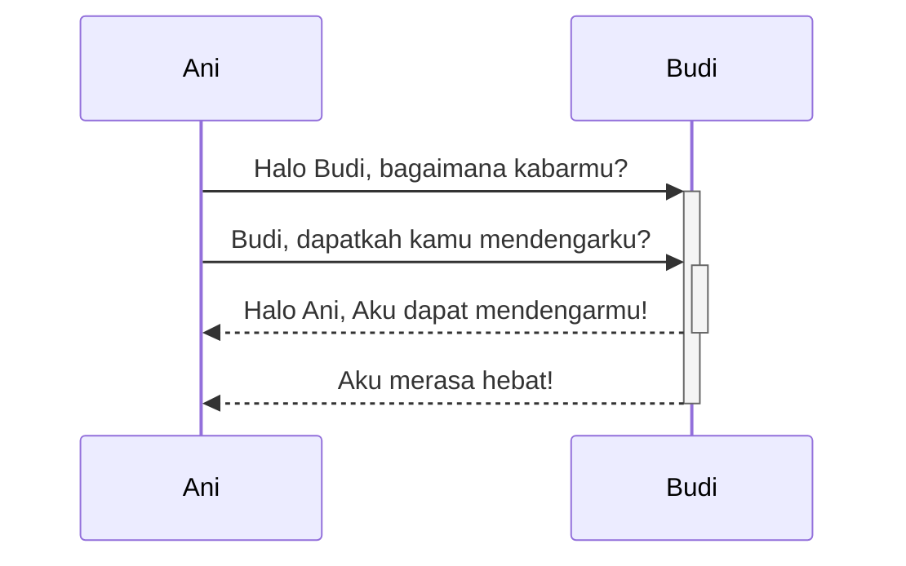

Obsidian adalah aplikasi pencatatan berbasis Markdown dan pengetahuan.

Sekarang kami mendukung format-format di bawah ini:

---

### Tautan internal

```md
Menautkan ke halaman: [[Tautan internal]].
```

Menautkan ke halaman: [[Tautan internal]].

---

### Sematan

Sematkan berkas lain (baca lebih lanjut tentang [[Menyematkan berkas]]). berikut bagian yang disematkan:

```md
![[Obsidian#Apa itu Obsidian]]
```

![[Obsidian#Apa itu Obsidian]]

---

### Judul

```md
# Ini judul 1
## Ini judul 2
### Ini judul 3
#### Ini judul 4
##### Ini judul 5
###### Ini judul 6
```

# Ini judul 1
## Ini judul 2
### Ini judul 3
#### Ini judul 4
##### Ini judul 5
###### Ini judul 6

---

### Penekanan

```md
*Teks ini akan menjadi miring*
_Teks ini juga menjadi miring_
```

*Teks ini akan menjadi miring*
_Teks ini juga menjadi miring_

```md
**Teks ini akan menjadi tebal**
__Teks ini juga menjadi tebal__
```

**Teks ini akan menjadi tebal**
__Teks ini juga menjadi tebal__

```md
_Anda **dapat** mengkombinasikannya_
```

_Anda **dapat** mengkombinasikannya_

---

### Daftar

```md
- Item 1
- Item 2
  - Item 2a
  - Item 2b

1. Item 1
1. Item 2
1. Item 3
   1. Item 3a
   1. Item 3b
```

- Item 1
- Item 2
	- Item 2a
	- Item 2b

1. Item 1
1. Item 2
1. Item 3
	1. Item 3a
	1. Item 3b

--- 

### Gambar

```md

```


#### Ubah ukuran gambar

Contoh di bawah mengubah ukuran gambar di atas menjadi lebar 100 piksel:

```md

```


---

### Tautan

#### Tautan eksternal

Gaya tautan Markdown dapat digunakan untuk merujuk ke objek eksternal, seperti halaman web, atau halaman internal ataupun gambar.

```md
http://obsidian.md - otomatis!
[Obsidian](http://obsidian.md)
```

http://obsidian.md - otomatis!
[Obsidian](http://obsidian.md)

#### Tautan URI Obsidian

[[Menggunakan URI Obsidian|Tautan URI Obsidian]] dapat digunakan untuk membuka catatan di Obsidian dari vault Obsidian lain atau program lain.

Contohnya, Anda dapat bertaut ke file dalam vault seperti ini (perhatikan [[Menggunakan URI Obsidian#Enkode|kebutuhan pengkodean]]):

```md
[Tautan ke catatan](obsidian://open?path=D:%2Falur%2Fke%2Fberkas.md)
```

[Tautan ke catatan](obsidian://open?path=D:%2Falur%2Fke%2Fberkas.md)

Anda juga dapat bertaut ke catatan dengan nama vault dan nama file bukannya menggunakan alur:

```md
[Tautan ke catatan](obsidian://open?vault=VaultUtama&file=CatatanSaya.md)
```

[Tautan ke catatan](obsidian://open?vault=VaultUtama&file=CatatanSaya.md)

#### Pelolosan

Jika ada spasi dalam tautan, mereka dapat diloloskan dengan menggunakan `%20` sebagai spasi, seperti:

```md
[Opsi ekspor](Gambar%20tertempel)
```

[Opsi ekspor](Gambar%20tertempel)

Atau Anda dapat mengurung target dengan `<>`, seperti:

```md
[Contoh slide](<Contoh slide>)
```

[Contoh slide](<Contoh%20slide.md>)

---

### Kutipan

```md
> Human beings face ever more complex and urgent problems, and their effectiveness in dealing with these problems is a matter that is critical to the stability and continued progress of society.

\- Doug Engelbart, 1961
```

> Human beings face ever more complex and urgent problems, and their effectiveness in dealing with these problems is a matter that is critical to the stability and continued progress of society.

\- Doug Engelbart, 1961

---

### Kode sebaris

```md
Teks di dalam `backtick` pada barus akan diformat seperti kode.
```

Teks dalam `backtick` pada baris akan diformat seperti kode.


---

### Blok kode

Sorotan sintaks didukung dengan bahasa yang dispesifikkan setelah mengatur backtick. Kami menggunakan prismjs untuk penyorotan sintaks, daftar bahasa yang didukung dapat dilihat [di situs mereka](https://prismjs.com/#supported-languages)

<pre><code>```js
function fancyAlert(arg) {
  if(arg) {
    $.facebox({div:'#foo'})
  }
}
```</code></pre>

```js
function fancyAlert(arg) {
  if(arg) {
    $.facebox({div:'#foo'})
  }
}
```
    
	
```md
    Teks yang diindentasikan dengan tab diformat seperti ini, dan juga akan terlihat seperti blok kode di pratinjau.
```

	Teks yang diindentasikan dengan tab diformat seperti ini, dan juga akan terlihat seperti blok kode di pratinjau.
    
---

### Daftar tugas

```md
- [x] #tag, [tautan](), **pemformatan** didukung
- [x] daftar sintaks dibutuhkan (baik daftar terurut dan tidak terurut didukung)
- [x] ini item yang selesai
- [?] ini juga item yang selesai (bekerja dengan semua karakter)
- [ ] ini item yang belum selesai
- [ ] tugas dapat di klik di pratinjau untuk dicentang
```

- [x] #tag, [tautan](), **pemformatan** didukung
- [x] daftar sintaks dibutuhkan (baik daftar terurut dan tidak terurut didukung)
- [x] ini item yang selesai
- [?] ini juga item yang selesai (bekerja dengan semua karakter)
- [ ] ini item yang belum selesai
- [ ] tugas dapat di klik di pratinjau untuk dicentang

---

### Tabel

Anda dapat membuat tabel dengan menyusun daftar kata dan membagi mereka dengan tanda hubung `-` (untuk baris pertama), dan memisahkan setiap kolom dengan pipa `|`:

```md
Judul Pertama | Judul Kedua
------------ | ------------
Konten dari sel 1 | Konten dari sel 2
Konten di kolom pertama | Konten di kolom kedua
```

Judul Pertama | Judul Kedua
------------ | ------------
Konten dari sel 1 | Konten dari sel 2
Konten di kolom pertama | Konten di kolom kedua

---

```md
Tabel dapat diratakan dengan tanda titik dua | Contoh lain dengan judul panjang
:----------------|-------------:
karena `:` | ini akan diratakan dua sisi
```

Tabel dapat diratakan dengan tanda titik dua | Contoh lain dengan judul panjang
:----------------|-------------:
karena `:` | ini akan diratakan dua sisi

Jika Anda menaruh tautan di tabel, mereka akan berfungsi, tetapi jika Anda menggunakan tautan berpipa, pipa harus diloloskan dengan `\` untuk mencegah ia dibaca sebagai elemen tabel.

```md
Judul Pertama | Judul Kedua
------------ | ------------
[[Memformat catatan Anda\|Pemformatan]]	|  [[Menggunakan pintasan\|pintasan]]	
```

Judul Pertama | Judul Kedua
------------ | ------------
[[Memformat catatan Anda\|Pemformatan]]	|  [[Menggunakan pintasan\|pintasan]]	

---

### Coretan

```md
Setiap kata yang dibungkus dengan dua tilde (seperti ~~ini~~) akan terlihat dicoret.
```

Setiap kata yang dibungkus dengan dua tilde (seperti ~~ini~~) akan terlihat dicoret.

---

### Penyorotan

```md
Gunakan dua tanda sama-dengan untuk ==menyorot teks==.
```

Gunakan dua tanda sama-dengan untuk ==menyorot teks==.

---

### Bilah Horizontal

```md
Gunakan tiga bintang ***, garis datar ---, atau garis bawah ___ di baris baru untuk menghasilkan bilah horizontal.

```

***

---

### Catatan kaki

```md
Ini catatan kaki sederhana,[^1] dan ini yang lebih panjang.[^catatan besar]

[^1]: bermakna!

[^catatan besar]: Ini dengan beberapa paragraf dan kode.

    Indenkan paragraf untuk mengikutkan mereka ke dalam catatan kaki.

    `{ kode saya }`

    Tambahkan paragraf sebanyak yang Anda suka.
```

Ini catatan kaki sederhana,[^1] dan ini yang lebih panjang.[^catatan besar]

[^1]: bermakna!

[^catatan besar]: Ini dengan beberapa paragraf dan kode.

    Indenkan paragraf untuk mengikutkan mereka ke dalam catatan kaki.

    `{ kode saya }`

    Tambahkan paragraf sebanyak yang Anda suka.
	
```md
Anda dapat gunakan catatan kaki di dalam teks ^[perhatikan bahwa tanda caret berada di luar tanda kurung ini.]
```

Anda dapat gunakan catatan kaki di dalam teks ^[perhatikan bahwa tanda caret berada di luar tanda kurung ini.]

### Matematika

```md
$$\begin{vmatrix}a & b\\
c & d
\end{vmatrix}=ad-bc$$
```

$$\begin{vmatrix}a & b\\
c & d
\end{vmatrix}=ad-bc$$

Anda juga dapat melakukan matematis sebaris seperti $e^{2i\pi} = 1$ .

Obsidian menggunakan [Mathjax](http://docs.mathjax.org/en/latest/basic/mathjax.html). Anda dapat memeriksa paket mana yang didukung di Mathjax[di sini](http://docs.mathjax.org/en/latest/input/tex/extensions/index.html).

### Komentar

Gunakan `%%` untuk membuat komentar, yang akan dilampirkan sebagai Markdown, tetapi tidak akan ditampilkan pada pratinjau.

```md
Ini adalah contoh komentar sebaris: %%Anda tidak dapat melihat teks ini%% (Tidak dapat melihatnya)

Ini merupakan blok komentar:
%%
Komentar dapat direntangkan
menjadi banyak baris
%%
```

Ini adalah contoh komentar sebaris: %%Anda tidak dapat melihat teks ini%% (tidak dapat melihatnya di pratinjau)

Ini merupakan blok komentar: (tidak dapat pula dilihat di pratinjau)
%%
Komentar dapat direntangkan
menjadi banyak baris
%%

## Callout

Gunakan sintaks berikut untuk menampilkan blok callout: `> [!INFO]`.

Pelajari lebih lanjut mengenai callout [[Menggunakan callout|di sini]].

```markdown
> [!INFO]
> Berikut merupakan blok callout.
> Ia mendukung **markdown** dan [[Tautan internal|wikilink]].
```

> [!INFO]
> Berikut merupakan blok callout.
> Ia mendukung **markdown** dan [[Tautan internal|wikilink]].

### Diagram

Obsidian menggunakan [Mermaid](https://mermaid-js.github.io/) untuk merender diagram dan grafik. Mermaid juga menyediakan [pengubah nyata yang sangat membantu](https://mermaid-js.github.io/mermaid-live-editor).

<pre><code>```mermaid
sequenceDiagram
    Ani->>+Budi: Halo Budi, bagaimana kabarmu?
    Ani->>+Budi: Budi, dapatkah kamu mendengarku?
    Budi-->>-Ani: Halo Ani, Aku dapat mendengarmu!
    Budi-->>-Ani: Aku merasa hebat!
```</code></pre>



Obsidian mendukung tautan ke catatan di Mermaid:
<pre><code>```mermaid
graph TD

Biologi --> Kimia

class Biologi,Kimia internal-link;
```</code></pre>

Cara yang lebih mudah dengan melakukannya seperti berikut: ^376b9d
<pre><code>```mermaid
graph TD

A[Biologi]
B[Kimia]

A --> B

class A,B,C,D,E,F,G,H,I,J,K,L,M,N,O,P,Q,R,S,T,U,V,W,X,Y,Z internal-link;
```</code></pre>

Cara ini, semua nama catatan(setidaknya hingga `Z[nama catatan]`) akan secara otomatis diberikan kelas `internal-link` saat Anda menggunakan cuplikan ini.

Jika Anda menggunakan karakter khusus pada nama catatan Anda, Anda perlu menempatkan nama catatan dengan tanda kutip ganda.
`"⨳ karakter khusus"`
Ini akan terlihas seperti ini jika Anda mengikuti [[Memformat catatan Anda#^376b9d|opsi kedua]]:
`A["⨳ karakter khusus"]`

## Catatan pengembang

Kami berusaha untuk memaksimalkan fungsi tanpa merusak format yang telah ada, maka kami menggunakan sedikit kombinasi tidak lazim dari jenis markdown. Umumnya CommonMark (GFM), beberapa dukungan latex, dan sintaks sematan pilihan kami, yang Anda dapat pelajari di [[Format berkas yang didukung]].

Kami dengan sengaja tidak mendukung penguraian sintaks markdown dan baris kosong pada blok HTML. Ini menghasilkan optimisasi untuk m engelola berkas yang sangat besar dan mendukung sinkronisasi antara mode pengubah dan baca.
