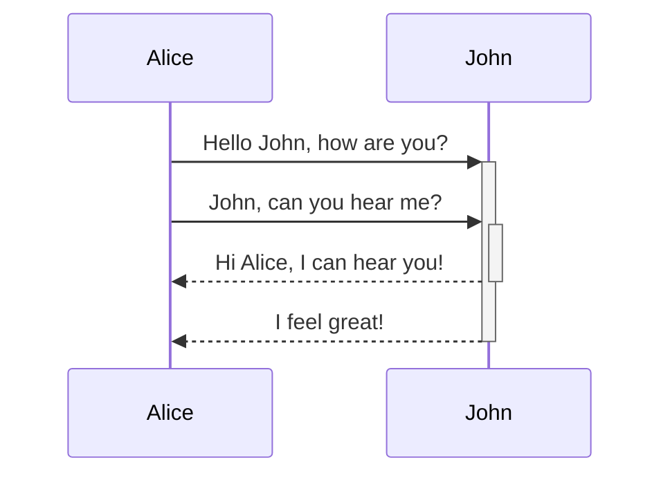
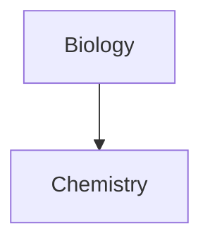

Pelajari cara menambahkan sintaksis format lanjutan ke catatan Anda.

## Tabel

Anda dapat membuat tabel menggunakan garis vertikal (`|`) untuk memisahkan kolom dan tanda hubung (`-`) untuk mendefinisikan header. Berikut contohnya:

```md
| First name | Last name |
| ---------- | --------- |
| Max        | Planck    |
| Marie      | Curie     |
```

| First name | Last name |
| ---------- | --------- |
| Max        | Planck    |
| Marie      | Curie     |

Meskipun garis vertikal di kedua sisi tabel bersifat opsional, menyertakannya disarankan untuk keterbacaan.

> [!tip] Dalam _Pratinjau langsung_, Anda dapat mengklik kanan tabel untuk menambah atau menghapus kolom dan baris. Anda juga dapat mengurutkan dan memindahkannya menggunakan menu konteks.

Anda dapat menyisipkan tabel menggunakan perintah **Sisipkan tabel** dari [[Palet perintah]] atau dengan mengklik kanan dan memilih _Sisipkan → Tabel_. Ini akan memberikan Anda tabel dasar yang dapat diedit:

```md
|     |     |
| --- | --- |
|     |     |
```

Perlu diingat bahwa sel tidak perlu disejajarkan dengan sempurna, tetapi baris header harus mengandung setidaknya dua tanda hubung:

```md
First name | Last name
-- | --
Max | Planck
Marie | Curie
```


### Memformat konten di dalam tabel

Anda dapat menggunakan [[Sintaksis format dasar]] untuk menata konten di dalam tabel.

| Kolom pertama        | Kolom kedua                                     |
| -------------------- | ----------------------------------------------- |
| [[Tautan internal]]  | Tautan ke file _di dalam_ **brankas** Anda.     |
| [[Sematkan file]]    | ![[Engelbart.jpg\|100]]                         |

> [!note] Garis vertikal dalam tabel
> Jika Anda ingin menggunakan [[Alias|alias]], atau [[Sintaksis format dasar#Gambar eksternal|mengubah ukuran gambar]] di tabel Anda, Anda perlu menambahkan `\` sebelum garis vertikal.
>
> ```md
> First column | Second column
> -- | --
> [[Sintaksis format dasar\|Sintaksis Markdown]] | ![[Engelbart.jpg\|200]]
> ```
>
> First column | Second column
> -- | --
> [[Sintaksis format dasar\|Sintaksis Markdown]] | ![[Engelbart.jpg\|200]]

Sejajarkan teks dalam kolom dengan menambahkan titik dua (`:`) ke baris header. Anda juga dapat menyelaraskan konten dalam _Pratinjau langsung_ melalui menu konteks.

```md
Teks rata kiri | Teks rata tengah | Teks rata kanan
:-- | :--: | --:
Konten | Konten | Konten
```

Teks rata kiri | Teks rata tengah | Teks rata kanan
:-- | :--: | --:
Konten | Konten | Konten

## Diagram

Anda dapat menambahkan diagram dan bagan ke catatan Anda menggunakan [Mermaid](https://mermaid-js.github.io/). Mermaid mendukung berbagai diagram, seperti [diagram alir](https://mermaid.js.org/syntax/flowchart.html), [diagram urutan](https://mermaid.js.org/syntax/sequenceDiagram.html), dan [garis waktu](https://mermaid.js.org/syntax/timeline.html).

> [!tip] Tip
> Anda juga dapat mencoba [Editor Langsung](https://mermaid-js.github.io/mermaid-live-editor) Mermaid untuk membantu Anda membangun diagram sebelum menyertakannya dalam catatan Anda.

Untuk menambahkan diagram Mermaid, buat [[Sintaksis format dasar#Blok kode|blok kode]] `mermaid`.

````md

````


````md

````


### Menautkan file dalam diagram

Anda dapat membuat [[Tautan internal|tautan internal]] dalam diagram Anda dengan melampirkan [kelas](https://mermaid.js.org/syntax/flowchart.html#classes) `internal-link` ke node Anda.

````md

````


> [!note] Catatan
> Tautan internal dari diagram tidak muncul di [[Tampilan grafik]].

Jika Anda memiliki banyak node dalam diagram, Anda dapat menggunakan cuplikan berikut.

````md

````

Dengan cara ini, setiap node huruf menjadi tautan internal, dengan [teks node](https://mermaid.js.org/syntax/flowchart.html#a-node-with-text) sebagai teks tautan.

> [!note] Catatan
> Jika Anda menggunakan karakter khusus dalam nama catatan Anda, Anda perlu meletakkan nama catatan dalam tanda kutip ganda.
>
> ```
> class "⨳ special character" internal-link
> ```
>
> Atau, `A["⨳ special character"]`.

Untuk informasi lebih lanjut tentang membuat diagram, lihat [dokumentasi resmi Mermaid](https://mermaid.js.org/intro/).

## Matematika

Anda dapat menambahkan ekspresi matematika ke catatan Anda menggunakan [MathJax](http://docs.mathjax.org/en/latest/basic/mathjax.html) dan notasi LaTeX.

Untuk menambahkan ekspresi MathJax ke catatan Anda, apit dengan tanda dolar ganda (`$$`).

```md
$$
\begin{vmatrix}a & b\\
c & d
\end{vmatrix}=ad-bc
$$
```

$$
\begin{vmatrix}a & b\\
c & d
\end{vmatrix}=ad-bc
$$

Anda juga dapat menyisipkan ekspresi matematika sebaris dengan mengapitnya menggunakan simbol `$`.

```md
Ini adalah ekspresi matematika sebaris $e^{2i\pi} = 1$.
```

Ini adalah ekspresi matematika sebaris $e^{2i\pi} = 1$.

Untuk informasi lebih lanjut tentang sintaksisnya, lihat [Tutorial dasar dan referensi cepat MathJax](https://math.meta.stackexchange.com/questions/5020/mathjax-basic-tutorial-and-quick-reference).

Untuk daftar paket MathJax yang didukung, lihat [Daftar Ekstensi TeX/LaTeX](http://docs.mathjax.org/en/latest/input/tex/extensions/index.html).
