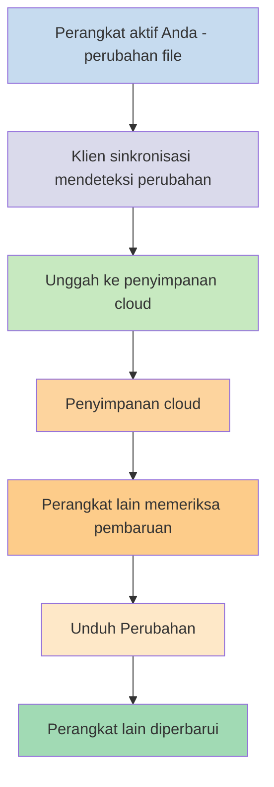
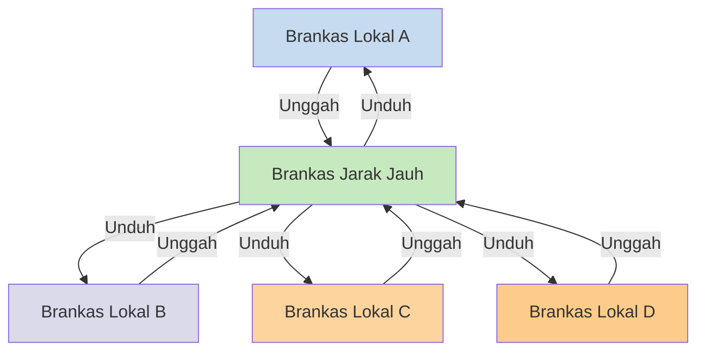

Jika Anda ingin menggunakan catatan Anda di perangkat yang berbeda, salah satu opsi yang Anda miliki adalah [[Sinkronisasi catatan antar perangkat]]. Obsidian menawarkan satu layanan seperti itu, [[Pengantar Obsidian Sync|Obsidian Sync]], yang bekerja secara berbeda dari layanan sinkronisasi lainnya, seperti [[Sinkronisasi catatan antar perangkat#iCloud|iCloud]] dan [[Sinkronisasi catatan antar perangkat#OneDrive|OneDrive]].

Berikut beberapa istilah penting:

- Sebuah **brankas** adalah folder di sistem file Anda yang berisi catatan dan folder `.obsidian` dengan konfigurasi khusus Obsidian.
- Sebuah **brankas lokal** adalah salinan brankas Anda yang ada di masing-masing perangkat Anda. Saat menggunakan layanan sinkronisasi, Anda menghubungkan brankas lokal ini untuk mengaktifkan sinkronisasi.
- Sebuah **brankas jarak jauh** adalah penyimpanan terpusat yang terhubung langsung dengan brankas lokal melalui Obsidian Sync.

Ada dua pendekatan umum untuk sinkronisasi:

- **[[#Layanan sinkronisasi berbasis file]]**: Brankas lokal harus berada di folder yang dipantau, sinkronisasi terjadi melalui sistem file
- **[[#Obsidian Sync|Brankas jarak jauh]]**: Penyimpanan terpusat yang terhubung langsung dengan brankas lokal melalui Obsidian

## Layanan sinkronisasi berbasis file

Layanan seperti Dropbox, Google Drive, iCloud, dan OneDrive bersifat berbasis folder. Layanan ini memantau folder tertentu dan secara otomatis menyinkronkan file apa pun yang ditempatkan di dalamnya. File harus berada di folder layanan cloud yang ditentukan agar dapat disinkronkan. Dengan layanan sinkronisasi berbasis file, brankas lokal Anda bertindak sebagai folder biasa yang dipantau. Tidak ada brankas jarak jauh khusus - sebaliknya, penyimpanan cloud berfungsi sebagai perantara, menyalin file antara brankas lokal di perangkat yang berbeda.

Diagram di bawah menunjukkan versi sederhana dari cara kerja layanan ini:

Jika layanan cloud memiliki sinkronisasi latar belakang, maka beberapa proses ini mungkin terjadi bahkan ketika Anda tidak aktif menggunakan aplikasi untuk melihat file. Layanan ini memantau folder tertentu dan secara otomatis menyinkronkan file apa pun yang ditempatkan di dalamnya. File harus berada di folder layanan cloud yang ditentukan agar dapat disinkronkan.

## Obsidian Sync

Obsidian Sync memungkinkan Anda membuat brankas jarak jauh yang berfungsi sebagai penyimpanan terpusat melalui layanan [[Pengantar Obsidian Sync|Obsidian Sync]]. Ini memungkinkan Anda memilih hampir semua folder di perangkat mana pun untuk menyimpan file Anda - baik di hard drive eksternal, di `C:\`, atau di penyimpanan aplikasi di Android.

Namun, kami memiliki daftar lokasi yang direkomendasikan untuk brankas lokal Anda jika Anda juga menggunakan [[#Layanan sinkronisasi berbasis file]] di perangkat yang sama - terutama, di mana saja yang bukan di [[Beralih ke Obsidian Sync#Pindahkan brankas Anda keluar dari layanan sinkronisasi pihak ketiga atau penyimpanan cloud|layanan sinkronisasi pihak ketiga]].

Diagram di bawah menunjukkan versi sederhana dari cara kerja Obsidian Sync:

Kekuatan sistem ini menjadi lebih jelas dengan semakin banyak jenis perangkat. [[#Layanan sinkronisasi berbasis file]] dapat diimplementasikan secara tidak konsisten di berbagai sistem operasi, dan perangkat seluler memiliki aturan sendiri tentang bagaimana aplikasi dapat di-sandbox dan dibatasi dayanya, yang membuat layanan berbasis file tradisional jauh lebih sulit bekerja dengan mulus.

Dengan Obsidian Sync, layanan ini menangani sinkronisasi langsung melalui aplikasi, memberikan perilaku yang konsisten terlepas dari jenis perangkat atau keterbatasan sistem operasi, sambil memprioritaskan penyimpanan salinan lokal data Anda sebagai [[Cadangkan file Obsidian Anda|cadangan lunak]].

### Perilaku sinkronisasi

Ketika Anda membuat perubahan pada file di brankas lokal Anda, Obsidian Sync mendeteksi perubahan ini dan mengunggahnya ke brankas jarak jauh. Perangkat lain yang terhubung ke brankas jarak jauh yang sama kemudian akan mengunduh perubahan ini dan menerapkannya ke brankas lokal mereka. Obsidian Sync melacak perubahan di tingkat file dan hanya mentransfer file yang telah dimodifikasi, bukan menyinkronkan seluruh folder. Ini mengurangi penggunaan bandwidth dan waktu sinkronisasi.

Ketika konflik terjadi atau ketika Anda perlu mengontrol file mana yang disinkronkan, Obsidian Sync menyediakan mekanisme khusus untuk menangani situasi ini:

![[Pemecahan masalah Obsidian Sync#Resolusi konflik|Resolusi konflik]]

![[Pengaturan Sync dan sinkronisasi selektif#Sinkronisasi selektif#Kecualikan folder dari sinkronisasi]]

### Perilaku offline

Perubahan yang dibuat saat offline diantrekan dan disinkronkan secara otomatis ketika perangkat Anda terhubung kembali ke internet dan Obsidian terbuka. Brankas lokal Anda tetap berfungsi penuh selama periode offline.

## Langkah berikutnya

- [[Menyiapkan Obsidian Sync]] untuk memulai dengan brankas jarak jauh.
- [[Beralih ke Obsidian Sync]] jika Anda saat ini menggunakan sinkronisasi berbasis file dan ingin menggunakan Obsidian Sync.
- [[Sinkronisasi catatan antar perangkat|Jelajahi opsi sinkronisasi lainnya]] jika Anda masih mempertimbangkan.
