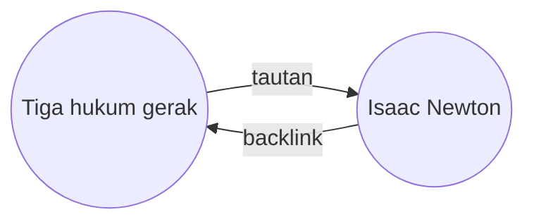

Dengan plugin Backlink, Anda dapat melihat semua _backlink_ untuk catatan yang sedang aktif.

Backlink untuk catatan merupakan sebuah tautan dari catatan lain ke catatan tersebut. Misalnya, catatan "Tiga hukum gerak" mengandung tautan menuju catatan "Isaac Newton". Backlink yang sesuak akan menautkan dari "Isaac Newton" kembali menuju "Tiga hukum gerak".

Backlink dapat berguna untuk menemukan catatan yang merujuk catatan yang dengan Anda tulis. Cukup bayangkan jika Anda mendata backlink dari situs web manapun di internet!

## Panel backlink

Anda dapat melihat semua backlink untuk catatan yang sedang aktif melalui _panel backlink_. Panel backlink memiliki dua bagian yang dapat diciutkan: **Sebutan yang tertaut** dan **Sebutan yang belum tertaut**.

- **Sebutan yang tertaut** merupakan backlink menuju catatan yang mengandung tautan internal ke catatan yang sedang aktif.
- **Sebutan yang belum tertaut** merupakan backlink ke perihal backlink nama manapun dari catatan yang sedang aktif.

Panel backlink memiliki opsi berikut:

- **Ciutkan hasil** peralih yang dapat meluaskan setiap catatan untuk menampikan sebutan di sana.
- **Tampilkan lebih banyak konteks** peralih yang dapat menyingkat atau menampilkan paragraf penuh yang mengandung sebutan.
- **Ubah urutan sortir** menentukan bagaimana mengurutkan sebutan.
- **Tampilkan saringan penelusuran** peralih bidang teks yang memperbolehkan Anda menyaring sebutan. Informasi lebih lanjut mengenai kueri penelusuran, lihat [[Penelusuran]].

> **Saran:** Jika Anda ingin melihat backlink untuk banyak catatan pada waktu yang sama, Anda dapat mengaktifkan **Backlink di dokumen** pada opsi plugin, untuk menampilkan backlink pada panel yang sama dengan catatan Anda.

## Menampilkan backlink untuk catatan

Untuk menampilkan backlink untuk catatan yang sedang aktif, klik tab **Backlink** (ikon tautan dan panah) pada bilah sisi sebelah kanan.

> **Catatan:** Jika Anda tidak dapat melihat tab Backlink, Anda dapat membuatnya terlihat dengan membuka [[Palet perintah]] dan menjalankan perintah **Backlink: Tampilkan panel backlink**.
