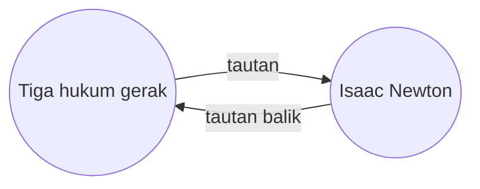

Dengan [[Plugin inti|plugin]] Backlink, Anda dapat melihat semua _tautan balik_ untuk catatan yang aktif.

Tautan balik untuk sebuah catatan adalah tautan dari catatan lain ke catatan tersebut. Dalam contoh berikut, catatan "Tiga hukum gerak" berisi tautan ke catatan "Isaac Newton". Tautan balik yang sesuai akan menghubungkan dari "Isaac Newton" kembali ke "Tiga hukum gerak".

```mermaid
flowchart LR
  laws((Tiga hukum gerak))
  newton((Isaac Newton))

  laws --tautan--> newton
  newton --tautan balik--> laws
```

Tautan balik dapat berguna untuk menemukan catatan yang mereferensikan catatan yang sedang Anda tulis. Bayangkan jika Anda bisa menampilkan daftar tautan balik untuk situs web mana pun di internet.

## Tampilkan backlink

Plugin Backlink menampilkan tautan balik untuk tab yang aktif. Ada dua bagian yang dapat dilipat: **Sebutan yang tertaut** dan **Sebutan yang belum tertaut**.

- **Sebutan yang tertaut** adalah tautan balik ke catatan yang berisi tautan internal ke catatan yang aktif.
- **Sebutan yang belum tertaut** adalah tautan balik ke setiap kemunculan nama catatan aktif yang belum ditautkan.

Plugin ini menyediakan opsi berikut:

- **Ciutkan hasil** mengaktifkan/menonaktifkan apakah setiap catatan diperluas untuk menampilkan sebutan di dalamnya.
- **Tampilkan lebih banyak konteks** mengaktifkan/menonaktifkan apakah paragraf yang berisi sebutan dipotong atau ditampilkan secara penuh.
- **Ubah urutan sortir** menentukan cara mengurutkan sebutan.
- **Tampilkan saringan penelusuran** mengaktifkan/menonaktifkan kolom teks yang memungkinkan Anda memfilter sebutan. Untuk informasi lebih lanjut tentang cara membangun istilah pencarian, lihat [[Cari]].

## Lihat tautan balik untuk sebuah catatan

Untuk melihat tautan balik untuk catatan yang aktif, klik tab **Backlink** ![[obsidian-icon-links-coming-in.svg#icon]] di bilah samping kanan.

> [!note] Catatan
> Jika Anda tidak dapat melihat tab Backlink, Anda dapat menampilkannya dengan membuka [[Palet perintah]] dan menjalankan perintah **Backlinks: Tampilkan backlink**.

> [!info] Berkas yang dikecualikan
> File yang cocok dengan pola [[Pengaturan#Berkas yang dikecualikan|Berkas yang dikecualikan]] Anda tidak akan muncul di Sebutan yang belum tertaut.

## Lihat tautan balik dari catatan tertentu

Tab backlink menampilkan tautan balik untuk catatan yang aktif dan diperbarui saat Anda beralih ke catatan lain. Jika Anda ingin melihat tautan balik untuk catatan tertentu, terlepas dari apakah catatan tersebut aktif atau tidak, Anda dapat membuka tab backlink yang _ditautkan_.

Untuk membuka tab backlink yang ditautkan:

1. Buka [[Palet perintah]].
2. Pilih **Backlinks: Buka backlink**.

Tab terpisah akan terbuka di samping catatan aktif Anda. Tab tersebut menampilkan ikon tautan untuk memberi tahu bahwa tab tersebut ditautkan ke sebuah catatan.

## Tampilkan tautan balik dalam catatan

Alih-alih menampilkan tautan balik di tab terpisah, Anda dapat menampilkan tautan balik di bagian bawah catatan Anda.

Untuk menampilkan tautan balik dalam catatan:

1. Buka [[Palet perintah]].
2. Pilih **Backlinks: Aktifkan backlink di dokumen**.

Atau, aktifkan **Tautan balik dalam dokumen** di Pengaturan plugin Backlink untuk secara otomatis mengaktifkan tautan balik saat Anda membuka catatan baru.
