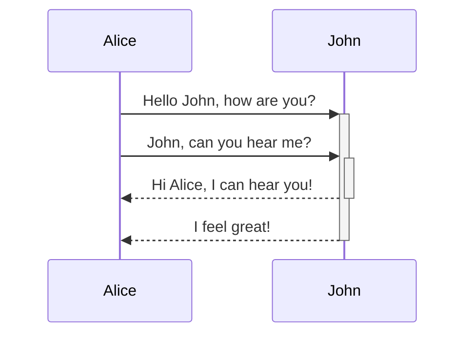
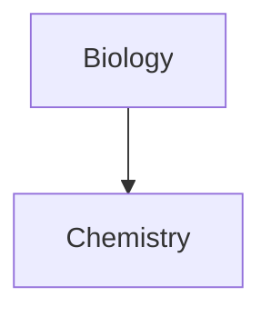

Scopri come aggiungere una sintassi di formattazione avanzata alle tue note.

## Tabelle

Puoi creare tabelle utilizzando le barre verticali (`|`) per separare le colonne e i trattini (`-`) per definire le intestazioni. Ecco un esempio:

```md
| Nome      | Cognome   |
| --------- | --------- |
| Max       | Planck    |
| Marie     | Curie     |
```

| Nome      | Cognome   |
| --------- | --------- |
| Max       | Planck    |
| Marie     | Curie     |

Sebbene le barre verticali ai lati della tabella siano opzionali, è consigliabile includerle per una migliore leggibilità.

> [!tip] Nell'_anteprima dal vivo_, puoi fare clic destro su una tabella per aggiungere o eliminare colonne e righe. Puoi anche ordinarle e spostarle utilizzando il menu contestuale.

Puoi inserire una tabella utilizzando il comando **Inserisci tabella** dalla [[Command palette|Tavolozza dei comandi]] o facendo clic destro e selezionando _Inserisci → Tabella_. Questo ti fornirà una tabella base e modificabile:

```md
|     |     |
| --- | --- |
|     |     |
```

Nota che le celle non devono essere perfettamente allineate, ma la riga di intestazione deve contenere almeno due trattini:

```md
Nome | Cognome
-- | --
Max | Planck
Marie | Curie
```


### Formattare il contenuto all'interno di una tabella

Puoi utilizzare la [[basic formatting syntax|sintassi di formattazione di base]] per stilizzare il contenuto all'interno di una tabella.

| Prima colonna          | Seconda colonna                                       |
| ---------------------- | ----------------------------------------------------- |
| [[Internal links]]     | Collegamento a un file _all'interno_ della **cassaforte**. |
| [[Embed files]]        | ![[Engelbart.jpg\|100]]                               |

> [!note] Barre verticali nelle tabelle
> Se vuoi utilizzare gli [[aliases|alias]], o [[Basic formatting syntax#Immagini esterne|ridimensionare un'immagine]] nella tua tabella, devi aggiungere un `\` prima della barra verticale.
>
> ```md
> Prima colonna | Seconda colonna
> -- | --
> [[Basic formatting syntax\|Sintassi Markdown]] | ![[Engelbart.jpg\|200]]
> ```
>
> Prima colonna | Seconda colonna
> -- | --
> [[Basic formatting syntax\|Sintassi Markdown]] | ![[Engelbart.jpg\|200]]

Allinea il testo nelle colonne aggiungendo i due punti (`:`) alla riga di intestazione. Puoi anche allineare il contenuto nell'_anteprima dal vivo_ tramite il menu contestuale.

```md
Testo allineato a sinistra | Testo allineato al centro | Testo allineato a destra
:-- | :--: | --:
Contenuto | Contenuto | Contenuto
```

Testo allineato a sinistra | Testo allineato al centro | Testo allineato a destra
:-- | :--: | --:
Contenuto | Contenuto | Contenuto

## Diagrammi

Puoi aggiungere diagrammi e grafici alle tue note utilizzando [Mermaid](https://mermaid-js.github.io/). Mermaid supporta una varietà di diagrammi, come [diagrammi di flusso](https://mermaid.js.org/syntax/flowchart.html), [diagrammi di sequenza](https://mermaid.js.org/syntax/sequenceDiagram.html) e [linee temporali](https://mermaid.js.org/syntax/timeline.html).

> [!tip] Suggerimento
> Puoi anche provare l'[Editor dal vivo](https://mermaid-js.github.io/mermaid-live-editor) di Mermaid per costruire i diagrammi prima di includerli nelle tue note.

Per aggiungere un diagramma Mermaid, crea un [[Basic formatting syntax#Blocchi di codice|blocco di codice]] `mermaid`.

````md

````


````md

````


### Collegare file in un diagramma

Puoi creare [[internal links|collegamenti interni]] nei tuoi diagrammi associando la [classe](https://mermaid.js.org/syntax/flowchart.html#classes) `internal-link` ai tuoi nodi.

````md

````


> [!note] Nota
> I collegamenti interni dai diagrammi non vengono visualizzati nella [[Graph view|Vista grafo]].

Se hai molti nodi nei tuoi diagrammi, puoi utilizzare il seguente frammento.

````md

````

In questo modo, ogni nodo con una lettera diventa un collegamento interno, con il [testo del nodo](https://mermaid.js.org/syntax/flowchart.html#a-node-with-text) come testo del collegamento.

> [!note] Nota
> Se utilizzi caratteri speciali nei nomi delle note, devi racchiudere il nome della nota tra virgolette doppie.
>
> ```
> class "⨳ special character" internal-link
> ```
>
> Oppure, `A["⨳ special character"]`.

Per ulteriori informazioni sulla creazione di diagrammi, consulta la [documentazione ufficiale di Mermaid](https://mermaid.js.org/intro/).

## Matematica

Puoi aggiungere espressioni matematiche alle tue note utilizzando [MathJax](http://docs.mathjax.org/en/latest/basic/mathjax.html) e la notazione LaTeX.

Per aggiungere un'espressione MathJax alla tua nota, racchiudila tra doppi segni di dollaro (`$$`).

```md
$$
\begin{vmatrix}a & b\\
c & d
\end{vmatrix}=ad-bc
$$
```

$$
\begin{vmatrix}a & b\\
c & d
\end{vmatrix}=ad-bc
$$

Puoi anche inserire espressioni matematiche in linea racchiudendole tra simboli `$`.

```md
Questa è un'espressione matematica in linea $e^{2i\pi} = 1$.
```

Questa è un'espressione matematica in linea $e^{2i\pi} = 1$.

Per ulteriori informazioni sulla sintassi, consulta il [Tutorial base e riferimento rapido di MathJax](https://math.meta.stackexchange.com/questions/5020/mathjax-basic-tutorial-and-quick-reference).

Per un elenco dei pacchetti MathJax supportati, consulta l'[Elenco delle estensioni TeX/LaTeX](http://docs.mathjax.org/en/latest/input/tex/extensions/index.html).
