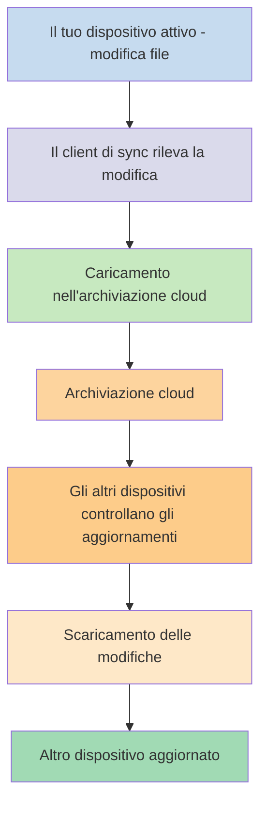
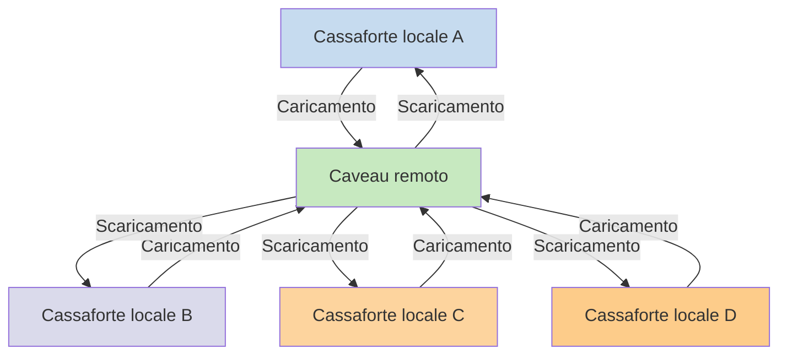

Se vuoi utilizzare le tue note su diversi dispositivi, una delle opzioni a disposizione è [[Sync your notes across devices|Sincronizzare le note tra dispositivi]]. Obsidian offre un servizio di questo tipo, [[Introduction to Obsidian Sync|Obsidian Sync]], che funziona in modo diverso rispetto ad altri servizi di sincronizzazione, come [[Sync your notes across devices#iCloud|iCloud]] e [[Sync your notes across devices#OneDrive|OneDrive]].

Ecco alcuni termini chiave:

- Una **cassaforte** è una cartella nel tuo file system che contiene note e una cartella `.obsidian` con la configurazione specifica di Obsidian.
- Una **cassaforte locale** è la copia della tua cassaforte che esiste su ciascuno dei tuoi dispositivi. Quando si utilizzano servizi di sincronizzazione, si collegano queste cassaforti locali per abilitare la sincronizzazione.
- Un **caveau remoto** è un'archiviazione centralizzata a cui le cassaforti locali si connettono direttamente tramite Obsidian Sync.

Esistono due approcci comuni alla sincronizzazione:

- **[[#Servizi di sincronizzazione basati su file]]**: Le cassaforti locali devono trovarsi in cartelle monitorate, la sincronizzazione avviene attraverso il file system
- **[[#Obsidian Sync|Caveau remoti]]**: Archiviazione centralizzata a cui le cassaforti locali si connettono direttamente tramite Obsidian

## Servizi di sincronizzazione basati su file

Servizi come Dropbox, Google Drive, iCloud e OneDrive sono basati su cartelle. Questi servizi monitorano cartelle specifiche e sincronizzano automaticamente qualsiasi file inserito al loro interno. I file devono trovarsi nelle cartelle designate del servizio cloud per essere sincronizzati. Con i servizi di sincronizzazione basati su file, la tua cassaforte locale agisce semplicemente come un'altra cartella monitorata. Non esiste un caveau remoto dedicato: l'archiviazione cloud funge invece da passaggio, copiando i file tra le cassaforti locali su dispositivi diversi.

Il diagramma seguente mostra una versione semplificata di come funzionano questi servizi:

Se il servizio cloud dispone di sincronizzazione in background, alcuni di questi processi possono avvenire anche quando non si stanno utilizzando attivamente le applicazioni per visualizzare i file. Questi servizi monitorano cartelle specifiche e sincronizzano automaticamente qualsiasi file inserito al loro interno. I file devono trovarsi nelle cartelle designate del servizio cloud per essere sincronizzati.

## Obsidian Sync

Obsidian Sync consente di creare un caveau remoto che funge da archiviazione centralizzata tramite il servizio [[Introduction to Obsidian Sync|Obsidian Sync]]. Questo permette di scegliere quasi qualsiasi cartella su qualsiasi dispositivo per archiviare i propri file, che sia su un disco rigido esterno, in `C:\` o nell'archiviazione dell'app su Android.

Tuttavia, abbiamo un elenco di posizioni consigliate per la cassaforte locale se si utilizzano anche [[#Servizi di sincronizzazione basati su file]] sullo stesso dispositivo, principalmente qualsiasi posizione che non si trovi in un [[Switch to Obsidian Sync#Spostare la cassaforte fuori dal servizio di sincronizzazione di terze parti o dall'archiviazione cloud|servizio di sincronizzazione di terze parti]].

Il diagramma seguente mostra una versione semplificata di come funziona Obsidian Sync:

La forza di questo sistema diventa più evidente con un maggior numero di tipi di dispositivi. I [[#Servizi di sincronizzazione basati su file]] possono essere implementati in modo inconsistente tra i sistemi operativi, e i dispositivi mobile hanno le proprie regole riguardo al sandboxing delle applicazioni e alla limitazione dell'energia, il che rende molto più difficile per i servizi tradizionali basati su file funzionare in modo fluido.

Con Obsidian Sync, il servizio gestisce la sincronizzazione direttamente attraverso l'applicazione, fornendo un comportamento coerente indipendentemente dal tipo di dispositivo o dalle limitazioni del sistema operativo, dando al contempo priorità al mantenimento di una copia locale dei dati come [[Back up your Obsidian files|backup leggero]].

### Comportamento della sincronizzazione

Quando si apportano modifiche ai file nella cassaforte locale, Obsidian Sync rileva queste modifiche e le carica nel caveau remoto. Gli altri dispositivi connessi allo stesso caveau remoto scaricheranno quindi queste modifiche e le applicheranno alle rispettive cassaforti locali. Obsidian Sync traccia le modifiche a livello di file e trasferisce solo i file che sono stati modificati, anziché sincronizzare intere cartelle. Questo riduce l'utilizzo di banda e il tempo di sincronizzazione.

Quando si verificano conflitti o quando è necessario controllare quali file sincronizzare, Obsidian Sync fornisce meccanismi specifici per gestire queste situazioni:

![[Troubleshoot Obsidian Sync#Risoluzione dei conflitti|Risoluzione dei conflitti]]

![[Sync settings and selective syncing#Sincronizzazione selettiva#Escludi una cartella dalla sincronizzazione]]

### Comportamento offline

Le modifiche effettuate mentre si è offline vengono messe in coda e sincronizzate automaticamente quando il dispositivo si riconnette a internet e Obsidian è aperto. La cassaforte locale rimane completamente funzionale durante i periodi offline.

## Passaggi successivi

- [[Set up Obsidian Sync|Configura Obsidian Sync]] per iniziare con i caveau remoti.
- [[Switch to Obsidian Sync|Passa a Obsidian Sync]] se attualmente utilizzi la sincronizzazione basata su file e vuoi usare Obsidian Sync.
- [[Sync your notes across devices|Esplora altre opzioni di sincronizzazione]] se stai ancora decidendo.
