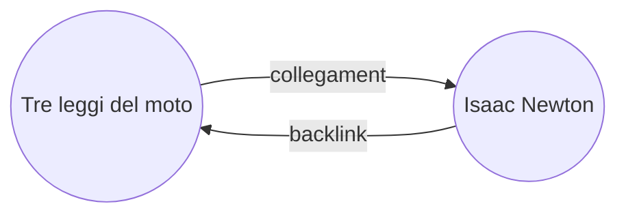

Con il [[Plugin principali|plugin]] Riferimenti, puoi visualizzare tutti i _backlink_ per la nota attiva.

Un backlink per una nota è un collegamento da un'altra nota verso quella nota. Nel seguente esempio, la nota "Tre leggi del moto" contiene un collegamento alla nota "Isaac Newton". Il backlink corrispondente collegherebbe da "Isaac Newton" di nuovo a "Tre leggi del moto".

I backlink possono essere utili per trovare note che fanno riferimento alla nota che stai scrivendo. Immagina solo se potessi elencare i backlink di qualsiasi sito web su Internet.

## Mostra riferimenti

Il plugin Riferimenti visualizza i backlink per le schede attive. Ci sono due sezioni comprimibili: **Menzioni collegate** e **Menzioni scollegate**.

- Le **Menzioni collegate** sono backlink alle note che contengono un collegamento interno alla nota attiva.
- Le **Menzioni scollegate** sono backlink a qualsiasi occorrenza non collegata del nome della nota attiva.

Fornisce le seguenti opzioni:

- **Comprimi risultati** attiva o disattiva l'espansione di ogni nota per mostrare le menzioni al suo interno.
- **Mostra più contesto** attiva o disattiva la visualizzazione del paragrafo completo che contiene la menzione oppure lo tronca.
- **Ordinamento** determina come ordinare le menzioni.
- **Mostra filtro di ricerca** attiva o disattiva un campo di testo che consente di filtrare le menzioni. Per ulteriori informazioni su come costruire un termine di ricerca, consulta [[Cerca]].

## Visualizza i backlink per una nota

Per visualizzare i backlink per la nota attiva, fai clic sulla scheda **Riferimenti** ![[obsidian-icon-links-coming-in.svg#icon]] nella barra laterale destra.

> [!note] Nota
> Se non riesci a vedere la scheda Riferimenti, puoi renderla visibile aprendo la [[Riquadro comandi]] ed eseguendo il comando **Riferimenti: Mostra riferimenti**.

> [!info] File esclusi
> I file che corrispondono ai tuoi pattern [[Impostazioni#File esclusi|File esclusi]] non appariranno nelle Menzioni scollegate.

## Vedi i backlink di una nota specifica

La scheda dei backlink elenca i backlink per la nota attiva e si aggiorna quando passi a una nota diversa. Se vuoi vedere i backlink per una nota specifica, indipendentemente dal fatto che sia attiva o meno, puoi aprire una scheda di backlink _collegata_.

Per aprire una scheda di backlink collegata:

1. Apri la [[Riquadro comandi]].
2. Seleziona **Riferimenti: Apri riferimenti per il file attuale**.

Si apre una scheda separata accanto alla tua nota attiva. La scheda mostra un'icona di collegamento per indicare che è collegata a una nota.

## Mostra i backlink in una nota

Invece di mostrare i backlink in una scheda separata, puoi mostrarli in fondo alla tua nota.

Per mostrare i backlink in una nota:

1. Apri la [[Riquadro comandi]].
2. Seleziona **Riferimenti: Attiva/disattiva riferimenti nel documento**.

Oppure, abilita **Riferimenti nel documento** nelle opzioni del plugin Riferimenti per attivare automaticamente i backlink quando apri una nuova nota.
