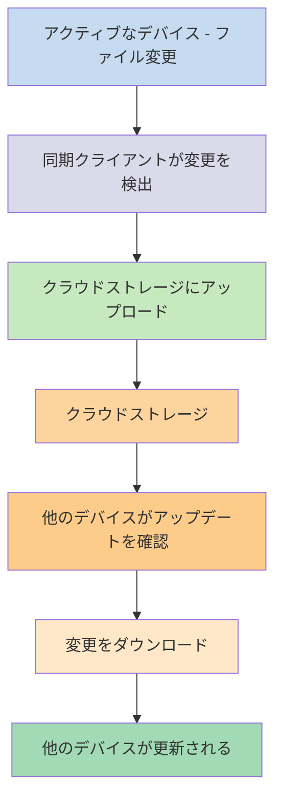
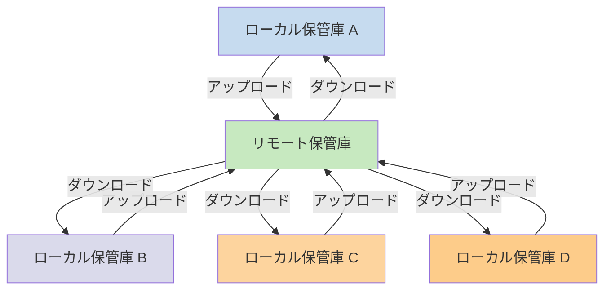

異なるデバイスでノートを使いたい場合、選択肢の1つとして[[デバイス間でノートを同期する]]方法があります。Obsidianはそのようなサービスの1つとして[[Obsidian Syncの紹介|Obsidian Sync]]を提供しており、[[デバイス間でノートを同期する#iCloud|iCloud]]や[[デバイス間でノートを同期する#OneDrive|OneDrive]]などの他の同期サービスとは異なる仕組みで動作します。

以下は重要な用語です：

- **保管庫**とは、ノートとObsidian固有の設定を含む`.obsidian`フォルダを格納するファイルシステム上のフォルダです。
- **ローカル保管庫**とは、各デバイスに存在する保管庫のコピーです。同期サービスを使用する場合、これらのローカル保管庫を接続して同期を有効にします。
- **リモート保管庫**とは、ローカル保管庫がObsidian Syncを通じて直接接続する集中型ストレージです。

同期には2つの一般的なアプローチがあります：

- **[[#ファイルベースの同期サービス]]**：ローカル保管庫は監視対象フォルダ内に配置する必要があり、同期はファイルシステムを通じて行われます
- **[[#Obsidian Sync|リモート保管庫]]**：ローカル保管庫がObsidianを通じて直接接続する集中型ストレージ

## ファイルベースの同期サービス

Dropbox、Google Drive、iCloud、OneDriveなどのサービスはフォルダベースです。これらのサービスは特定のフォルダを監視し、その中に配置されたファイルを自動的に同期します。同期するには、ファイルが指定されたクラウドサービスのフォルダ内に存在する必要があります。ファイルベースの同期サービスでは、ローカル保管庫は監視対象の単なるフォルダとして扱われます。専用のリモート保管庫は存在せず、代わりにクラウドストレージがパススルーとして機能し、異なるデバイスのローカル保管庫間でファイルをコピーします。

以下の図は、これらのサービスの仕組みを簡略化したものです：

クラウドサービスがバックグラウンド同期に対応している場合、ファイルを表示するアプリケーションを積極的に使用していなくても、これらのプロセスの一部が実行されている可能性があります。これらのサービスは特定のフォルダを監視し、その中に配置されたファイルを自動的に同期します。同期するには、ファイルが指定されたクラウドサービスのフォルダ内に存在する必要があります。

## Obsidian Sync

Obsidian Syncでは、[[Obsidian Syncの紹介|Obsidian Sync]]サービスを通じて集中型ストレージとして機能するリモート保管庫を作成できます。これにより、外付けハードドライブ、`C:\`、Androidのアプリストレージなど、任意のデバイスのほぼ任意のフォルダにファイルを保存することができます。

ただし、同じデバイスで[[#ファイルベースの同期サービス]]も使用している場合は、ローカル保管庫の推奨ロケーションのリストがあります。基本的に、[[Obsidian Syncへの切り替え#サードパーティの同期サービスやクラウドストレージから保管庫を移動する|サードパーティの同期サービス]]内でなければどこでも構いません。

以下の図は、Obsidian Syncの仕組みを簡略化したものです：

このシステムの強みは、デバイスの種類が増えるほど顕著になります。[[#ファイルベースの同期サービス]]はオペレーティングシステムごとに実装が一貫しておらず、モバイルデバイスにはアプリケーションのサンドボックス化や電力制限に関する独自のルールがあるため、従来のファイルベースのサービスではシームレスに動作させることが非常に困難です。

Obsidian Syncでは、アプリケーションを通じて直接同期を処理するため、デバイスの種類やオペレーティングシステムの制限に関係なく一貫した動作を提供し、同時にデータのローカルコピーを[[Obsidianファイルのバックアップ|ソフトバックアップ]]として保持することを優先します。

### 同期の挙動

ローカル保管庫のファイルに変更を加えると、Obsidian Syncがその変更を検出してリモート保管庫にアップロードします。同じリモート保管庫に接続されている他のデバイスは、これらの変更をダウンロードしてローカル保管庫に適用します。Obsidian Syncはファイルレベルで変更を追跡し、フォルダ全体を同期するのではなく、変更されたファイルのみを転送します。これにより、帯域幅の使用量と同期時間が削減されます。

競合が発生した場合や、同期するファイルを制御する必要がある場合、Obsidian Syncにはこれらの状況に対処するための特定のメカニズムが用意されています：

![[Obsidian Syncのトラブルシューティング#競合の解決|競合の解決]]

![[Sync設定と選択的同期#選択的同期#フォルダを同期から除外する]]

### オフライン時の挙動

オフライン中に行われた変更はキューに入れられ、デバイスがインターネットに再接続してObsidianが開かれると自動的に同期されます。オフライン期間中もローカル保管庫は完全に機能します。

## 次のステップ

- [[Obsidian Syncのセットアップ]]でリモート保管庫の使用を開始しましょう。
- 現在ファイルベースの同期を使用していてObsidian Syncを使いたい場合は、[[Obsidian Syncへの切り替え]]をご覧ください。
- まだ検討中の場合は、[[デバイス間でノートを同期する|その他の同期オプションを確認]]してください。
