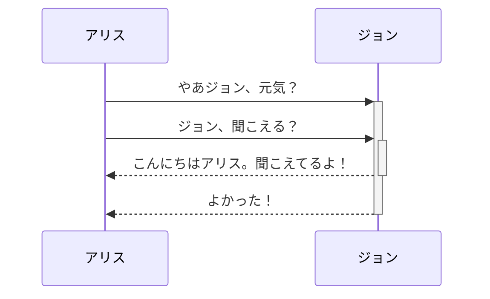

Obsidianはマークダウンベースのノートテイキングアプリであり、ナレッジベースアプリでもあります。

現在、以下のフォーマットをサポートしています。

---

### 内部リンク

```md
ページへのリンク: [[内部リンク]]
```

ページへのリンク: [[内部リンク|内部リンク]]

---

### 埋め込み

別のファイルを埋め込むことができます(詳細は[[ファイルを埋め込む]]を読んでください) これが埋め込み部分です。

```md
![[Obsidian#Obsidianとは何ですか？]]
```

![[Obsidian#Obsidianとは何ですか？]]

---

### 見出し

```md
# これは見出し1
## これは見出し2
### これは見出し3 
#### これは見出し4
##### これは見出し5
###### これは見出し6
```

# これは見出し1
## これは見出し2
### これは見出し3 
#### これは見出し4
##### これは見出し5
###### これは見出し6

---

### 強調

```md
*このテキストはイタリック体になります*
_このテキストもイタリック体になります_
```

*このテキストはイタリック体になります*
_このテキストもイタリック体になります_

```md
**このテキストはボールド体になります**
__このテキストもボールド体になります__
```

**このテキストはボールド体になります**
__このテキストもボールド体になります__

```md
_両方を組み合わせることが**可能**です_
```

_両方を組み合わせることが**可能**です_

---

### リスト

```md
- アイテム 1
- アイテム 2
  - アイテム 2a
  - アイテム 2b

1. アイテム 1
1. アイテム 2
1. アイテム 3
   1. アイテム 3a
   1. アイテム 3b
```

- アイテム 1
- アイテム 2
  - アイテム 2a
  - アイテム 2b

1. アイテム 1
1. アイテム 2
1. アイテム 3
   1. アイテム 3a
   1. アイテム 3b

--- 

### 画像

```md

```


#### 画像のリサイズ

幅100ピクセルにリサイズされた上記の画像の例。

```md

```


---

### リンク

#### 外部リンク

マークダウンスタイルのリンクは、ウェブページのような外部オブジェクトや、内部のページや画像のいずれかへのリンクとして利用できます。

```md
http://obsidian.md - automatic!
[Obsidian](http://obsidian.md)
```

http://obsidian.md - 自動的にリンクになります！
[Obsidian](http://obsidian.md)

#### Obsidian URIリンク

[[Obsidian URIの利用|Obsidian URI]]リンクによって他の保管庫か、他のプログラムのいずれかからObsidianのノートへリンク可能です。

例えば、このように保管庫内のファイルへリンクできます([[Obsidian URIの利用#エンコーディング|必要なエンコーディング]]を書いてください)。

```md
[ノートへのリンク](obsidian://open?path=D:%2Fpath%2Fto%2Ffile.md)
```

[ノートへのリンク](obsidian://open?path=D:%2Fpath%2Fto%2Ffile.md)

同様にパスの代わりに保管庫名とファイル名でノートへリンクできます。

```md
[ノートへのリンク](obsidian://open?vault=MainVault&file=MyNote.md)
```

[ノートへのリンク](obsidian://open?vault=MainVault&file=MyNote.md)

#### エスケープ

URLにスペースがある場合には、次のように `%20` を使用してスペースとしてエスケープできます。

```md
[エクスポートの設定](Pasted%20image)
```

[エクスポートの設定]](Pasted%20image)

もしくは次のようにターゲットを `<>` で囲むことでも可能です。

```md
[スライドデモ](<Slides Demo>)
```

[スライドデモ](<Slides Demo>)

---

### 引用

```md
> Human beings face ever more complex and urgent problems, and their effectiveness in dealing with these problems is a matter that is critical to the stability and continued progress of society.

\- Doug Engelbart, 1961
```

> Human beings face ever more complex and urgent problems, and their effectiveness in dealing with these problems is a matter that is critical to the stability and continued progress of society.

\- Doug Engelbart, 1961

---

### インラインコード

```md
行において`ブラケット`に囲まれたテキストはコードのようにフォーマットされます。
```

行において `ブラケット` に囲まれたテキストはコードのようにフォーマットされます。


---

### コードブロック

シンタックスハイライトは、最初のブラケットの後に言語を指定することでサポートされます。シンタックスハイライトにはprismjsを使用しており、サポートされている言語については[prismjsのサイト](https://prismjs.com/#supported-languages)で確認できます。

<pre><code>```js
function fancyAlert(arg) {
  if(arg) {
    $.facebox({div:'#foo'})
  }
}
```</code></pre>

```js
function fancyAlert(arg) {
  if(arg) {
    $.facebox({div:'#foo'})
  }
}
```
    
    
```md
    タブでインデントされたテキストはこのようにフォーマットされ、プレビューモードではコードブロックのように表示されます。
```

    タブでインデントされたテキストはこのようにフォーマットされ、プレビューモードではコードブロックのように表示されます。
    
---

### タスクリスト

```md
- [x] #タグ,  [リンク]() の**フォーマット**をサポートしています。
- [x] 必要なリスト構文（順序無しリストまたは順序付きリストがサポートされています）
- [x] これは完了したアイテムです。
- [ ] これは未完了のアイテムです。
- [ ] タスクはプレビューモードでクリックするとチェックオフできます。
```

- [x] #タグ、[リンク]() の**フォーマット**をサポートしています。
- [x] 必要なリスト構文（順序無しリストまたは順序付きリストがサポートされています）
- [x] これは完了したアイテムです。
- [ ] これは未完了のアイテムです。
- [ ] タスクはプレビューモードでクリックするとチェックを外せます。

---

### テーブル

次のように単語のリストを集めて、ハイフン`-`(最初の行)で分割し、各列をパイプ `|` で分けることによりテーブルが作成可能です。

```md
1番目のヘッダー | 二番目のヘッダー
------------ | ------------
セル1の内容 | セル2の内容
1番目の列の内容 | 2番目の列の内容
```

1番目のヘッダー | 二番目のヘッダー
------------ | ------------
セル1の内容 | セル2の内容
1番目の列の内容 | 2番目の列の内容

---

```md
テーブルはコロンで行末そろえが可能です | 長いタイトルのもう一つの例
:----------------|-------------:
`:` のおかげで | 行末がそろえられます

テーブル内にリンクを挿入しても機能します。しかし、パイプが入ったリンクを使用する場合は、テーブル要素として読まれるのを防ぐために`\`を使ってエスケープされなくてはなりません。
```

テーブルはコロンで行末そろえが可能です | 長いタイトルのもう一つの例
:----------------|-------------:
`:` のおかげで | 行末がそろえられます

テーブル内にリンクを挿入しても機能します。しかし、パイプが入ったリンクを使用する場合は、テーブル要素として読まれるのを防ぐために`\`を使ってエスケープされなくてはなりません。

```md
1番目のヘッダー | 二番目のヘッダー
------------ | ------------
[[Format your notes\|フォーマット]]	|  [[Keyboard shortcuts\|ホットキー]]	
```

1番目のヘッダー | 二番目のヘッダー
------------ | ------------
[[ノートをフォーマットする\|フォーマット]]	|  [[キーボードショートカット\|ホットキー]]	

---

### 取り消し線

```md
二つのチルダで囲まれた単語は(~~このように~~)取り消し線が引かれて表示されます。
```

二つのチルダで囲まれた単語は(~~このように~~)取り消し線が引かれて表示されます。

---

### ハイライト

```md
二つのイコール記号を使うと==テキストをハイライト==できます。
```

二つのイコール記号を使うと==テキストをハイライト==できます。

---

### 脚注

```md
ここにシンプルな脚注[^1] と長い段落があります。[^bignote]

[^1]: 有意義な

[^bignote]: ここに多数のパラグラフとコードの脚注があります。

    脚注に段落を挿入するには段落をインデントしてください。

    `{ my code }`

    好きなだけ段落を追加してください。
```

ここにシンプルな脚注[^1] と長い段落があります。[^bignote]

[^1]: 有意義な

[^bignote]: ここに多数のパラグラフとコードの脚注があります。

    脚注に段落を挿入するには段落をインデントしてください。

    `{ my code }`

    好きなだけ段落を追加してください。

```md
インラインでも同様に脚注を使うことができます。^[キャレットがこの括弧の外に出ていることに注意してください。]
```

インラインでも同様に脚注を使うことができます。^[キャレットがこの括弧の外に出ていることに注意してください。]

### 数学

```md
$$\begin{vmatrix}a & b\\
c & d
\end{vmatrix}=ad-bc$$
```

$$\begin{vmatrix}a & b\\
c & d
\end{vmatrix}=ad-bc$$

インラインでも $e^{2i\pi} = 1$ のように数学表示が可能です。

Obsidianは[Mathjax](http://docs.mathjax.org/en/latest/basic/mathjax.html)を利用しています。Mathjaxでサポートされているパッケージは[ここ](http://docs.mathjax.org/en/latest/input/tex/extensions/index.html)で確認できます。

### コメント

コメントを `%%` で囲むとマークダウンとしてパースされますが、コメントはプレビューモードでは表示されません。

```md
これがインラインコメント: %%このテキストは見えません%% (見えません)

これがブロックコメント:
%%
It can span
multiple lines
%%
```

これがインラインコメント: %%このテキストは見えません%% (プレビューでは見えません))

これがブロックコメント: (プレビューでも見えません)
%%
It can span
multiple lines
%%

### ダイアグラム

Obsidianは[Mermaid](https://mermaid-js.github.io/) を利用してダイアグラムやチャートを描写できます。Mermaidは助けとなる[ライブエディタ](https://mermaid-js.github.io/mermaid-live-editor)も提供しています。

<pre><code>```mermaid
sequenceDiagram
    アリス->>+ジョン: やあジョン、元気？
    アリス->>+ジョン: ジョン、聞こえる？
    ジョン-->>-アリス: こんにちはアリス。聞こえてるよ！
    ジョン-->>-アリス: よかった！
```</code></pre>



ObsidianはMermaidでのノートリンクをサポートしています。
<pre><code>```mermaid
graph TD

生物学 --> 化学

class 生物学,化学 internal-link;
```</code></pre>

より簡単に同様のことを行うには次のようにします: ^376b9d
<pre><code>```mermaid
graph TD

A[生物学]
B[化学]

A --> B

class A,B,C,D,E,F,G,H,I,J,K,L,M,N,O,P,Q,R,S,T,U,V,W,X,Y,Z internal-link;
```</code></pre>

このように、このスニペットを利用すればすべてのノート名(すくなくとも `Z[note name]` まで)が自動的に `internal-link` クラスとしてアサインされます。

ノート名に特殊文字を利用している場合には、二重引用符でノート名を囲む必要があります。
`"⨳ 特殊文字"`
[[ノートをフォーマットする#^376b9d|2つ目のオプション]]に従えばこのように見えます:
`A["⨳ 特殊文字"]`

## 開発者ノート

既存のフォーマットを壊すことなく最大限の機能を追求するため、マークダウンのフレーバーにいささか典型的でない組み合わせを使用しています。これは広くCommonMarkであり、GitHub Flavoured Markdown（GFM）の機能、latexのサポート、および私達の選んだ埋め込み構文が追加されています。詳細については[[利用可能なファイルフォーマット]]を参照してください。