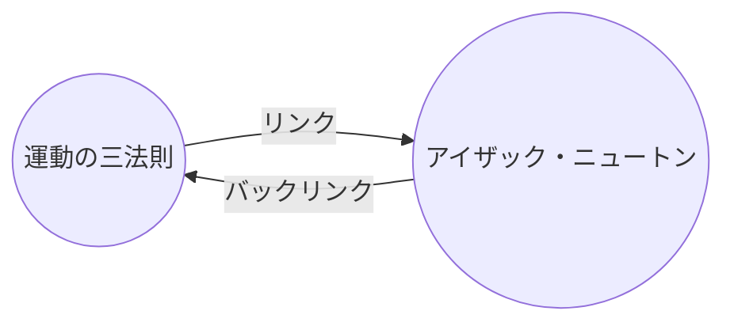

バックリンク[[コアプラグイン|プラグイン]]を使うと、アクティブなノートのすべての_バックリンク_を確認できます。

あるノートのバックリンクとは、別のノートからそのノートへのリンクのことです。以下の例では、「運動の三法則」ノートには「アイザック・ニュートン」ノートへのリンクが含まれています。対応するバックリンクは、「アイザック・ニュートン」から「運動の三法則」へと遡るリンクになります。

バックリンクは、現在書いているノートを参照しているノートを見つけるのに役立ちます。インターネット上のあらゆるウェブサイトのバックリンクを一覧表示できたらと想像してみてください。

## バックリンクを表示

バックリンクプラグインは、アクティブなタブのバックリンクを表示します。折りたたみ可能な2つのセクションがあります：**リンクされたメンション**と**リンクされていないメンション**です。

- **リンクされたメンション**は、アクティブなノートへの内部リンクを含むノートへのバックリンクです。
- **リンクされていないメンション**は、アクティブなノートの名前がリンクされずに出現しているすべての箇所へのバックリンクです。

以下のオプションが提供されます：

- **検索結果を折りたたむ**は、各ノートを展開してメンションを表示するかどうかを切り替えます。
- **前後を表示**は、メンションを含む段落を省略するか全文表示するかを切り替えます。
- **ソート順の変更**は、メンションの並べ替え方法を決定します。
- **検索フィルターを表示**は、メンションをフィルタリングするためのテキストフィールドの表示を切り替えます。検索語の作成方法について詳しくは、[[検索]]を参照してください。

## ノートのバックリンクを表示する

アクティブなノートのバックリンクを表示するには、右サイドバーの**バックリンク**（ ![[obsidian-icon-links-coming-in.svg#icon]] ）タブをクリックします。

> [!note] ノート
> バックリンクタブが表示されない場合は、[[コマンドパレット]]を開いて**バックリンク: バックリンクを表示**コマンドを実行することで表示できます。

> [!info] 除外ファイル
> [[設定#除外ファイル|除外ファイル]]のパターンに一致するファイルは、リンクされていないメンションには表示されません。

## 特定のノートのバックリンクを確認する

バックリンクタブはアクティブなノートのバックリンクを一覧表示し、別のノートに切り替えると更新されます。アクティブかどうかに関係なく特定のノートのバックリンクを確認したい場合は、_リンクされた_バックリンクタブを開くことができます。

リンクされたバックリンクタブを開くには：

1. [[コマンドパレット]]を開きます。
2. **バックリンク: 現在のファイルのバックリンクを開く**を選択します。

アクティブなノートの横に別のタブが開きます。そのタブにはリンクアイコンが表示され、ノートにリンクされていることがわかります。

## ノート内にバックリンクを表示する

バックリンクを別のタブに表示する代わりに、ノートの下部にバックリンクを表示できます。

ノート内にバックリンクを表示するには：

1. [[コマンドパレット]]を開きます。
2. **バックリンク: ドキュメント内バックリンクを切り替え**を選択します。

または、バックリンクのプラグインオプションで**ドキュメント内バックリンクを表示**を有効にすると、新しいノートを開いたときに自動的にバックリンクが表示されます。
