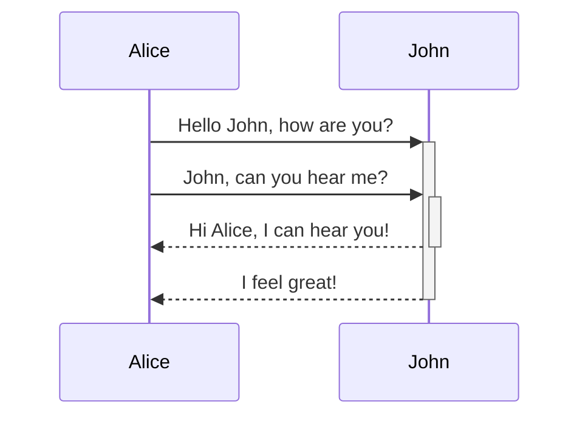
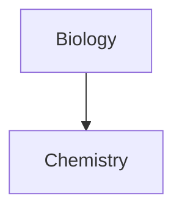

ノートに高度な書式構文を追加する方法を学びましょう。

## 表

縦棒（`|`）で列を区切り、ハイフン（`-`）でヘッダーを定義することで表を作成できます。以下は例です：

```md
| First name | Last name |
| ---------- | --------- |
| Max        | Planck    |
| Marie      | Curie     |
```

| First name | Last name |
| ---------- | --------- |
| Max        | Planck    |
| Marie      | Curie     |

表の両側の縦棒は任意ですが、読みやすさのために含めることをおすすめします。

> [!tip] _ライブプレビュー_では、表を右クリックして列や行を追加・削除できます。コンテキストメニューを使って並べ替えや移動も可能です。

[[コマンドパレット]]から**テーブルを挿入**コマンドを使用するか、右クリックして_挿入 → テーブル_を選択することで表を挿入できます。これにより、基本的な編集可能な表が作成されます：

```md
|     |     |
| --- | --- |
|     |     |
```

セルは完全に揃っている必要はありませんが、ヘッダー行には少なくとも2つのハイフンが必要です：

```md
First name | Last name
-- | --
Max | Planck
Marie | Curie
```


### 表内のコンテンツの書式設定

[[基本的な書式構文]]を使用して、表内のコンテンツにスタイルを適用できます。

| 最初の列               | 2番目の列                                   |
| ------------------ | --------------------------------------- |
| [[内部リンク]] | **保管庫**_内_のファイルへのリンク。 |
| [[ファイルの埋め込み]]    | ![[Engelbart.jpg\|100]]                 |

> [!note] 表内の縦棒
> [[エイリアス]]を使用したい場合、または表内で[[基本的な書式構文#外部画像|画像のサイズを変更]]したい場合は、縦棒の前に `\` を追加する必要があります。
>
> ```md
> First column | Second column
> -- | --
> [[基本的な書式構文\|Markdown構文]] | ![[Engelbart.jpg\|200]]
> ```
>
> First column | Second column
> -- | --
> [[基本的な書式構文\|Markdown構文]] | ![[Engelbart.jpg\|200]]

ヘッダー行にコロン（`:`）を追加することで、列内のテキストの配置を設定できます。_ライブプレビュー_ではコンテキストメニューからもコンテンツの配置を変更できます。

```md
Left-aligned text | Center-aligned text | Right-aligned text
:-- | :--: | --:
Content | Content | Content
```

Left-aligned text | Center-aligned text | Right-aligned text
:-- | :--: | --:
Content | Content | Content

## ダイアグラム

[Mermaid](https://mermaid-js.github.io/)を使用して、ノートにダイアグラムやチャートを追加できます。Mermaidは[フローチャート](https://mermaid.js.org/syntax/flowchart.html)、[シーケンス図](https://mermaid.js.org/syntax/sequenceDiagram.html)、[タイムライン](https://mermaid.js.org/syntax/timeline.html)など、さまざまなダイアグラムをサポートしています。

> [!tip] ヒント
> ノートに含める前に、Mermaidの[ライブエディタ](https://mermaid-js.github.io/mermaid-live-editor)を使ってダイアグラムを構築することもできます。

Mermaidダイアグラムを追加するには、`mermaid` [[基本的な書式構文#コードブロック|コードブロック]]を作成します。

````md

````


````md

````


### ダイアグラム内でファイルをリンクする

ノードに`internal-link`[クラス](https://mermaid.js.org/syntax/flowchart.html#classes)を付与することで、ダイアグラム内に[[内部リンク]]を作成できます。

````md

````


> [!note] 注意
> ダイアグラムからの内部リンクは[[グラフビュー]]には表示されません。

ダイアグラムに多数のノードがある場合は、以下のスニペットを使用できます。

````md

````

この方法では、各文字ノードが内部リンクとなり、[ノードテキスト](https://mermaid.js.org/syntax/flowchart.html#a-node-with-text)がリンクテキストとして使用されます。

> [!note] 注意
> ノート名に特殊文字を使用している場合は、ノート名をダブルクォートで囲む必要があります。
>
> ```
> class "⨳ special character" internal-link
> ```
>
> または、`A["⨳ special character"]` のようにします。

ダイアグラムの作成に関する詳細は、[Mermaid公式ドキュメント](https://mermaid.js.org/intro/)を参照してください。

## 数学

[MathJax](http://docs.mathjax.org/en/latest/basic/mathjax.html)とLaTeX記法を使用して、ノートに数式を追加できます。

ノートにMathJax式を追加するには、ダブルドル記号（`$$`）で囲みます。

```md
$$
\begin{vmatrix}a & b\\
c & d
\end{vmatrix}=ad-bc
$$
```

$$
\begin{vmatrix}a & b\\
c & d
\end{vmatrix}=ad-bc
$$

`$` 記号で囲むことで、数式をインラインで表示することもできます。

```md
これはインライン数式 $e^{2i\pi} = 1$ です。
```

これはインライン数式 $e^{2i\pi} = 1$ です。

構文の詳細については、[MathJax基本チュートリアルとクイックリファレンス](https://math.meta.stackexchange.com/questions/5020/mathjax-basic-tutorial-and-quick-reference)を参照してください。

サポートされているMathJaxパッケージの一覧については、[TeX/LaTeX拡張機能リスト](http://docs.mathjax.org/en/latest/input/tex/extensions/index.html)を参照してください。
