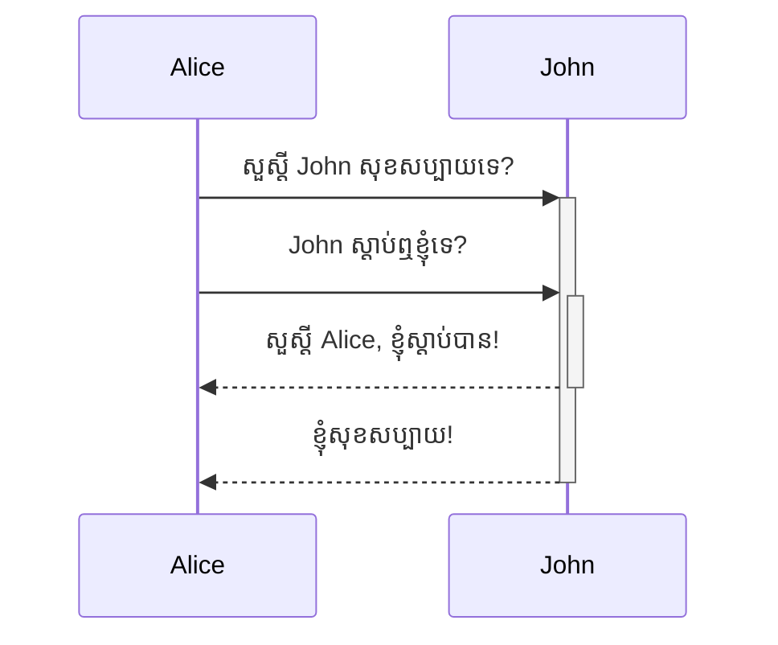
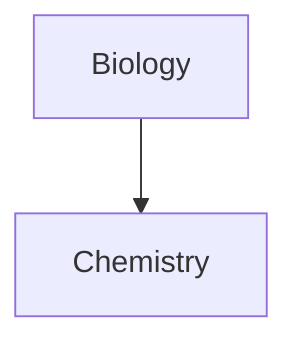

រៀនពីរបៀបរៀបចំទម្រង់ syntax នៅក្នុងកំំណត់ត្រារបស់អ្នកឲ្យកាន់តែសុីជម្រៅ

## តារាង

អ្នកអាចបង្កើតតារាងដោយប្រើរបារបញ្ឈរ (`|`) និង​ សហសញ្ញា (`-`) ។​ របារបញ្ឈរបែងចែកជួរឈរនៃតារាង និង​ សហសញ្ញាកំណត់ក្បាលជួរឈរ ។

```md
| ឈ្មោះ       | ត្រកូល     |
| ---------- | --------- |
| Max        | Planck    |
| Marie      | Curie     |
```

| ឈ្មោះ       | ត្រកូល     |
| ---------- | --------- |
| Max        | Planck    |
| Marie      | Curie     |

របារបញ្ឈរនៅសងខាងនៃតារាងអាចដាក់ក៏បាន មិនដាក់ក៏បាន ។

ប្លុកនៅក្នុងតារាងមិនចាំបាច់នៅសមស្របជាមួយជួរឈរខាងក្បាលទេ ។​ ក្បាលជួរដេកនីមួយៗត្រូវមានយ៉ាងហើចណាស់ សហសញ្ញាចំនួន ២ ។

```md
ឈ្មោះ | ត្រកូល
-- | --
Max | Planck
Marie | Curie
```

### រៀបចំអត្ថបទនៅក្នុងតារាង

អ្នកអាចប្រើ [[រៀបចំ syntax ទូទៅ]] ទៅរចនាអត្ថបទនៅក្នុងតារាង ។

ជួរឈរទីមួយ | ជួរឈរទីពីរ
-- | --
[[Internal links]] | Link ទៅកាន់ឯកសារ _នៅក្នុង_ **vault**​ របស់អ្នក ។
[[បង្កប់ឯកសារ]] | ![[og-image.png\|200]]

> [!note] របារបញ្ឈរនៅក្នុងតារាង ។
> បើអ្នកចង់ប្រើ [[aliases]] ឬ [[រៀបចំ syntax ទូទៅ#រូបភាពខាងក្រៅ|កែទំហំរូបភាព]] នៅក្នុងតារាង អ្នកត្រូវដាក់ `\` នៅមុនរបារបញ្ឈរ ។
>
> ```md
> ជួរឈរទីមួយ | ជួរឈរទីពីរ
> -- | --
> [[រៀបចំ syntax ទូទៅ\|Markdown syntax]] | ![[og-image.png\|200]]
> ```
>
> ជួរឈរទីមួយ | ជួរឈរទីពីរ
> -- | --
> [[រៀបចំ syntax ទូទៅ\|Markdown syntax]] | ![[og-image.png\|200]]

អ្នកអាចរៀបឲ្យអត្ថបទទៅឆ្វេង ទៅស្តាំ ឬ នៅកណ្តាលនៃជួរឈរដោយដាក់សញ្ញាចុចពីរ (`:`) ទៅក្បាលជួរឈរ ។

```md
អត្ថបទទៅឆ្វេង | អត្ថបទនៅកណ្តាល | អត្ថបទទៅស្តាំ
:-- | :--: | --:
អត្ថបទ | អត្ថបទ | អត្ថបទ
```

អត្ថបទទៅឆ្វេង | អត្ថបទនៅកណ្តាល | អត្ថបទទៅស្តាំ
:-- | :--: | --:
អត្ថបទ | អត្ថបទ | អត្ថបទ

## ដ្យាក្រាម

អ្នកអាចដាក់ដ្យាក្រាម និង តារាង​ទៅកំណត់ត្រារបស់អ្នក ដោយប្រើ [Mermaid](https://mermaid-js.github.io/) ។ Mermaid អាចយកទៅប្រើជាមួយដ្យាក្រាមយ៉ាងច្រើនដូចជា [flow charts](https://mermaid.js.org/syntax/flowchart.html), [sequence diagrams](https://mermaid.js.org/syntax/sequenceDiagram.html), និង [timelines](https://mermaid.js.org/syntax/timeline.html) ។

> [!tip]
> អ្នកអាចសាក Mermaid's [Live Editor](https://mermaid-js.github.io/mermaid-live-editor)​ ក្នុងការធ្វើដ្យាក្រាមមុនអ្នកដាក់វានៅក្នុងកំណត់ត្រារបស់អ្នក ។

ដើម្បីបង្កើត Mermaid ដ្យាក្រាមមួយ អ្នកត្រូវបង្កើត `mermaid` [[រៀបចំ syntax ទូទៅ#ប្លុកកូដ|ប្លុកកូដ]] ។

````md

````


````md

````


### Linking ឯកសារក្នុងដ្យាក្រាម

អ្នកអាចបង្កើត [[internal links]] នៅក្នុងដ្យាក្រាមអ្នកដោយភ្ជាប់ `internal-link` [class](https://mermaid.js.org/syntax/flowchart.html#classes) ទៅ nodes របស់អ្នក ។

````md

````


> [!note]
> Links ផ្ទៃក្នុង ក្នុងដ្យក្រាមមិនបង្ហាញខ្លួននៅក្នុង [[Graph view]] ទេ ។

បើសិនជាអ្នកមាន​ nodes ច្រើននៅក្នុងដ្យាក្រាមរបស់អ្នក អ្នកអាចប្រើកូដខាងក្រោមបាន ។

````md

````

តាមនេះ អក្សរ node នីមួយៗក្លាយជា link​ ផ្ទៃក្នុងដោយមាន [node text](https://mermaid.js.org/syntax/flowchart.html#a-node-with-text) ជាអត្ថបទ link ។

> [!note]
> បើអ្នកប្រើតួអក្សរពិសេសនៅក្នុងឈ្មោះកំណត់ត្រារបស់អ្នក អ្នកត្រូវដាក់ឈ្មោះកំណត់ត្រានៅក្នុងធ្មេញកណ្តុរ (double quotes) ។
>
> ```
> class "⨳ special character" internal-link
> ```
>
> ឬ `A["⨳ special character"]` ។

សម្រាប់ព័ត៌មានបន្ថែមអំពីការបង្កើតដ្យាក្រាម សូមមើល [official Mermaid docs](https://mermaid.js.org/intro/).

## គណិត

អ្នកអាចប្រើកន្សោមគណិតនៅក្នុងកំណត់ត្រារបស់អ្នកដោយប្រើ [MathJax](http://docs.mathjax.org/en/latest/basic/mathjax.html) និង LaTeX ។

ដើម្បីបង្កើតកន្សោម MathJax ទៅកំណត់ត្រារបស់អ្នក អ្នកត្រូវខ្ចប់វានៅក្នុងសញ្ញាដុល្លារ ២ (`$$`) ។

```md
$$
\begin{vmatrix}a & b\\
c & d
\end{vmatrix}=ad-bc
$$
```

$$
\begin{vmatrix}a & b\\
c & d
\end{vmatrix}=ad-bc
$$

អ្នកអាចដាក់កន្សោមគណិតនៅក្នុងប្រយោគដោយខ្ចប់វាជាមួយសញ្ញាដុល្លារ `$` ។

```md
នេះជាកន្សោមគណិតនៅក្នុងប្រយោគ $e^{2i\pi} = 1$ ។
```

នេះជាកន្សោមគណិតនៅក្នុងប្រយោគ $e^{2i\pi} = 1$ ។

សម្រាប់ព័ត៌មានបន្ថែមអំពី syntax សូមមើល [MathJax basic tutorial and quick reference](https://math.meta.stackexchange.com/questions/5020/mathjax-basic-tutorial-and-quick-reference) ។

សម្រាប់ បញ្ជីនៃ MathJax packages ដែលអាចប្រើបាន សូមមើល [The TeX/LaTeX Extension List](http://docs.mathjax.org/en/latest/input/tex/extensions/index.html) ។
