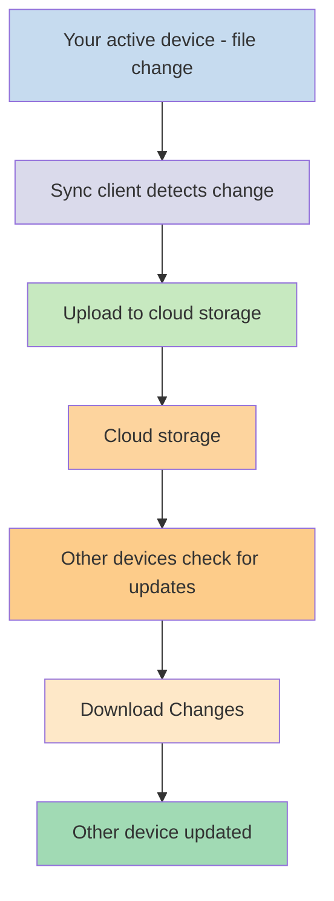
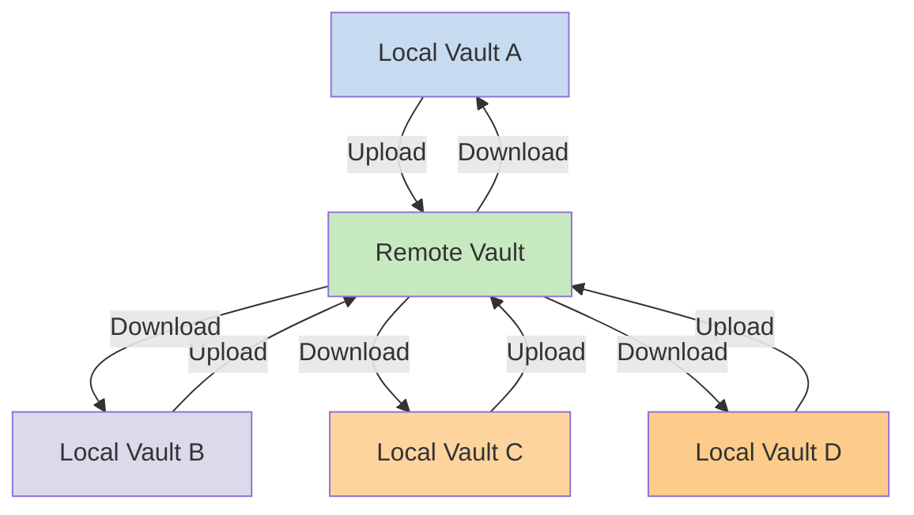

ប្រសិនបើអ្នកចង់ប្រើកំណត់ត្រារបស់អ្នកនៅលើឧបករណ៍ផ្សេងៗ មួយក្នុងចំណោមជម្រើសដែលអ្នកមានគឺ [[សមកាលកម្មកំណត់ត្រារបស់អ្នកឆ្លងឧបករណ៍]]។ Obsidian ផ្តល់សេវាកម្មមួយបែបនេះ [[ការណែនាំអំពី Obsidian Sync|Obsidian Sync]] ដែលដំណើរការខុសពីសេវាកម្មសមកាលកម្មផ្សេងទៀត ដូចជា [[សមកាលកម្មកំណត់ត្រារបស់អ្នកឆ្លងឧបករណ៍#iCloud|iCloud]] និង [[សមកាលកម្មកំណត់ត្រារបស់អ្នកឆ្លងឧបករណ៍#OneDrive|OneDrive]]។

នេះគឺជាពាក្យគន្លឹះសំខាន់ៗ៖

- **vault** គឺជាថតនៅលើប្រព័ន្ធឯកសាររបស់អ្នក ដែលមានកំណត់ត្រា និងថត `.obsidian` ដែលមានការកំណត់រចនាសម្ព័ន្ធជាក់លាក់របស់ Obsidian។
- **local vault** គឺជាច្បាប់ចម្លងនៃ vault របស់អ្នក ដែលមាននៅលើឧបករណ៍នីមួយៗរបស់អ្នក។ នៅពេលប្រើសេវាកម្មសមកាលកម្ម អ្នកភ្ជាប់ local vault ទាំងនេះ ដើម្បីបើកដំណើរការសមកាលកម្ម។
- **remote vault** គឺជាទំហំផ្ទុកកណ្តាល ដែល local vault ភ្ជាប់ទៅ​ដោយផ្ទាល់តាមរយៈ Obsidian Sync។

មានវិធីសាស្ត្រទូទៅពីរក្នុងការសមកាលកម្ម៖

- **[[#សេវាកម្មសមកាលកម្មផ្អែកលើឯកសារ|សេវាកម្មសមកាលកម្មផ្អែកលើឯកសារ]]**៖ Local vault ត្រូវតែនៅក្នុងថតដែលត្រូវបានតាមដាន ការសមកាលកម្មកើតឡើងតាមរយៈប្រព័ន្ធឯកសារ
- **[[#Obsidian Sync|Remote vault]]**៖ ទំហំផ្ទុកកណ្តាល ដែល local vault ភ្ជាប់ទៅដោយផ្ទាល់តាមរយៈ Obsidian

## សេវាកម្មសមកាលកម្មផ្អែកលើឯកសារ

សេវាកម្មដូចជា Dropbox, Google Drive, iCloud, និង OneDrive គឺផ្អែកលើថត។ សេវាកម្មទាំងនេះតាមដានថតជាក់លាក់ ហើយធ្វើសមកាលកម្មដោយស្វ័យប្រវត្តិនូវឯកសារណាមួយដែលដាក់នៅក្នុងថតទាំងនោះ។ ឯកសារត្រូវតែនៅក្នុងថតសេវាកម្មពពកដែលបានកំណត់ ដើម្បីធ្វើការសមកាលកម្ម។ ជាមួយសេវាកម្មសមកាលកម្មផ្អែកលើឯកសារ local vault របស់អ្នកដំណើរការដូចជាថតមួយទៀតដែលកំពុងត្រូវបានតាមដាន។ មិនមាន remote vault ដែលបម្រុងទុកជាមុន — ផ្ទុយទៅវិញ ទំហំផ្ទុកពពកបម្រើជាស្ពាន ចម្លងឯកសាររវាង local vault នៅលើឧបករណ៍ផ្សេងៗ។

គំនូសតាងខាងក្រោមបង្ហាញពីសំណួរដែលត្រូវបានធ្វើឱ្យសាមញ្ញនៃរបៀបដែលសេវាកម្មទាំងនេះដំណើរការ៖

ប្រសិនបើសេវាកម្មពពកមានការសមកាលកម្មផ្ទៃខាងក្រោយ នោះដំណើរការមួយចំនួនទាំងនេះអាចកំពុងកើតឡើង សូម្បីតែពេលអ្នកមិនបានប្រើកម្មវិធីដើម្បីមើលឯកសារយ៉ាងសកម្ម។ សេវាកម្មទាំងនេះតាមដានថតជាក់លាក់ ហើយធ្វើសមកាលកម្មដោយស្វ័យប្រវត្តិនូវឯកសារណាមួយដែលដាក់នៅក្នុងថតទាំងនោះ។ ឯកសារត្រូវតែនៅក្នុងថតសេវាកម្មពពកដែលបានកំណត់ ដើម្បីធ្វើការសមកាលកម្ម។

## Obsidian Sync

Obsidian Sync អនុញ្ញាតឱ្យអ្នកបង្កើត remote vault ដែលបម្រើជាទំហំផ្ទុកកណ្តាលតាមរយៈសេវាកម្ម [[ការណែនាំអំពី Obsidian Sync|Obsidian Sync]] របស់វា។ វាអនុញ្ញាតឱ្យអ្នកជ្រើសរើសថតស្ទើរតែណាមួយនៅលើឧបករណ៍ណាមួយរបស់អ្នក ដើម្បីរក្សាទុកឯកសាររបស់អ្នក — មិនថានៅ hard drive ខាងក្រៅ ក្នុង `C:\` ឬនៅក្នុង App storage នៅ Android។

ទោះជាយ៉ាងណា យើងមានបញ្ជីទីតាំងដែលបានណែនាំសម្រាប់ local vault របស់អ្នក ប្រសិនបើអ្នកប្រើ [[#សេវាកម្មសមកាលកម្មផ្អែកលើឯកសារ]] នៅលើឧបករណ៍ដដែល — ជាចំបង កន្លែងណាក៏ដោយដែលមិននៅក្នុង [[ប្តូរទៅ Obsidian Sync#Move your vault out of your third-party syncing service or cloud storage|សេវាកម្មសមកាលកម្មភាគីទីបី]]។

គំនូសតាងខាងក្រោមបង្ហាញពីសំណួរដែលត្រូវបានធ្វើឱ្យសាមញ្ញនៃរបៀបដែល Obsidian Sync ដំណើរការ៖

កម្លាំងនៃប្រព័ន្ធនេះកាន់តែច្បាស់ជាងមុន នៅពេលមានប្រភេទឧបករណ៍ច្រើន។ [[#សេវាកម្មសមកាលកម្មផ្អែកលើឯកសារ]] អាចត្រូវបានអនុវត្តដោយមិនស្ថិរភាពនៅទូទាំងប្រព័ន្ធប្រតិបត្តិការ ហើយឧបករណ៍ចល័តមានក្បួនផ្ទាល់ខ្លួនរបស់ពួកវាអំពីរបៀបដែលកម្មវិធីអាចត្រូវបាន sandbox និងដំណើរការថាមពលដែលត្រូវបានកំណត់ ដែលធ្វើឱ្យវាកាន់តែពិបាកសម្រាប់សេវាកម្មផ្អែកលើឯកសារបែបបុរាណ ក្នុងការដំណើរការដោយរលូន។

ជាមួយ Obsidian Sync សេវាកម្មដោះស្រាយការសមកាលកម្មដោយផ្ទាល់តាមរយៈកម្មវិធី ដោយផ្តល់នូវអាកប្បកិរិយាស្ថិរភាពដូចគ្នា ដោយមិនគិតពីប្រភេទឧបករណ៍ ឬដែនកំណត់ប្រព័ន្ធប្រតិបត្តិការ ខណៈពេលផ្តល់អាទិភាពក្នុងការរក្សាច្បាប់ចម្លងក្នុងស្រុកនៃទិន្នន័យរបស់អ្នក ជា [[បម្រុងទុកឯកសារ Obsidian របស់អ្នក|ការបម្រុងទុករហ័ស]]។

### អាកប្បកិរិយានៃការសមកាលកម្ម

នៅពេលអ្នកធ្វើការផ្លាស់ប្តូរឯកសារក្នុង local vault របស់អ្នក Obsidian Sync រកឃើញការផ្លាស់ប្តូរទាំងនេះ ហើយបញ្ចូលពួកវាទៅ remote vault។ ឧបករណ៍ផ្សេងទៀតដែលភ្ជាប់ទៅ remote vault ដដែល នឹងទាញយកការផ្លាស់ប្តូរទាំងនេះ ហើយអនុវត្តពួកវាទៅ local vault របស់ពួកគេ។ Obsidian Sync តាមដានការផ្លាស់ប្តូរនៅកម្រិតឯកសារ ហើយផ្ទេរតែឯកសារដែលត្រូវបានកែប្រែប៉ុណ្ណោះ ជំនួសឱ្យការធ្វើសមកាលកម្មថតទាំងមូល។ វាកាត់បន្ថយការប្រើប្រាស់ bandwidth និងពេលវេលាសមកាលកម្ម។

នៅពេលទំនាស់កើតឡើង ឬនៅពេលអ្នកត្រូវការគ្រប់គ្រងឯកសារណាដែលធ្វើការសមកាលកម្ម Obsidian Sync ផ្តល់យន្តការជាក់លាក់ ដើម្បីដោះស្រាយស្ថានការណ៍ទាំងនេះ៖

![[ដោះស្រាយបញ្ហា Obsidian Sync#ការដោះស្រាយជម្លោះ|Conflict resolution]]

![[ការកំណត់ Sync និងជ្រើសរើស សមកាលកម្ម#Selective syncing#Exclude a folder from syncing]]

### អាកប្បកិរិយានៅក្រៅបណ្តាញ

ការផ្លាស់ប្តូរដែលធ្វើឡើងនៅពេលគ្មានបណ្ដាញត្រូវបានដាក់ក្នុងជួររង់ចាំ ហើយធ្វើការសមកាលកម្មដោយស្វ័យប្រវត្តិ នៅពេលឧបករណ៍របស់អ្នកភ្ជាប់អ៊ីនធឺណែតឡើងវិញ ហើយ Obsidian បើកនៅ។ Local vault របស់អ្នកនៅតែដំណើរការបានពេញលេញ ក្នុងអំឡុងពេលគ្មានបណ្ដាញ។

##ជំហានបន្ទាប់

- [[ដំឡើង Obsidian Sync]] ដើម្បីចាប់ផ្តើមជាមួយ remote vault។
- [[ប្តូរទៅ Obsidian Sync]] ប្រសិនបើអ្នកកំពុងប្រើការសមកាលកម្មផ្អែកលើឯកសារ ហើយចង់ប្រើ Obsidian Sync។
- [[សមកាលកម្មកំណត់ត្រារបស់អ្នកឆ្លងឧបករណ៍|ស្វែងរកជម្រើសសមកាលកម្មផ្សេងទៀត]] ប្រសិនបើអ្នកនៅតែកំពុងសម្រេចចិត្ត។
