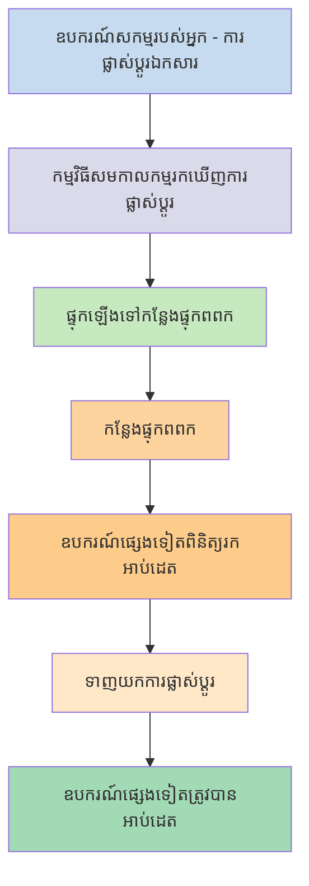
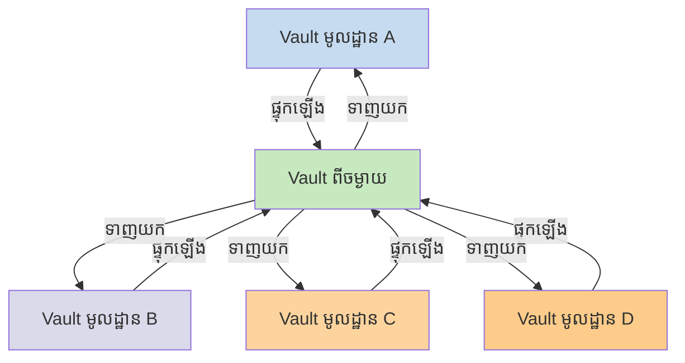

បើអ្នកចង់ប្រើកំណត់ត្រារបស់អ្នកនៅលើឧបករណ៍ផ្សេងៗ ជម្រើសមួយដែលអ្នកមានគឺ [[សមកាលកម្មកំណត់ត្រារបស់អ្នកឆ្លងឧបករណ៍]]។ Obsidian ផ្តល់សេវាកម្មមួយបែបនេះ [[ការណែនាំអំពី Obsidian Sync|Obsidian Sync]] ដែលដំណើរការខុសពីសេវាកម្មសមកាលកម្មផ្សេងទៀត ដូចជា [[សមកាលកម្មកំណត់ត្រារបស់អ្នកឆ្លងឧបករណ៍#iCloud|iCloud]] និង [[សមកាលកម្មកំណត់ត្រារបស់អ្នកឆ្លងឧបករណ៍#OneDrive|OneDrive]]។

នេះជាពាក្យគន្លឹះមួយចំនួន៖

- **vault** គឺជាថតមួយនៅលើប្រព័ន្ធឯកសាររបស់អ្នកដែលមានកំណត់ត្រា និងថត `.obsidian` ដែលមានការកំណត់រចនាសម្ព័ន្ធជាក់លាក់របស់ Obsidian។
- **vault មូលដ្ឋាន** គឺជាច្បាប់ចម្លងនៃ vault របស់អ្នកដែលមាននៅលើឧបករណ៍នីមួយៗរបស់អ្នក។ នៅពេលប្រើសេវាកម្មសមកាលកម្ម អ្នកភ្ជាប់ vault មូលដ្ឋានទាំងនេះដើម្បីបើកការសមកាលកម្ម។
- **vault ពីចម្ងាយ** គឺជាកន្លែងផ្ទុកកណ្តាលដែល vault មូលដ្ឋានភ្ជាប់ទៅដោយផ្ទាល់តាមរយៈ Obsidian Sync។

មានវិធីសាស្រ្តសមកាលកម្មទូទៅពីរ៖

- **[[#សេវាកម្មសមកាលកម្មផ្អែកលើឯកសារ]]**៖ vault មូលដ្ឋានត្រូវតែស្ថិតនៅក្នុងថតដែលត្រូវបានតាមដាន ការសមកាលកម្មកើតឡើងតាមរយៈប្រព័ន្ធឯកសារ
- **[[#Obsidian Sync|Vault ពីចម្ងាយ]]**៖ កន្លែងផ្ទុកកណ្តាលដែល vault មូលដ្ឋានភ្ជាប់ទៅដោយផ្ទាល់តាមរយៈ Obsidian

## សេវាកម្មសមកាលកម្មផ្អែកលើឯកសារ

សេវាកម្មដូចជា Dropbox, Google Drive, iCloud និង OneDrive គឺផ្អែកលើថត។ សេវាកម្មទាំងនេះតាមដានថតជាក់លាក់ និងសមកាលកម្មឯកសារណាមួយដែលដាក់នៅក្នុងនោះដោយស្វ័យប្រវត្តិ។ ឯកសារត្រូវតែស្ថិតនៅក្នុងថតសេវាកម្មពពកដែលបានកំណត់ដើម្បីសមកាលកម្ម។ ជាមួយសេវាកម្មសមកាលកម្មផ្អែកលើឯកសារ vault មូលដ្ឋានរបស់អ្នកដើរតួជាថតមួយទៀតដែលត្រូវបានតាមដាន។ មិនមាន vault ពីចម្ងាយជាក់លាក់ទេ - ផ្ទុយទៅវិញ កន្លែងផ្ទុកពពកដើរតួជាផ្លូវឆ្លង ចម្លងឯកសាររវាង vault មូលដ្ឋាននៅលើឧបករណ៍ផ្សេងៗ។

ដ្យាក្រាមខាងក្រោមបង្ហាញកំណែសាមញ្ញនៃរបៀបដែលសេវាកម្មទាំងនេះដំណើរការ៖

បើសេវាកម្មពពកមានការសមកាលកម្មក្នុងផ្ទៃខាងក្រោយ នោះដំណើរការមួយចំនួនទាំងនេះអាចកើតឡើងសូម្បីតែនៅពេលអ្នកមិនកំពុងប្រើកម្មវិធីដើម្បីមើលឯកសារយ៉ាងសកម្ម។ សេវាកម្មទាំងនេះតាមដានថតជាក់លាក់ និងសមកាលកម្មឯកសារណាមួយដែលដាក់នៅក្នុងនោះដោយស្វ័យប្រវត្តិ។ ឯកសារត្រូវតែស្ថិតនៅក្នុងថតសេវាកម្មពពកដែលបានកំណត់ដើម្បីសមកាលកម្ម។

## Obsidian Sync

Obsidian Sync អនុញ្ញាតឱ្យអ្នកបង្កើត vault ពីចម្ងាយដែលបម្រើជាកន្លែងផ្ទុកកណ្តាលតាមរយៈសេវាកម្ម [[ការណែនាំអំពី Obsidian Sync|Obsidian Sync]] របស់វា។ នេះអនុញ្ញាតឱ្យអ្នកជ្រើសរើសថតស្ទើរតែគ្រប់កន្លែងនៅលើឧបករណ៍ណាមួយរបស់អ្នកដើម្បីផ្ទុកឯកសាររបស់អ្នក - មិនថានៅលើថាសរឹងខាងក្រៅ នៅក្នុង `C:\` ឬក្នុងកន្លែងផ្ទុកកម្មវិធីនៅលើ Android។

ទោះជាយ៉ាងណា យើងមានបញ្ជីទីតាំងដែលបានផ្តល់អនុសាសន៍សម្រាប់ vault មូលដ្ឋានរបស់អ្នក បើអ្នកក៏ប្រើ [[#សេវាកម្មសមកាលកម្មផ្អែកលើឯកសារ]] នៅលើឧបករណ៍ដូចគ្នា - ជាចម្បង គ្រប់ទីកន្លែងដែលមិនស្ថិតនៅក្នុង [[ប្តូរទៅ Obsidian Sync#Move your vault out of your third-party syncing service or cloud storage|សេវាកម្មសមកាលកម្មភាគីទីបី]]។

ដ្យាក្រាមខាងក្រោមបង្ហាញកំណែសាមញ្ញនៃរបៀបដែល Obsidian Sync ដំណើរការ៖

ភាពខ្លាំងនៃប្រព័ន្ធនេះកាន់តែច្បាស់ជាមួយប្រភេទឧបករណ៍កាន់តែច្រើន។ [[#សេវាកម្មសមកាលកម្មផ្អែកលើឯកសារ]] អាចត្រូវបានអនុវត្តមិនស្របគ្នាលើប្រព័ន្ធប្រតិបត្តិការផ្សេងៗ ហើយឧបករណ៍ចល័តមានច្បាប់ផ្ទាល់ខ្លួនអំពីរបៀបដែលកម្មវិធីអាចត្រូវបាន sandbox និងដាក់កម្រិតថាមពល ដែលធ្វើឱ្យវាពិបាកជាងច្រើនសម្រាប់សេវាកម្មផ្អែកលើឯកសារបែបប្រពៃណីក្នុងការដំណើរការដោយរលូន។

ជាមួយ Obsidian Sync សេវាកម្មនេះគ្រប់គ្រងការសមកាលកម្មដោយផ្ទាល់តាមរយៈកម្មវិធី ផ្តល់ឥរិយាបថស្របគ្នាដោយមិនគិតពីប្រភេទឧបករណ៍ ឬដែនកំណត់នៃប្រព័ន្ធប្រតិបត្តិការ ខណៈពេលដែលផ្តល់អាទិភាពលើការរក្សាច្បាប់ចម្លងមូលដ្ឋាននៃទិន្នន័យរបស់អ្នកជា [[បម្រុងទុកឯកសារ Obsidian របស់អ្នក|ការបម្រុងទុកបន្សុទ្ធ]]។

### ឥរិយាបថសមកាលកម្ម

នៅពេលអ្នកធ្វើការផ្លាស់ប្តូរឯកសារនៅក្នុង vault មូលដ្ឋានរបស់អ្នក Obsidian Sync រកឃើញការផ្លាស់ប្តូរទាំងនេះ និងផ្ទុកឡើងទៅ vault ពីចម្ងាយ។ ឧបករណ៍ផ្សេងទៀតដែលភ្ជាប់ទៅ vault ពីចម្ងាយដូចគ្នានឹងទាញយកការផ្លាស់ប្តូរទាំងនេះ និងអនុវត្តពួកវាទៅ vault មូលដ្ឋានរបស់ពួកគេ។ Obsidian Sync តាមដានការផ្លាស់ប្តូរនៅកម្រិតឯកសារ និងផ្ទេរតែឯកសារដែលត្រូវបានកែប្រែ ជាជាងសមកាលកម្មថតទាំងមូល។ នេះកាត់បន្ថយការប្រើប្រាស់កម្រិតបញ្ជូន និងពេលវេលាសមកាលកម្ម។

នៅពេលមានជម្លោះកើតឡើង ឬនៅពេលអ្នកត្រូវការគ្រប់គ្រងថាឯកសារណាខ្លះដែលត្រូវសមកាលកម្ម Obsidian Sync ផ្តល់យន្តការជាក់លាក់ដើម្បីដោះស្រាយស្ថានភាពទាំងនេះ៖

![[ដោះស្រាយបញ្ហា Obsidian Sync#ការដោះស្រាយជម្លោះ|Conflict resolution]]

![[ការកំណត់ Sync និងជ្រើorg រើorg សមកាលកម្ម#Selective syncing#Exclude a folder from syncing]]

### ឥរិយាបថអុហ្វឡាញ

ការផ្លាស់ប្តូរដែលធ្វើខណៈពេលអុហ្វឡាញត្រូវបានដាក់ក្នុងជួរ និងសមកាលកម្មដោយស្វ័យប្រវត្តិនៅពេលឧបករណ៍របស់អ្នកភ្ជាប់អ៊ីនធឺណិតឡើងវិញ ហើយ Obsidian កំពុងបើក។ vault មូលដ្ឋានរបស់អ្នកនៅតែដំណើរការពេញលេញក្នុងអំឡុងពេលអុហ្វឡាញ។

## ជំហានបន្ទាប់

- [[ដំឡើង Obsidian Sync]] ដើម្បីចាប់ផ្តើមជាមួយ vault ពីចម្ងាយ។
- [[ប្តូរទៅ Obsidian Sync]] បើអ្នកកំពុងប្រើការសមកាលកម្មផ្អែកលើឯកសារ ហើយចង់ប្រើ Obsidian Sync។
- [[សមកាលកម្មកំណត់ត្រារបស់អ្នកឆ្លងឧបករណ៍|ស្វែងរកជម្រើorg សមកាលកម្មផ org សorg org org org org org org org org org org org org org org org org org org org org org org org org org org org org org org org org org org org org org org org org org org org org org org org org org org org org org org org org org org org org org org org org org org org org org org org org org org org org org org org org org org org org org org org org org org org org org org org org org org org org org org org org org org org org org org org org org org org org org org org org org org org org org org org org org org org org org org org org org org org org org org org org org org org org org org org org org org org org org org org org org org org org org org org org org org org org org org org org org org org org org org org org org org org org org org org org org org org org org org org org org org org org org org org org org org org org org org org org org org org org org org org org org org org org org org org org org org org org org org org org org org org org org org org org org org org org org org org org org org org org org org org org org org org org org org org org org org org org org org org org org org org org org org org org org org org org org org org org org org org org org org org org org org org org org org org org org org org org org org org org org org org org org org org org org org org org org org org org org org org org org org org org org org org org org org org org org org org org org org org org org org org org org org org org org org org org org org org org org org org org org org org org org org org org org org org org org org org org org org org org org org org org org org org org org org org org org org org org org org org org org org org org org org org org org org org org org org org org org org org org org org org org org org org org org org org org org org org org org org org org org org org org org org org org org org org org org org org org org org org org org org org org org org org org org org org org org org org org org org org org org org org org org org org org org org org org org org org org org org org org org org org org org org org org org org org org org org org org org org org org org org org org org org org org org org org org org org org org org org org org org org org org org org org org org org org org org org org org org org org org org org org org org org org org org org org org org org org org org org org org org org org org org org org org org org org org org org org org org org org org org org org org org org org org org org org org org org org org org org org org org org org org org org org org org org org org org org org org org org org org org org org org org org org org org org org org org org org org org org org org org org org org org org org org org org org org org org org org org org org org org org org org org org org org org org org org org org org org org org org org org org org org org org org org org org org org org org org org org org org org org org org org org org org org org org org org org org org org org org org org org org org org org org org org org org org org org org org org org org org org org org org org org org org org org org org org org org org org org org org org org org org org org org org org org org org org org org org org org org org org org org org org org org org org org org org org org org org org org org org org org org org org org org org org org org org org org org org org org org org org org org org org org org org org org org org org org org org org org org org org org org org org org org org org org org org org org org org org org org org org org org org org org org org org org org org org org org org org org org org org org org org org org org org org org org org org org org org org org org org org org org org org org org org org org org org org org org org org org org org org org org org org org org org org org org org org org org org org org org org org org org org org org org org org org org org org org org org org org org org org org org org org org org org org org org org org org org org org org org org org org org org org org org org org org org org org org org org org org org org org org org org org org org org org org org org org org org org org org org org org org org org org org org org org org org org org org org org org org org org org org org org org org org org org org org org org org org org org org org org org org org org org org org org org org org org org org org org org org org org org org org org org org org org org org org org org org org org org org org org org org org org org org org org org org org org org org org org org org org org org org org org org org org org org org org org org org org org org org org org org org org org org org org org org org org org org org org org org org org org org org org org org org org org org org org org org org org org org org org org org org org org org org org org org org org org org org org org org org org org org org org org org org org org org org org org org org org org org org org org org org org org org org org org org org org org org org org org org org org org org org org org org org org org org org org org org org org org org org org org org org org org org org org org org org org org org org org org org org org org org org org org org org org org org org org org org org org org org org org org org org org org org org org org org org org org org org org org org org org org org org org org org org org org org org org org org org org org org org org org org org org org org org org org org org org org org org org org org org org org org org org org org org org org org org org org org org org org org org org org org org org org org org org org org org org org org org org org org org org org org org org org org org org org org org org org org org org org org org org org org org org org org org org org org org org org org org org org org org org org org org org org org org org org org org org org org org org org org org org org org org org org org org org org org org org org org org org org org org org org org org org org org org org org org org org org org org org org org org org org org org org org org org org org org org org org org org org org org org org org org org org org org org org org org org org org org org org org org org org org org org org org org org org org org org org org org org org org org org org org org org org org org org org org org org org org org org org org org org org org org org org org org org org org org org org org org org org org org org org org org org org org org org org org org org org org org org org org org org org org org org org org org org org org org org org org org org org org org org org org org org org org org org org org org org org org org org org org org org org org org org org org org org org org org org org org org org org org org org org org org org org org org org org org org org org org org org org org org org org org org org org org org org org org org org org org org org org org org org org org org org org org org org org org org org org org org org org org org org org org org org org org org org org org org org org org org org org org org org org org org org org org org org org org org org org org org org org org org org org org org org org org org org org org org org org org org org org org org org org org org org org org org org org org org org org org org org org org org org org org org org org org org org org org org org org org org org org org org org org org org org org org org org org org org org org org org org org org org org org org org org org org org org org org org org org org org org org org org org org org org org org org org org org org org org org org org org org org org org org org org org org org org org org org org org org org org org org org org org org org org org org org org org org org org org org org org org org org org org org org org org org org org org org org org org org org org org org org org org org org org org org org org org org org org org org org org org org org org org org org org org org org org org org org org org org org org org org org org org org org org org org org org org org org org org org org org org org org org org org org org org org org org org org org org org org org org org org org org org org org org org org org org org org org org org org org org org org org org org org org org org org org org org org org org org org org org org org org org org org org org org org org org org org org org org org org org org org org org org org org org org org org org org org org org org org org org org org org org org org org org org org org org org org org org org org org org org org org org org org org org org org org org org org org org org org org org org org org org org org org org org org org org org org org org org org org org org org org org org org org org org org org org org org org org org org org org org org org org org org org org org org org org org org org org org org org org org org org org org org org org org org org org org org org org org org org org org org org org org org org org org org org org org org org org org org org org org org org org org org org org org org org org org org org org org org org org org org org org org org org org org org org org org org org org org org org org org org org org org org org org org org org org org org org org org org org org org org org org org org org org org org org org org org org org org org org org org org org org org org org org org org org org org org org org org org org org org org org org org org org org org org org org org org org org org org org org org org org org org org org org org org org org org org org org org org org org org org org org org org org org org org org org org org org org org org org org org org org org org org org org org org org org org org org org org org org org org org org org org org org org org org org org org org org org org org org org org org org org org org org org org org org org org org org org org org org org org org org org org org org org org org org org org org org org org org org org org org org org org org org org org org org org org org org org org org org org org org org org org org org org org org org org org org org org org org org org org org org org org org org org org org org org org org org org org org org org org org org org org org org org org org org org org org org org org org org org org org org org org org org org org org org org org org org org org org org org org org org org org org org org org org org org org org org org org org org org org org org org org org org org org org org org org org org org org org org org org org org org org org org org org org org org org org org org org org org org org org org org org org org org org org org org org org org org org org org org org org org org org org org org org org org org org org org org org org org org org org org org org org org org org org org org org org org org org org org org org org org org org org org org org org org org org org org org org org org org org org org org org org org org org org org org org org org org org org org org org org org org org org org org org org org org org org org org org org org org org org org org org org org org org org org org org org org org org org org org org org org org org org org org org org org org org org org org org org org org org org org org org org org org org org org org org org org org org org org org org org org org org org org org org org org org org org org org org org org org org org org org org org org org org org org org org org org org org org org org org org org org org org org org org org org org org org org org org org org org org org org org org org org org org org org org org org org org org org org org org org org org org org org org org org org org org org org org org org org org org org org org org org org org org org org org org org org org org org org org org org org org org org org org org org org org org org org org org org org org org org org org org org org org org org org org org org org org org org org org org org org org org org org org org org org org org org org org org org org org org org org org org org org org org org org org org org org org org org org org org org org org org org org org org org org org org org org org org org org org org org org org org org org org org org org org org org org org org org org org org org org org org org org org org org org org org org org org org org org org org org org org org org org org org org org org org org org org org org org org org org org org org org org org org org org org org org org org org org org org org org org org org org org org org org org org org org org org org org org org org org org org org org org org org org org org org org org org org org org org org org org org org org org org org org org org org org org org org org org org org org org org org org org org org org org org org org org org org org org org org org org org org org org org org org org org org org org org org org org org org org org org org org org org org org org org org org org org org org org org org org org org org org org org org org org org org org org org org org org org org org org org org org org org org org org org org org org org org org org org org org org org org org org org org org org org org org org org org org org org org org org org org org org org org org org org org org org org org org org org org org org org org org org org org org org org org org org org org org org org org org org org org org org org org org org org org org org org org org org org org org org org org org org org org org org org org org org org org org org org org org org org org org org org org org org org org org org org org org org org org org org org org org org org org org org org org org org org org org org org org org org org org org org org org org org org org org org org org org org org org org org org org org org org org org org org org org org org org org org org org org org org org org org org org org org org org org org org org org org org org org org org org org org org org org org org org org org org org org org org org org org org org org org org org org org org org org org org org org org org org org org org org org org org org org org org org org org org org org org org org org org org org org org org org org org org org org org org org org org org org org org org org org org org org org org org org org org org org org org org org org org org org org org org org org org org org org org org org org org org org org org org org org org org org org org org org org org org org org org org org org org org org org org org org org org org org org org org org org org org org org org org org org org org org org org org org org org org org org org org org org org org org org org org org org org org org org org org org org org org org org org org org org org org org org org org org org org org org org org org org org org org org org org org org org org org org org org org org org org org org org org org org org org org org org org org org org org org org org org org org org org org org org org org org org org org org org org org org org org org org org org org org org org org org org org org org org org org org org org org org org org org org org org org org org org org org org org org org org org org org org org org org org org org org org org org org org org org org org org org org org org org org org org org org org org org org org org org org org org org org org org org org org org org org org org org org org org org org org org org org org org org org org org org org org org org org org org org org org org org org org org org org org org org org org org org org org org org org org org org org org org org org org org org org org org org org org org org org org org org org org org org org org org org org org org org org org org org org org org org org org org org org org org org org org org org org org org org org org org org org org org org org org org org org org org org org org org org org org org org org org org org org org org org org org org org org org org org org org org org org org org org org org org org org org org org org org org org org org org org org org org org org org org org org org org org org org org org org org org org org org org org org org org org org org org org org org org org org org org org org org org org org org org org org org org org org org org org org org org org org org org org org org org org org org org org org org org org org org org org org org org org org org org org org org org org org org org org org org org org org org org org org org org org org org org org org org org org org org org org org org org org org org org org org org org org org org org org org org org org org org org org org org org org org org org org org org org org org org org org org org org org org org org org org org org org org org org org org org org org org org org org org org org org org org org org org org org org org org org org org org org org org org org org org org org org org org org org org org org org org org org org org org org org org org org org org org org org org org org org org org org org org org org org org org org org org org org org org org org org org org org org org org org org org org org org org org org org org org org org org org org org org org org org org org org org org org org org org org org org org org org org org org org org org org org org org org org org org org org org org org org org org org org org org org org org org org org org org org org org org org org org org org org org org org org org org org org org org org org org org org org org org org org org org org org org org org org org org org org org org org org org org org org org org org org org org org org org org org org org org org org org org org org org org org org org org org org org org org org org org org org org org org org org org org org org org org org org org org org org org org org org org org org org org org org org org org org org org org org org org org org org org org org org org org org org org org org org org org org org org org org org org org org org org org org org org org org org org org org org org org org org org org org org org org org org org org org org org org org org org org org org org org org org org org org org org org org org org org org org org org org org org org org org org org org org org org org org org org org org org org org org org org org org org org org org org org org org org org org org org org org org org org org org org org org org org org org org org org org org org org org org org org org org org org org org org org org org org org org org org org org org org org org org org org org org org org org org org org org org org org org org org org org org org org org org org org org org org org org org org org org org org org org org org org org org org org org org org org org org org org org org org org org org org org org org org org org org org org org org org org org org org org org org org org org org org org org org org org org org org org org org org org org org org org org org org org org org org org org org org org org org org org org org org org org org org org org org org org org org org org org org org org org org org org org org org org org org org org org org org org org org org org org org org org org org org org org org org org org org org org org org org org org org org org org org org org org org org org org org org org org org org org org org org org org org org org org org org org org org org org org org org org org org org org org org org org org org org org org org org org org org org org org org org org org org org org org org org org org org org org org org org org org org org org org org org org org org org org org org org org org org org org org org org org org org org org org org org org org org org org org org org org org org org org org org org org org org org org org org org org org org org org org org org org org org org org org org org org org org org org org org org org org org org org org org org org org org org org org org org org org org org org org org org org org org org org org org org org org org org org org org org org org org org org org org org org org org org org org org org org org org org org org org org org org org org org org org org org org org org org org org org org org org org org org org org org org org org org org org org org org org org org org org org org org org org org org org org org org org org org org org org org org org org org org org org org org org org org org org org org org org org org org org org org org org org org org org org org org org org org org org org org org org org org org org org org org org org org org org org org org org org org org org org org org org org org org org org org org org org org org org org org org org org org org org org org org org org org org org org org org org org org org org org org org org org org org org org org org org org org org org org org org org org org org org org org org org org org org org org org org org org org org org org org org org org org org org org org org org org org org org org org org org org org org org org org org org org org org org org org org org org org org org org org org org org org org org org org org org org org org org org org org org org org org org org org org org org org org org org org org org org org org org org org org org org org org org org org org org org org org org org org org org org org org org org org org org org org org org org org org org org org org org org org org org org org org org org org org org org org org org org org org org org org org org org org org org org org org org org org org org org org org org org org org org org org org org org org org org org org org org org org org org org org org org org org org org org org org org org org org org org org org org org org org org org org org org org org org org org org org org org org org org org org org org org org org org org org org org org org org org org org org org org org org org org org org org org org org org org org org org org org org org org org org org org org org org org org org org org org org org org org org org org org org org org org org org org org org org org org org org org org org org org org org org org org org org org org org org org org org org org org org org org org org org org org org org org org org org org org org org org org org org org org org org org org org org org org org org org org org org org org org org org org org org org org org org org org org org org org org org org org org org org org org org org org org org org org org org org org org org org org org org org org org org org org org org org org org org org org org org org org org org org org org org org org org org org org org org org org org org org org org org org org org org org org org org org org org org org org org org org org org org org org org org org org org org org org org org org org org org org org org org org org org org org org org org org org org org org org org org org org org org org org org org org org org org org org org org org org org org org org org org org org org org org org org org org org org org org org org org org org org org org org org org org org org org org org org org org org org org org org org org org org org org org org org org org org org org org org org org org org org org org org org org org org org org org org org org org org org org org org org org org org org org org org org org org org org org org org org org org org org org org org org org org org org org org org org org org org org org org org org org org org org org org org org org org org org org org org org org org org org org org org org org org org org org org org org org org org org org org org org org org org org org org org org org org org org org org org org org org org org org org org org org org org org org org org org org org org org org org org org org org org org org org org org org org org org org org org org org org org org org org org org org org org org org org org org org org org org org org org org org org org org org org org org org org org org org org org org org org org org org org org org org org org org org org org org org org org org org org org org org org org org org org org org org org org org org org org org org org org org org org org org org org org org org org org org org org org org org org org org org org org org org org org org org org org org org org org org org org org org org org org org org org org org org org org org org org org org org org org org org org org org org org org org org org org org org org org org org org org org org org org org org org org org org org org org org org org org org org org org org org org org org org org org org org org org org org org org org org org org org org org org org org org org org org org org org org org org org org org org org org org org org org org org org org org org org org org org org org org org org org org org org org org org org org org org org org org org org org org org org org org org org org org org org org org org org org org org org org org org org org org org org org org org org org org org org org org org org org org org org org org org org org org org org org org org org org org org org org org org org org org org org org org org org org org org org org org org org org org org org org org org org org org org org org org org org org org org org org org org org org org org org org org org org org org org org org org org org org org org org org org org org org org org org org org org org org org org org org org org org org org org org org org org org org org org org org org org org org org org org org org org org org org org org org org org org org org org org org org org org org org org org org org org org org org org org org org org org org org org org org org org org org org org org org org org org org org org org org org org org org org org org org org org org org org org org org org org org org org org org org org org org org org org org org org org org org org org org org org org org org org org org org org org org org org org org org org org org org org org org org org org org org org org org org org org org org org org org org org org org org org org org org org org org org org org org org org org org org org org org org org org org org org org org org org org org org org org org org org org org org org org org org org org org org org org org org org org org org org org org org org org org org org org org org org org org org org org org org org org org org org org org org org org org org org org org org org org org org org org org org org org org org org org org org org org org org org org org org org org org org org org org org org org org org org org org org org org org org org org org org org org org org org org org org org org org org org org org org org org org org org org org org org org org org org org org org org org org org org org org org org org org org org org org org org org org org org org org org org org org org org org org org org org org org org org org org org org org org org org org org org org org org org org org org org org org org org org org org org org org org org org org org org org org org org org org org org org org org org org org org org org org org org org org org org org org org org org org org org org org org org org org org org org org org org org org org org org org org org org org org org org org org org org org org org org org org org org org org org org org org org org org org org org org org org org org org org org org org org org org org org org org org org org org org org org org org org org org org org org org org org org org org org org org org org org org org org org org org org org org org org org org org org org org org org org org org org org org org org org org org org org org org org org org org org org org org org org org org org org org org org org org org org org org org org org org org org org org org org org org org org org org org org org org org org org org org org org org org org org org org org org org org org org org org org org org org org org org org org org org org org org org org org org org org org org org org org org org org org org org org org org org org org org org org org org org org org org org org org org org org org org org org org org org org org org org org org org org org org org org org org org org org org org org org org org org org org org org org org org org org org org org org org org org org org org org org org org org org org org org org org org org org org org org org org org org org org org org org org org org org org org org org org org org org org org org org org org org org org org org org org org org org org org org org org org org org org org org org org org org org org org org org org org org org org org org org org org org org org org org org org org org org org org org org org org org org org org org org org org org org org org org org org org org org org org org org org org org org org org org org org org org org org org org org org org org org org org org org org org org org org org org org org org org org org org org org org org org org org org org org org org org org org org org org org org org org org org org org org org org org org org org org org org org org org org org org org org org org org org org org org org org org org org org org org org org org org org org org org org org org org org org org org org org org org org org org org org org org org org org org org org org org org org org org org org org org org org org org org org org org org org org org org org org org org org org org org org org org org org org org org org org org org org org org org org org org org org org org org org org org org org org org org org org org org org org org org org org org org org org org org org org org org org org org org org org org org org org org org org org org org org org org org org org org org org org org org org org org org org org org org org org org org org org org org org org org org org org org org org org org org org org org org org org org org org org org org org org org org org org org org org org org org org org org org org org org org org org org org org org org org org org org org org org org org org org org org org org org org org org org org org org org org org org org org org org org org org org org org org org org org org org org org org org org org org org org org org org org org org org org org org org org org org org org org org org org org org org org org org org org org org org org org org org org org org org org org org org org org org org org org org org org org org org org org org org org org org org org org org org org org org org org org org org org org org org org org org org org org org org org org org org org org org org org org org org org org org org org org org org org org org org org org org org org org org org org org org org org org org org org org org org org org org org org org org org org org org org org org org org org org org org org org org org org org org org org org org org org org org org org org org org org org org org org org org org org org org org org org org org org org org org org org org org org org org org org org org org org org org org org org org org org org org org org org org org org org org org org org org org org org org org org org org org org org org org org org org org org org org org org org org org org org org org org org org org org org org org org org org org org org org org org org org org org org org org org org org org org org org org org org org org org org org org org org org org org org org org org org org org org org org org org org org org org org org org org org org org org org org org org org org org org org org org org org org org org org org org org org org org org org org org org org org org org org org org org org org org org org org org org org org org org org org org org org org org org org org org org org org org org org org org org org org org org org org org org org org org org org org org org org org org org org org org org org org org org org org org org org org org org org org org org org org org org org org org org org org org org org org org org org org org org org org org org org org org org org org org org org org org org org org org org org org org org org org org org org org org org org org org org org org org org org org org org org org org org org org org org org org org org org org org org org org org org org org org org org org org org org org org org org org org org org org org org org org org org org org org org org org org org org org org org org org org org org org org org org org org org org org org org org org org org org org org org org org org org org org org org org org org org org org org org org org org org org org org org org org org org org org org org org org org org org org org org org org org org org org org org org org org org org org org org org org org org org org org org org org org org org org org org org org org org org org org org org org org org org org org org org org org org org org org org org org org org org org org org org org org org org org org org org org org org org org org org org org org org org org org org org org org org org org org org org org org org org org org org org org org org org org org org org org org org org org org org org org org org org org org org org org org org org org org org org org org org org org org org org org org org org org org org org org org org org org org org org org org org org org org org org org org org org org org org org org org org org org org org org org org org org org org org org org org org org org org org org org org org org org org org org org org org org org org org org org org org org org org org org org org org org org org org org org org org org org org org org org org org org org org org org org org org org org org org org org org org org org org org org org org org org org org org org org org org org org org org org org org org org org org org org org org org org org org org org org org org org org org org org org org org org org org org org org org org org org org org org org org org org org org org org org org org org org org org org org org org org org org org org org org org org org org org org org org org org org org org org org org org org org org org org org org org org org org org org org org org org org org org org org org org org org org org org org org org org org org org org org org org org org org org org org org org org org org org org org org org org org org org org org org org org org org org org org org org org org org org org org org org org org org org org org org org org org org org org org org org org org org org org org org org org org org org org org org org org org org org org org org org org org org org org org org org org org org org org org org org org org org org org org org org org org org org org org org org org org org org org org org org org org org org org org org org org org org org org org org org org org org org org org org org org org org org org org org org org org org org org org org org org org org org org org org org org org org org org org org org org org org org org org org org org org org org org org org org org org org org org org org org org org org org org org org org org org org org org org org org org org org org org org org org org org org org org org org org org org org org org org org org org org org org org org org org org org org org org org org org org org org org org org org org org org org org org org org org org org org org org org org org org org org org org org org org org org org org org org org org org org org org org org org org org org org org org org org org org org org org org org org org org org org org org org org org org org org org org org org org org org org org org org org org org org org org org org org org org org org org org org org org org org org org org org org org org org org org org org org org org org org org org org org org org org org org org org org org org org org org org org org org org org org org org org org org org org org org org org org org org org org org org org org org org org org org org org org org org org org org org org org org org org org org org org org org org org org org org org org org org org org org org org org org org org org org org org org org org org org org org org org org org org org org org org org org org org org org org org org org org org org org org org org org org org org org org org org org org org org org org org org org org org org org org org org org org org org org org org org org org org org org org org org org org org org org org org org org org org org org org org org org org org org org org org org org org org org org org org org org org org org org org org org org org org org org org org org org org org org org org org org org org org org org org org org org org org org org org org org org org org org org org org org org org org org org org org org org org org org org org org org org org org org org org org org org org org org org org org org org org org org org org org org org org org org org org org org org org org org org org org org org org org org org org org org org org org org org org org org org org org org org org org org org org org org org org org org org org org org org org org org org org org org org org org org org org org org org org org org org org org org org org org org org org org org org org org org org org org org org org org org org org org org org org org org org org org org org org org org org org org org org org org org org org org org org org org org org org org org org org org org org org org org org org org org org org org org org org org org org org org org org org org org org org org org org org org org org org org org org org org org org org org org org org org org org org org org org org org org org org org org org org org org org org org org org org org org org org org org org org org org org org org org org org org org org org org org org org org org org org org org org org org org org org org org org org org org org org org org org org org org org org org org org org org org org org org org org org org org org org org org org org org org org org org org org org org org org org org org org org org org org org org org org org org org org org org org org org org org org org org org org org org org org org org org org org org org org org org org org org org org org org org org org org org org org org org org org org org org org org org org org org org org org org org org org org org org org org org org org org org org org org org org org org org org org org org org org org org org org org org org org org org org org org org org org org org org org org org org org org org org org org org org org org org org org org org org org org org org org org org org org org org org org org org org org org org org org org org org org org org org org org org org org org org org org org org org org org org org org org org org org org org org org org org org org org org org org org org org org org org org org org org org org org org org org org org org org org org org org org org org org org org org org org org org org org org org org org org org org org org org org org org org org org org org org org org org org org org org org org org org org org org org org org org org org org org org org org org org org org org org org org org org org org org org org org org org org org org org org org org org org org org org org org org org org org org org org org org org org org org org org org org org org org org org org org org org org org org org org org org org org org org org org org org org org org org org org org org org org org org org org org org org org org org org org org org org org org org org org org org org org org org org org org org org org org org org org org org org org org org org org org org org org org org org org org org org org org org org org org org org org org org org org org org org org org org org org org org org org org org org org org org org org org org org org org org org org org org org org org org org org org org org org org org org org org org org org org org org org org org org org org org org org org org org org org org org org org org org org org org org org org org org org org org org org org org org org org org org org org org org org org org org org org org org org org org org org org org org org org org org org org org org org org org org org org org org org org org org org org org org org org org org org org org org org org org org org org org org org org org org org org org org org org org org org org org org org org org org org org org org org org org org org org org org org org org org org org org org org org org org org org org org org org org org org org org org org org org org org org org org org org org org org org org org org org org org org org org org org org org org org org org org org org org org org org org org org org org org org org org org org org org org org org org org org org org org org org org org org org org org org org org org org org org org org org org org org org org org org org org org org org org org org org org org org org org org org org org org org org org org org org org org org org org org org org org org org org org org org org org org org org org org org org org org org org org org org org org org org org org org org org org org org org org org org org org org org org org org org org org org org org org org org org org org org org org org org org org org org org org org org org org org org org org org org org org org org org org org org org org org org org org org org org org org org org org org org org org org org org org org org org org org org org org org org org org org org org org org org org org org org org org org org org org org org org org org org org org org org org org org org org org org org org org org org org org org org org org org org org org org org org org org org org org org org org org org org org org org org org org org org org org org org org org org org org org org org org org org org org org org org org org org org org org org org org org org org org org org org org org org org org org org org org org org org org org org org org org org org org org org org org org org org org org org org org org org org org org org org org org org org org org org org org org org org org org org org org org org org org org org org org org org org org org org org org org org org org org org org org org org org org org org org org org org org org org org org org org org org org org org org org org org org org org org org org org org org org org org org org org org org org org org org org org org org org org org org org org org org org org org org org org org org org org org org org org org org org org org org org org org org org org org org org org org org org org org org org org org org org org org org org org org org org org org org org org org org org org org org org org org org org org org org org org org org org org org org org org org org org org org org org org org org org org org org org org org org org org org org org org org org org org org org org org org org org org org org org org org org org org org org org org org org org org org org org org org org org org org org org org org org org org org org org org org org org org org org org org org org org org org org org org org org org org org org org org org org org org org org org org org org org org org org org org org org org org org org org org org org org org org org org org org org org org org org org org org org org org org org org org org org org org org org org org org org org org org org org org org org org org org org org org org org org org org org org org org org org org org org org org org org org org org org org org org org org org org org org org org org org org org org org org org org org org org org org org org org org org org org org org org org org org org org org org org org org org org org org org org org org org org org org org org org org org org org org org org org org org org org org org org org org org org org org org org org org org org org org org org org org org org org org org org org org org org org org org org org org org org org org org org org org org org org org org org org org org org org org org org org org org org org org org org org org org org org org org org org org org org org org org org org org org org org org org org org org org org org org org org org org org org org org org org org org org org org org org org org org org org org org org org org org org org org org org org org org org org org org org org org org org org org org org org org org org org org org org org org org org org org org org org org org org org org org org org org org org org org org org org org org org org org org org org org org org org org org org org org org org org org org org org org org org org org org org org org org org org org org org org org org org org org org org org org org org org org org org org org org org org org org org org org org org org org org org org org org org org org org org org org org org org org org org org org org org org org org org org org org org org org org org org org org org org org org org org org org org org org org org org org org org org org org org org org org org org org org org org org org org org org org org org org org org org org org org org org org org org org org org org org org org org org org org org org org org org org org org org org org org org org org org org org org org org org org org org org org org org org org org org org org org org org org org org org org org org org org org org org org org org org org org org org org org org
