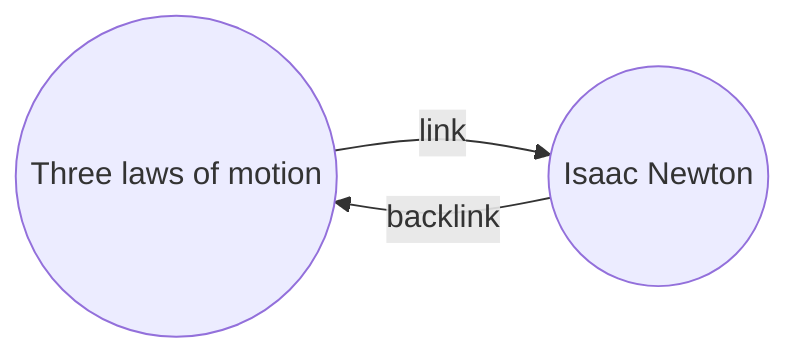

ជាមួយនឹងកម្មវិធីជំនួយ Backlinks អ្នកអាចមើលឃើញ _backlinks_ ទាំងអស់សម្រាប់ចំណាំត្រាដែលកំពុងដំណើរការ។

Backlink សម្រាប់ចំណាំត្រាគឺជាតំណភ្ជាប់ពីចំណាំត្រាមួយផ្សេងទៀតទៅកាន់ចំណាំត្រានោះ។ ក្នុងឧទាហរណ៍ខាងក្រោម កំណត់ត្រា "ច្បាប់បីនៃចលនា" មាន Link ទៅកាន់ចំណាំ "Isaac Newton" ។ Backlink ដែលត្រូវគ្នានឹងភ្ជាប់ពី "Isaac Newton" ត្រលប់ទៅ "Three laws of motion"វិញ។

Backlinks អាចមានប្រយោជន៍ក្នុងការស្វែងរកកំណត់ត្រាដែលយោងកំណត់ត្រាដែលអ្នកកំពុងសរសេរ។ ស្រមៃថាបើអ្នកអាចរាយបញ្ជី backlinks សម្រាប់គេហទំព័រណាមួយនៅលើអ៊ីនធឺណិត។

## ផ្ទាំង Backlinks (Backlinks Pane)

អ្នកអាចមើលឃើញ backlinks ទាំងអស់សម្រាប់កំណត់ត្រាដែលកំពុងដំណើរការពី _backlinks pane_ ។  Backlinks pane មានផ្នែកពីរដែលអាចបង្រួមបាន៖ **Linked mentions** និង Unlinked mentions។

- **Linked mentions** គឺជា backlinks ទៅកំណត់ត្រាដែលមាន Link ខាងក្នុងទៅកំណត់ត្រាដែលកំពុងដំណើរការ។
- **Unlinked mentions** គឺជា backlinks​ ទៅនឹងការកើតឡើងណាមួយនៃ Unlinked នៃឈ្មោះនៃកំណត់ត្រាដែលកំពុងដំណើរការ។

Backlinks pane មានជម្រើសដូចខាងក្រោមៈ

- **Collapse results** ចុចលើវាដើម្បីសម្រេចថាតើត្រូវពង្រីកកំណត់ត្រានីមួយៗ ដើម្បីបង្ហាញពីការលើកឡើងនៅនៃ Backlinks ក្នុងវាឬទេ។
- **Show more context** ចុចលើវាដើម្បីសម្រេចថាតើត្រូវកាត់ឱ្យខ្លី ឬបង្ហាញកថាខណ្ឌពេញលេញដែលមានការលើកឡើងនៃ Backlinks ឬទេ។
- **Change sort order** កំណត់ពីរបៀបតម្រៀបការ​ Mentions។
- **Show search filter** ចុចលើ​ Textfield ដែលអនុញ្ញាតអោយអ្នក filter the Mentions ។ សម្រាប់ព័ត៌មានបន្ថែមអំពីរបៀបបង្កើត​​ Search Query សូមមើល [[ស្វែងរក]]។

## មើល backlinks សម្រាប់កំណត់ត្រា

ដើម្បីមើល backlinks សម្រាប់កំណត់ត្រាដែលកំពុងដំណើរការ។ សូមចុច **Backlinks** (រូប Link និង​ សញ្ញាព្រួញ) នៅក្នុងរបារចំហៀងខាងស្តាំ។

> [!ចំណាំ]
> ប្រសិនបើអ្នកមិនឃើញផ្ទាំង Backlinks អ្នកអាចធ្វើឱ្យវាបង្ហាញខ្លួនឱ្យអ្នកឃើញដោយបើក [[Command palette]] ហើយដំណើរការពាក្យបញ្ជា **Backlinks: Show backlinks pane** ។

## បើក backlinks pane ដែលបានភ្ជាប់

ផ្ទាំងBacklinks បង្ហាញ backlinks សម្រាប់កំណត់ត្រាដែលកំពុងដំណើរការ និងការធ្វើបច្ចុប្បន្នភាព(Update) នៅពេលអ្នកប្តូរទៅកំណត់ត្រាផ្សេងទៀត។ ប្រសិនបើអ្នកចង់ឃើញ backlinks សម្រាប់កំណត់ត្រាជាក់លាក់ណាមួយ ដោយមិនគិតពីថាតើវាកំពុងដំណើរការឬអត់ អ្នកអាចបើកផ្ទាំង backlinks _ដែលបានភ្ជាប់_ ​។

ដើម្បីបើកផ្ទាំង backlinks ដែលបានភ្ជាប់៖

1. បើក [[Command palette]]។
2. ចុចយក **Backlinks: Open backlinks for the current note**។

A separate tab opens next to your active note. The tab shows a link icon to let you know it's linked to a note.
Tab ដាច់ដោយឡែកមួយបើកនៅជាប់នឹងកំណត់ត្រាដែលកំពុងដំណើរមរបស់អ្នក។ Tab នោះបង្ហាញរូបតំណាង Linkមួយ ដើម្បីអោយអ្នកដឹងថាវាត្រូវបានភ្ជាប់ទៅកំណត់ត្រា។

## បង្ហាញ backlinks​ កំណត់ត្រា

ជំនួសឱ្យការបង្ហាញ backlinks នៅក្នុង Tab ដាច់ដោយឡែកមួយ អ្នកអាចបង្ហាញ backlinks នៅផ្នែកខាងក្រោមនៃកំណត់ត្រារបស់អ្នក។

ដើម្បីបង្ហាញ backlinks ក្នុងកំណត់ត្រា៖

1. បើក [[Command palette]]។
2. ចុចយក **Backlinks: Toggle backlinks in document**។ 

ឬបើកដំណើរការ **Backlink in document** នៅក្រោមជម្រើសកម្មវិធីជំនួយ Backlinks (Backlinks Plugin) ដើម្បីបិទបើក backlinks ដោយស្វ័យប្រវត្តិ នៅពេលអ្នកបើកកំណត់ត្រាថ្មី។​