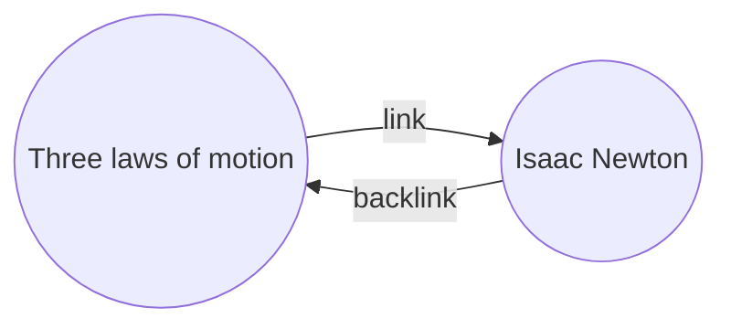

ជាមួយនឹង[[កម្មវិធីជំនួយចម្បង|កម្មវិធីជំនួយ]][[តំណភ្ជាប់ខាងក្រោយ]] អ្នកអាចមើលឃើញ _តំណភ្ជាប់ខាងក្រោយ_ ទាំងអស់សម្រាប់កំណត់ត្រាសកម្ម។

តំណភ្ជាប់ខាងក្រោយសម្រាប់កំណត់ត្រាមួយ គឺជាតំណភ្ជាប់ពីកំណត់ត្រាមួយទៀតទៅកាន់កំណត់ត្រានោះ។ ក្នុងឧទាហរណ៍ខាងក្រោម កំណត់ត្រា "Three laws of motion" មានតំណភ្ជាប់ទៅកាន់កំណត់ត្រា "Isaac Newton"។ តំណភ្ជាប់ខាងក្រោយដែលត្រូវគ្នានឹងភ្ជាប់ពី "Isaac Newton" ត្រឡប់ទៅ "Three laws of motion" វិញ។

តំណភ្ជាប់ខាងក្រោយអាចមានប្រយោជន៍ក្នុងការស្វែងរកកំណត់ត្រាដែលយោងទៅកំណត់ត្រាដែលអ្នកកំពុងសរសេរ។ ចូរស្រមៃថាអ្នកអាចរាយបញ្ជីតំណភ្ជាប់ខាងក្រោយសម្រាប់គេហទំព័រណាមួយនៅលើអ៊ីនធឺណិត។

## បង្ហាញតំណភ្ជាប់ខាងក្រោយ

កម្មវិធីជំនួយតំណភ្ជាប់ខាងក្រោយបង្ហាញតំណភ្ជាប់ខាងក្រោយសម្រាប់ផ្ទាំងសកម្ម។ មានផ្នែកដែលអាចបត់បាន​ពីរ៖ **ការលើកឡើងដែលមានតំណភ្ជាប់** និង **ការលើកឡើងដែលគ្មានតំណភ្ជាប់**។

- **ការលើកឡើងដែលមានតំណភ្ជាប់** គឺជាតំណភ្ជាប់ខាងក្រោយទៅកាន់កំណត់ត្រាដែលមាន​តំណភ្ជាប់ផ្ទៃក្នុងទៅកាន់កំណត់ត្រាសកម្ម។
- **ការលើកឡើងដែលគ្មានតំណភ្ជាប់** គឺជាតំណភ្ជាប់ខាងក្រោយទៅកាន់រាល់ការកើតឡើងដែលគ្មានតំណភ្ជាប់នៃឈ្មោះកំណត់ត្រាសកម្ម។

វាផ្តល់ជម្រើសដូចខាងក្រោម៖

- **បត់លទ្ធផល** បិទបើកថាតើត្រូវពន្លាកំណត់ត្រានីមួយៗដើម្បីបង្ហាញការលើកឡើងនៅក្នុងនោះឬអត់។
- **បង្ហាញបរិបទបន្ថែម** បិទបើកថាតើត្រូវកាត់ឬបង្ហាញកថាខណ្ឌពេញដែលមានការលើកឡើង។
- **ផ្លាស់ប្តូរលំដាប់តម្រៀប** កំណត់រៀបចំការលើកឡើងតាមលំដាប់អ្វី។
- **បង្ហាញតម្រងស្វែងរក** បិទបើកប្រអប់អត្ថបទដែលអនុញ្ញាតឱ្យអ្នកត្រងការលើកឡើង។ សម្រាប់ព័ត៌មានបន្ថែមអំពីរបៀបបង្កើតពាក្យស្វែងរក សូមមើល [[ស្វែងរក]]។

## មើលតំណភ្ជាប់ខាងក្រោយសម្រាប់កំណត់ត្រាមួយ

ដើម្បីមើលតំណភ្ជាប់ខាងក្រោយសម្រាប់កំណត់ត្រាសកម្ម សូមចុចផ្ទាំង **តំណភ្ជាប់ខាងក្រោយ** ![[obsidian-icon-links-coming-in.svg#icon]] នៅក្នុងរបារចំហៀងខាងស្តាំ។

> [!note] ចំណាំ
> ប្រសិនបើអ្នកមើលមិនឃើញផ្ទាំងតំណភ្ជាប់ខាងក្រោយ អ្នកអាចធ្វើឱ្យវាមើលឃើញដោយបើក [[ក្ដារលាយពាក្យបញ្ជា]] ហើយដំណើរការពាក្យបញ្ជា **Backlinks: Show backlinks**។

> [!info] ឯកសារដែលត្រូវបានដកចេញ
> ឯកសារដែលត្រូវគ្នានឹងលំនាំ [[ការកំណត់#Excluded files|ឯកសារដែលត្រូវបានដកចេញ]] របស់អ្នកនឹងមិនបង្ហាញនៅក្នុងការលើកឡើងដែលគ្មានតំណភ្ជាប់ទេ។

## មើលតំណភ្ជាប់ខាងក្រោយរបស់កំណត់ត្រាជាក់លាក់មួយ

ផ្ទាំងតំណភ្ជាប់ខាងក្រោយរាយបញ្ជីតំណភ្ជាប់ខាងក្រោយសម្រាប់កំណត់ត្រាសកម្ម ហើយធ្វើបច្ចុប្បន្នភាពនៅពេលអ្នកប្តូរទៅកំណត់ត្រាផ្សេង។ ប្រសិនបើអ្នកចង់មើលតំណភ្ជាប់ខាងក្រោយសម្រាប់កំណត់ត្រាជាក់លាក់មួយ ដោយមិនគិតថាវាសកម្មឬអត់ អ្នកអាចបើកផ្ទាំងតំណភ្ជាប់ខាងក្រោយដែល _ភ្ជាប់_ រួច។

ដើម្បីបើកផ្ទាំងតំណភ្ជាប់ខាងក្រោយដែលភ្ជាប់រួច៖

1. បើក [[ក្ដារលាយពាក្យបញ្ជា]]។
2. ជ្រើសរើស **Backlinks: Open backlinks for the current note**។

ផ្ទាំងដាច់ដោយឡែកមួយបើកនៅក្បែរកំណត់ត្រាសកម្មរបស់អ្នក។ ផ្ទាំងនេះបង្ហាញរូបតំណាងតំណភ្ជាប់ដើម្បីឱ្យអ្នកដឹងថាវាភ្ជាប់ទៅកំណត់ត្រាមួយ។

## បង្ហាញតំណភ្ជាប់ខាងក្រោយនៅក្នុងកំណត់ត្រា

ជំនួសឱ្យការបង្ហាញតំណភ្ជាប់ខាងក្រោយនៅក្នុងផ្ទាំងដាច់ដោយឡែក អ្នកអាចបង្ហាញតំណភ្ជាប់ខាងក្រោយនៅផ្នែកខាងក្រោមនៃកំណត់ត្រារបស់អ្នក។

ដើម្បីបង្ហាញតំណភ្ជាប់ខាងក្រោយនៅក្នុងកំណត់ត្រា៖

1. បើក [[ក្ដារលាយពាក្យបញ្ជា]]។
2. ជ្រើសរើស **Backlinks: Toggle backlinks in document**។

ឬ បើក **Backlink in document** នៅក្រោមជម្រើសកម្មវិធីជំនួយតំណភ្ជាប់ខាងក្រោយ ដើម្បីបិទបើកតំណភ្ជាប់ខាងក្រោយដោយស្វ័យប្រវត្តិនៅពេលអ្នកបើកកំណត់ត្រាថ្មី។
