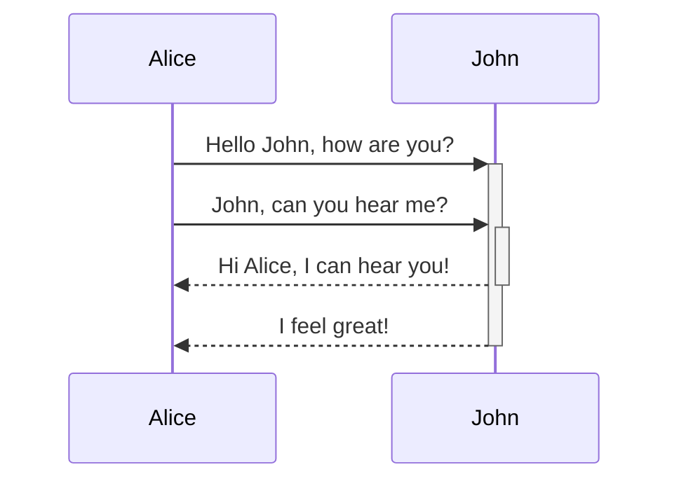
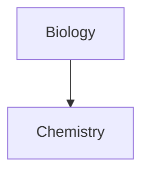

រៀនពីរបៀបបន្ថែមវាក្យសម្ពន្ធទម្រង់កម្រិតខ្ពស់ទៅកំណត់ត្រារបស់អ្នក។

## តារាង

អ្នកអាចបង្កើតតារាងដោយប្រើបន្ទាត់បញ្ឈរ (`|`) ដើម្បីបែងចែកជួរឈរ និងសហសញ្ញា (`-`) ដើម្បីកំណត់ក្បាល។ នេះជាឧទាហរណ៍៖

```md
| First name | Last name |
| ---------- | --------- |
| Max        | Planck    |
| Marie      | Curie     |
```

| First name | Last name |
| ---------- | --------- |
| Max        | Planck    |
| Marie      | Curie     |

ទោះបីជាបន្ទាត់បញ្ឈរនៅផ្នែកម្ខាងនីមួយៗនៃតារាងគឺជាជម្រើសក៏ដោយ ការដាក់បញ្ចូលវាត្រូវបានណែនាំសម្រាប់ភាពងាយអាន។

> [!tip] នៅក្នុង _Live Preview_ អ្នកអាចចុចស្ដាំលើតារាងដើម្បីបន្ថែម ឬលុបជួរឈរ និងជួរដេក។ អ្នកក៏អាចតម្រៀប និងផ្លាស់ទីពួកវាដោយប្រើម៉ឺនុយបរិបទផងដែរ។

អ្នកអាចបញ្ចូលតារាងដោយប្រើពាក្យបញ្ជា **Insert Table** ពី [[ក្ដារលាយពាក្យបញ្ជា]] ឬដោយចុចស្ដាំ និងជ្រើសរើស _Insert → Table_។ នេះនឹងផ្តល់ឱ្យអ្នកនូវតារាងមូលដ្ឋានដែលអាចកែសម្រួលបាន៖

```md
|     |     |
| --- | --- |
|     |     |
```

ចំណាំថាក្រឡាមិនចាំបាច់តម្រឹមឱ្យល្អឥតខ្ចោះទេ ប៉ុន្តែជួរក្បាលត្រូវតែមានសហសញ្ញាយ៉ាងហោចណាស់ពីរ៖

```md
First name | Last name
-- | --
Max | Planck
Marie | Curie
```


### ធ្វើទម្រង់មាតិកានៅក្នុងតារាង

អ្នកអាចប្រើ [[វាក្យសម្ពន្ធទម្រង់មូលដ្ឋាន]] ដើម្បីកែសម្រស់មាតិកានៅក្នុងតារាង។

| ជួរទីមួយ       | ជួរទីពីរ                           |
| ------------------ | --------------------------------------- |
| [[តំណភ្ជាប់ផ្ទៃក្នុង]] | តំណភ្ជាប់ទៅឯកសារ _នៅក្នុង_ **vault** របស់អ្នក។ |
| [[បង្កប់ឯកសារ]]    | ![[Engelbart.jpg\|100]]                 |

> [!note] បន្ទាត់បញ្ឈរនៅក្នុងតារាង
> ប្រសិនបើអ្នកចង់ប្រើ [[ឈ្មោះក្លែងក្លាយ]] ឬ [[វាក្យសម្ពន្ធទម្រង់មូលដ្ឋាន#រូបភាពខាងក្រៅ|ប្តូរទំហំរូបភាព]] នៅក្នុងតារាងរបស់អ្នក អ្នកត្រូវបន្ថែម `\` មុនបន្ទាត់បញ្ឈរ។
>
> ```md
> First column | Second column
> -- | --
> [[វាក្យសម្ពន្ធទម្រង់មូលដ្ឋាន\|វាក្យសម្ពន្ធ Markdown]] | ![[Engelbart.jpg\|200]]
> ```
>
> First column | Second column
> -- | --
> [[វាក្យសម្ពន្ធទម្រង់មូលដ្ឋាន\|វាក្យសម្ពន្ធ Markdown]] | ![[Engelbart.jpg\|200]]

តម្រឹមអត្ថបទក្នុងជួរឈរដោយបន្ថែមសញ្ញាចុចគូ (`:`) ទៅជួរក្បាល។ អ្នកក៏អាចតម្រឹមមាតិកានៅក្នុង _Live Preview_ តាមរយៈម៉ឺនុយបរិបទផងដែរ។

```md
Left-aligned text | Center-aligned text | Right-aligned text
:-- | :--: | --:
Content | Content | Content
```

Left-aligned text | Center-aligned text | Right-aligned text
:-- | :--: | --:
Content | Content | Content

## ដ្យាក្រាម

អ្នកអាចបន្ថែមដ្យាក្រាម និងគំនូសតាងទៅកំណត់ត្រារបស់អ្នក ដោយប្រើ [Mermaid](https://mermaid-js.github.io/)។ Mermaid គាំទ្រដ្យាក្រាមជាច្រើនប្រភេទ ដូចជា [គំនូសតាងលំហូរ](https://mermaid.js.org/syntax/flowchart.html) [ដ្យាក្រាមលំដាប់](https://mermaid.js.org/syntax/sequenceDiagram.html) និង [បន្ទាត់ពេលវេលា](https://mermaid.js.org/syntax/timeline.html)។

> [!tip] គន្លឹះ
> អ្នកក៏អាចសាកល្បង [Live Editor](https://mermaid-js.github.io/mermaid-live-editor) របស់ Mermaid ដើម្បីជួយអ្នកបង្កើតដ្យាក្រាមមុនពេលអ្នកបញ្ចូលពួកវាក្នុងកំណត់ត្រារបស់អ្នក។

ដើម្បីបន្ថែមដ្យាក្រាម Mermaid សូមបង្កើត [[វាក្យសម្ពន្ធទម្រង់មូលដ្ឋាន#ប្លុកកូដ|ប្លុកកូដ]] `mermaid`។

````md

````


````md

````


### តភ្ជាប់ឯកសារក្នុងដ្យាក្រាម

អ្នកអាចបង្កើត [[តំណភ្ជាប់ផ្ទៃក្នុង]] ក្នុងដ្យាក្រាមរបស់អ្នកដោយភ្ជាប់ [class](https://mermaid.js.org/syntax/flowchart.html#classes) `internal-link` ទៅថ្នាំងរបស់អ្នក។

````md

````


> [!note] ចំណាំ
> តំណភ្ជាប់ផ្ទៃក្នុងពីដ្យាក្រាមមិនបង្ហាញនៅក្នុង [[ទិដ្ឋភាពក្រាហ្វ]] ទេ។

ប្រសិនបើអ្នកមានថ្នាំងច្រើននៅក្នុងដ្យាក្រាមរបស់អ្នក អ្នកអាចប្រើស្នីប៉ែតខាងក្រោម។

````md

````

តាមរបៀបនេះ ថ្នាំងអក្សរនីមួយៗក្លាយជាតំណភ្ជាប់ផ្ទៃក្នុង ដោយមាន [អត្ថបទថ្នាំង](https://mermaid.js.org/syntax/flowchart.html#a-node-with-text) ជាអត្ថបទតំណភ្ជាប់។

> [!note] ចំណាំ
> ប្រសិនបើអ្នកប្រើតួអក្សរពិសេសក្នុងឈ្មោះកំណត់ត្រារបស់អ្នក អ្នកត្រូវដាក់ឈ្មោះកំណត់ត្រាក្នុងសញ្ញាដកពីរ។
>
> ```
> class "⨳ special character" internal-link
> ```
>
> ឬ `A["⨳ special character"]`។

សម្រាប់ព័ត៌មានបន្ថែមអំពីការបង្កើតដ្យាក្រាម សូមយោងទៅ [ឯកសារផ្លូវការរបស់ Mermaid](https://mermaid.js.org/intro/)។

## គណិតវិទ្យា

អ្នកអាចបន្ថែមកន្សោមគណិតវិទ្យាទៅកំណត់ត្រារបស់អ្នក ដោយប្រើ [MathJax](http://docs.mathjax.org/en/latest/basic/mathjax.html) និងសញ្ញាណ LaTeX។

ដើម្បីបន្ថែមកន្សោម MathJax ទៅកំណត់ត្រារបស់អ្នក សូមព័ទ្ធវាដោយសញ្ញាដុល្លារគូ (`$$`)។

```md
$$
\begin{vmatrix}a & b\\
c & d
\end{vmatrix}=ad-bc
$$
```

$$
\begin{vmatrix}a & b\\
c & d
\end{vmatrix}=ad-bc
$$

អ្នកក៏អាចបញ្ចូលកន្សោមគណិតវិទ្យាក្នុងបន្ទាត់ដោយព័ទ្ធវាដោយសញ្ញា `$`។

```md
This is an inline math expression $e^{2i\pi} = 1$.
```

This is an inline math expression $e^{2i\pi} = 1$.

សម្រាប់ព័ត៌មានបន្ថែមអំពីវាក្យសម្ពន្ធ សូមយោងទៅ [មេរៀនមូលដ្ឋាន និងឯកសារយោងរហ័សរបស់ MathJax](https://math.meta.stackexchange.com/questions/5020/mathjax-basic-tutorial-and-quick-reference)។

សម្រាប់បញ្ជីកញ្ចប់ MathJax ដែលគាំទ្រ សូមយោងទៅ [បញ្ជីផ្នែកបន្ថែម TeX/LaTeX](http://docs.mathjax.org/en/latest/input/tex/extensions/index.html)។
