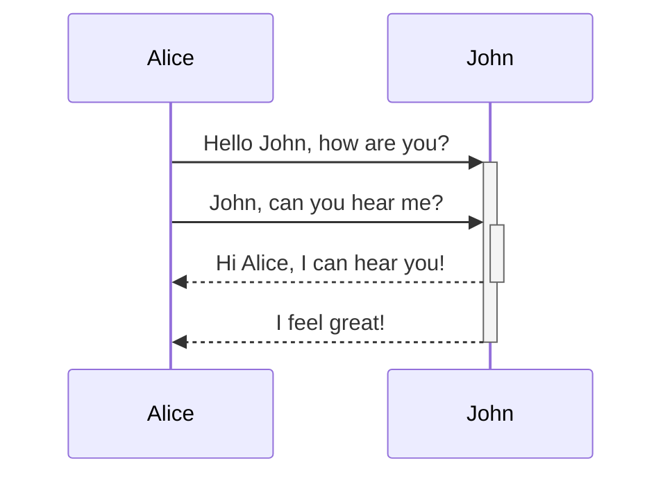
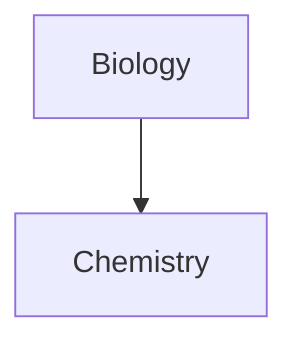

---
aliases:
  - Advanced Markdown
---
고급 포맷팅 구문을 노트에 추가하는 방법을 배우세요.

## Tables

세로 막대기 (`|`)와 하이픈 (`-`)을 사용하여 표를 만들 수 있습니다. 세로 막대기는 열을 나누고, 하이픈은 열 머리글을 정의합니다.

```md
| First name | Last name |
| ---------- | --------- |
| Max        | Planck    |
| Marie      | Curie     |
```

| First name | Last name |
| ---------- | --------- |
| Max        | Planck    |
| Marie      | Curie     |

또한, 표 양쪽의 세로 막대기는 선택 사항입니다.

셀은 열과 완벽하게 정렬되어야 할 필요가 없습니다. 각 머리글 행은 적어도 두 개의 하이픈을 가져야 합니다.

```md
First name | Last name
-- | --
Max | Planck
Marie | Curie
```

### Format content within a table

표 내용에 포맷팅을 적용하려면 [[Basic formatting syntax]]을 사용할 수 있습니다.

First column | Second column
-- | --
[[Internal links]] | Link to a file _within_ your **vault**.
[[Embedding files]] | ![[og-image.png\|200]]

> [!note] Vertical bars in tables
> 표에서 [[Aliases]]을 사용하거나 표에서 이미지를 [[Basic formatting syntax#External images|resize an image]]하려면 세로 막대기 앞에 `\`를 추가해야 합니다.
>
> ```md
> First column | Second column
> -- | --
> [[Basic formatting syntax\|Markdown syntax]] | ![[og-image.png\|200]]
> ```
>
> First column | Second column
> -- | --
> [[Basic formatting syntax\|Markdown syntax]] | ![[og-image.png\|200]]

열의 텍스트를 왼쪽, 가운데 또는 오른쪽으로 정렬하려면 머리글 행에 콜론 (`:`)을 추가하십시오.

```md
Left-aligned text | Center-aligned text | Right-aligned text
:-- | :--: | --:
Content | Content | Content
```

Left-aligned text | Center-aligned text | Right-aligned text
:-- | :--: | --:
Content | Content | Content

## Diagram

[Mermaid](https://mermaid-js.github.io/)를 사용하여 노트에 다이어그램과 차트를 추가할 수 있습니다. Mermaid는 [flow charts](https://mermaid.js.org/syntax/flowchart.html), [sequence diagrams](https://mermaid.js.org/syntax/sequenceDiagram.html),[timelines](https://mermaid.js.org/syntax/timeline.html)과 같은 여러 종류의 다이어그램을 지원합니다.

> [!tip]
> Mermaid의 [Live Editor](https://mermaid-js.github.io/mermaid-live-editor)도 사용해보세요. 이것은 노트에 포함하기 전에 다이어그램을 작성하는 데 도움이 됩니다.

Mermaid 다이어그램을 추가하려면 `mermaid` [[Basic formatting syntax#Code blocks|code block]]을 생성하세요.

````md

````


````md

````


### Linking files in a diagram

노트에서 [[Internal links]]를 다이어그램에 만들려면 노드에 `internal-link` [class](https://mermaid.js.org/syntax/flowchart.html#classes)를 추가하세요.

````md

````


> [!note]
> 다이어그램에서의 내부 링크는 [[Graph view]]에 표시되지 않습니다.

다이어그램에 많은 노드가 있는 경우 다음 스니펫을 사용할 수 있습니다.

````md

````

이렇게 하면 각 문자 노드가 내부 링크로 작동하며 [node text](https://mermaid.js.org/syntax/flowchart.html#a-node-with-text)가 링크 텍스트가 됩니다.

> [!note]
> 노트 이름에 특수 문자를 사용하는 경우, 노트 이름을 큰따옴표로 묶어야 합니다.
>
> ```
> class "⨳ special character" internal-link
> ```
>
> Or, `A["⨳ special character"]`.

더 자세한 다이어그램 작성 정보는 [official Mermaid docs](https://mermaid.js.org/intro/)를 참조하십시오.

## Math

[MathJax](http://docs.mathjax.org/en/latest/basic/mathjax.html) 및 LaTeX 표기법을 사용하여 수식을 노트에 추가할 수 있습니다.

노트에 MathJax 수식을 추가하려면 더블 달러 기호로 둘러싸세요 (`$$`).

```md
$$
\begin{vmatrix}a & b\\
c & d
\end{vmatrix}=ad-bc
$$
```

$$
\begin{vmatrix}a & b\\
c & d
\end{vmatrix}=ad-bc
$$

또한, `$` 기호로 감싸면 인라인 수식으로 추가할 수 있습니다.

```md
이것은 인라인 수식 $e^{2i\pi} = 1$ 입니다.
```

이것은 인라인 수식 $e^{2i\pi} = 1$ 입니다.

더 많은 구문 정보는 [MathJax basic tutorial and quick reference](https://math.meta.stackexchange.com/questions/5020/mathjax-basic-tutorial-and-quick-reference)를 참조하십시오.

지원되는 MathJax 패키지 목록은 [The TeX/LaTeX Extension List](http://docs.mathjax.org/en/latest/input/tex/extensions/index.html)을 참조하십시오.

