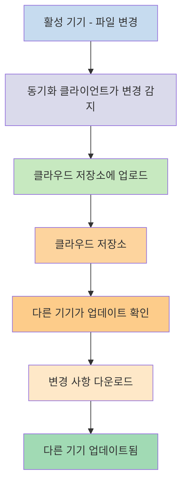
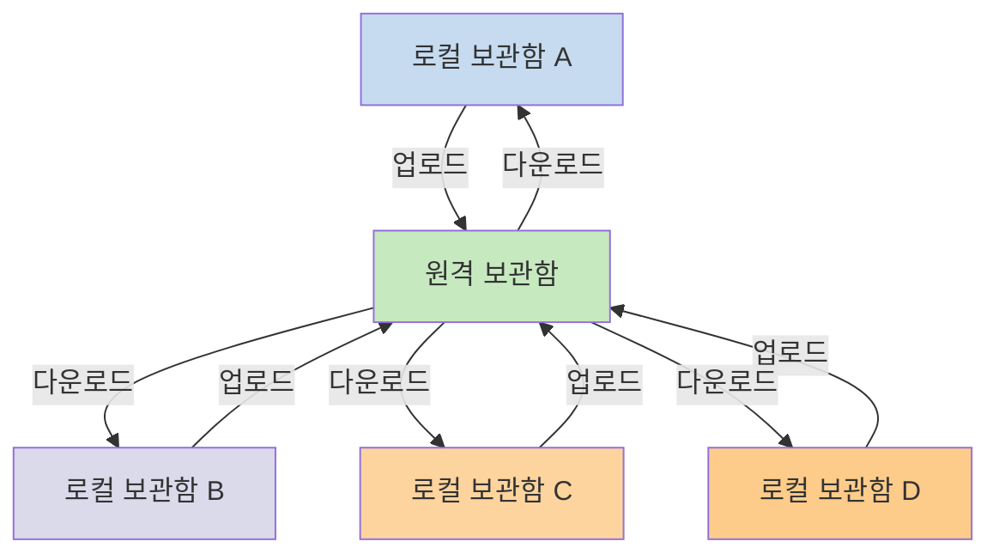

다른 기기에서 노트를 사용하려면 [[기기 간 노트 동기화]]를 활용할 수 있어요. Obsidian은 [[Obsidian Sync 소개|Obsidian Sync]]라는 서비스를 제공하며, 이는 [[기기 간 노트 동기화#iCloud|iCloud]]나 [[기기 간 노트 동기화#OneDrive|OneDrive]] 같은 다른 동기화 서비스와는 다르게 작동해요.

다음은 몇 가지 주요 용어예요:

- **보관함**은 파일 시스템에 있는 폴더로, 노트와 Obsidian 관련 설정이 담긴 `.obsidian` 폴더를 포함해요.
- **로컬 보관함**은 각 기기에 존재하는 보관함의 사본이에요. 동기화 서비스를 사용할 때, 이 로컬 보관함들을 연결하여 동기화를 활성화해요.
- **원격 보관함**은 로컬 보관함이 Obsidian Sync를 통해 직접 연결하는 중앙 집중식 저장소예요.

동기화에는 두 가지 일반적인 접근 방식이 있어요:

- **[[#파일 기반 동기화 서비스]]**: 로컬 보관함이 모니터링되는 폴더 안에 있어야 하며, 파일 시스템을 통해 동기화가 이루어져요
- **[[#Obsidian Sync|원격 보관함]]**: 로컬 보관함이 Obsidian을 통해 직접 연결하는 중앙 집중식 저장소예요

## 파일 기반 동기화 서비스

Dropbox, Google Drive, iCloud, OneDrive와 같은 서비스는 폴더 기반이에요. 이러한 서비스는 특정 폴더를 모니터링하고 그 안에 있는 파일을 자동으로 동기화해요. 파일이 동기화되려면 지정된 클라우드 서비스 폴더 안에 있어야 해요. 파일 기반 동기화 서비스에서는 로컬 보관함이 모니터링되는 또 다른 폴더에 불과해요. 전용 원격 보관함은 없으며, 대신 클라우드 저장소가 중계 역할을 하여 다른 기기의 로컬 보관함 사이에서 파일을 복사해요.

아래 다이어그램은 이러한 서비스가 작동하는 방식을 간략히 보여줘요:

클라우드 서비스에 백그라운드 동기화 기능이 있다면, 파일을 보기 위해 앱을 적극적으로 사용하지 않을 때에도 이러한 프로세스가 진행될 수 있어요. 이러한 서비스는 특정 폴더를 모니터링하고 그 안에 있는 파일을 자동으로 동기화해요. 파일이 동기화되려면 지정된 클라우드 서비스 폴더 안에 있어야 해요.

## Obsidian Sync

Obsidian Sync를 사용하면 [[Obsidian Sync 소개|Obsidian Sync]] 서비스를 통해 중앙 집중식 저장소 역할을 하는 원격 보관함을 생성할 수 있어요. 이를 통해 외장 하드 드라이브, `C:\`, 또는 Android의 앱 저장소 등 어떤 기기의 거의 모든 폴더에 파일을 저장할 수 있어요.

다만, 동일한 기기에서 [[#파일 기반 동기화 서비스]]를 함께 사용하는 경우 로컬 보관함의 권장 위치 목록이 있어요 - 주로 [[Obsidian Sync로 전환하기#타사 동기화 서비스 또는 클라우드 저장소에서 보관함 이동하기|타사 동기화 서비스]] 안이 아닌 곳이면 돼요.

아래 다이어그램은 Obsidian Sync가 작동하는 방식을 간략히 보여줘요:

이 시스템의 강점은 기기 유형이 많아질수록 더 뚜렷해져요. [[#파일 기반 동기화 서비스]]는 운영체제마다 일관성 없이 구현될 수 있으며, 모바일 기기에는 앱의 샌드박싱과 전력 제한에 대한 고유한 규칙이 있어 기존 파일 기반 서비스가 원활하게 작동하기 어려워요.

Obsidian Sync는 앱을 통해 직접 동기화를 처리하므로, 기기 유형이나 운영체제 제한에 관계없이 일관된 동작을 제공하면서 데이터의 로컬 사본을 [[Obsidian 파일 백업|소프트 백업]]으로 유지하는 것을 우선시해요.

### 동기화 동작

로컬 보관함의 파일을 변경하면 Obsidian Sync가 이러한 변경을 감지하여 원격 보관함에 업로드해요. 동일한 원격 보관함에 연결된 다른 기기는 이 변경 사항을 다운로드하여 자신의 로컬 보관함에 적용해요. Obsidian Sync는 파일 수준에서 변경 사항을 추적하며, 전체 폴더를 동기화하는 대신 수정된 파일만 전송해요. 이를 통해 대역폭 사용량과 동기화 시간을 줄여요.

충돌이 발생하거나 어떤 파일을 동기화할지 제어해야 할 때, Obsidian Sync는 이러한 상황을 처리하기 위한 특정 메커니즘을 제공해요:

![[Obsidian Sync 문제 해결#충돌 해결|충돌 해결]]

![[동기화 설정 및 선택적 동기화#선택적 동기화#동기화에서 폴더 제외]]

### 오프라인 동작

오프라인 상태에서 변경한 사항은 대기열에 추가되며, 기기가 인터넷에 다시 연결되고 Obsidian이 열려 있을 때 자동으로 동기화돼요. 오프라인 기간 동안에도 로컬 보관함은 완전히 정상적으로 작동해요.

## 다음 단계

- [[Obsidian Sync 설정하기]]를 통해 원격 보관함을 시작하세요.
- 현재 파일 기반 동기화를 사용 중이고 Obsidian Sync를 사용하려면 [[Obsidian Sync로 전환하기]]를 참고하세요.
- 아직 결정 중이라면 [[기기 간 노트 동기화|다른 동기화 옵션 살펴보기]]를 확인하세요.
