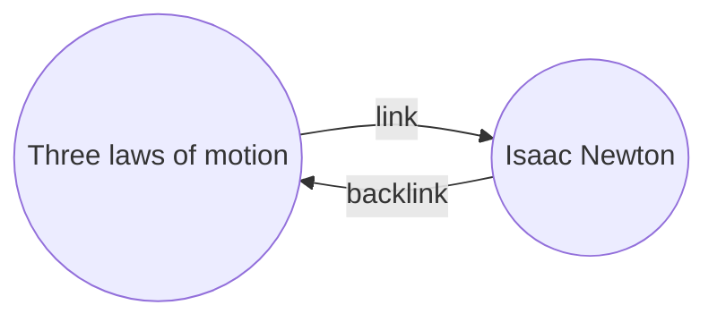

Backlinks 플러그인을 사용하면 활성 노트의 모든 _백링크_를 볼 수 있습니다.

노트의 백링크는 다른 노트에서 해당 노트로의 링크를 의미합니다. 다음 예에서 "Three laws of motion" 노트는 "Isaac Newton" 노트로의 링크를 포함하고 있습니다. 해당 백링크는 "Isaac Newton"에서 "Three laws of motion"으로의 링크를 나타내게 됩니다.

백링크는 작성 중인 노트를 참조하는 노트를 찾는 데 유용합니다. 인터넷 상의 모든 웹 사이트의 백링크 목록을 볼 수 있다면 상상해보십시오.

## Show backlinks

Backlinks 플러그인은 활성 탭의 백링크를 표시합니다. 두 가지 접는 섹션이 있습니다: **링크된 언급**과 **링크되지 않은 언급**.

- **링크된 언급**은 활성 노트에 대한 내부 링크를 포함하는 노트로의 백링크입니다.
- **링크되지 않은 언급**은 활성 노트의 이름이 나타난 어떠한 내부 링크되지 않은 발생에 대한 백링크입니다.

다음 옵션을 제공합니다:

- **결과 접기**는 각 노트를 확장하여 언급 내용을 표시할지 여부를 전환합니다.
- **더 많은 맥락 표시**는 언급을 포함하는 전체 단락을 자르거나 표시할지 여부를 전환합니다.
- **정렬 순서 변경**은 언급을 어떻게 정렬할지 결정합니다.
- **검색 필터 표시**는 언급을 필터링하는 데 사용되는 텍스트 필드를 전환합니다. 검색 쿼리를 작성하는 방법에 대한 자세한 정보는 [[Search]]를 참조하십시오.

## View backlinks for a note

활성 노트의 백링크를 보려면 오른쪽 사이드바의 **백링크** (링크와 화살표 아이콘) 탭을 클릭하십시오.

> [!note]
> 백링크 탭을 볼 수 없다면, [[Command palette|명령어 팔레트]]를 열고 **백링크: 백링크 표시** 명령을 실행하여 표시할 수 있습니다.

## See backlinks of a specific note

백링크 탭은 활성 노트의 백링크를 나열하고, 다른 노트로 전환할 때 업데이트됩니다. 특정 노트의 백링크를 보려면 해당 노트가 활성 노트인지 여부에 관계없이 _연결된_ 백링크 탭을 열 수 있습니다.

연결된 백링크 탭을 열려면:

1. [[Command palette|명령어 팔레트]]를 엽니다.
2. **백링크: 현재 파일의 백링크 열기**를 선택하십시오.

A separate tab opens next to your active note. The tab shows a link icon to let you know it's linked to a note.

## Show backlinks in a note

백링크를 별도의 탭에 표시하는 대신 노트 하단에 백링크를 표시할 수 있습니다.

노트에서 백링크를 표시하려면:

1. [[Command palette|명령어 팔레트]]를 엽니다.
2. **백링크: 문서 내 백링크 토글**을 선택하십시오.

또는, 새 노트를 열 때 백링크를 자동으로 토글하도록 하려면 Backlinks 플러그인 옵션 아래에서 **문서 내 백링크 토글**을 활성화하십시오.
