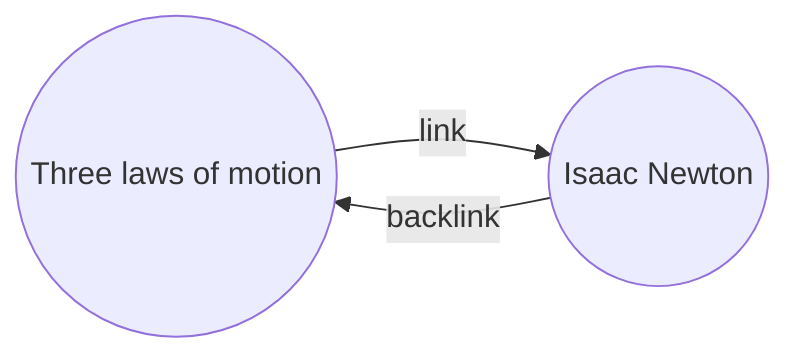

[[백링크]] [[코어 플러그인|플러그인]]을 사용하면 활성 노트의 모든 _백링크_를 확인할 수 있어요.

노트의 백링크는 다른 노트에서 해당 노트로 향하는 링크예요. 다음 예시에서 "운동의 세 가지 법칙" 노트는 "아이작 뉴턴" 노트로의 링크를 포함하고 있어요. 이에 대응하는 백링크는 "아이작 뉴턴"에서 "운동의 세 가지 법칙"으로 되돌아가는 링크가 돼요.

백링크는 작성 중인 노트를 참조하는 노트를 찾는 데 유용할 수 있어요. 인터넷의 모든 웹사이트에 대한 백링크를 나열할 수 있다고 상상해 보세요.

## 백링크 보기

백링크 플러그인은 활성 탭의 백링크를 표시해요. **링크된 언급**과 **링크되지 않은 호출** 두 개의 접을 수 있는 섹션이 있어요.

- **링크된 언급**은 활성 노트로의 내부 링크를 포함하는 노트에 대한 백링크예요.
- **링크되지 않은 호출**은 활성 노트 이름이 링크 없이 언급된 모든 경우에 대한 백링크예요.

다음 옵션을 제공해요:

- **결과 더 작게 표시**는 각 노트를 펼쳐서 그 안의 언급을 표시할지 여부를 전환해요.
- **내용 더 길게 표시하기**는 언급이 포함된 전체 문단을 표시할지 또는 잘라서 보여줄지를 전환해요.
- **정렬 순서 변경**은 언급을 정렬하는 방법을 결정해요.
- **검색 필터 보기**는 언급을 필터링할 수 있는 텍스트 필드를 전환해요. 검색어를 작성하는 방법에 대한 자세한 내용은 [[검색]]을 참조하세요.

## 노트의 백링크 보기

활성 노트의 백링크를 보려면 오른쪽 사이드바에서 **백링크** ![[obsidian-icon-links-coming-in.svg#icon]] 탭을 클릭하세요.

> [!note] 참고
> 백링크 탭이 보이지 않는 경우, [[명령어 팔레트]]를 열고 **백링크: 백링크 보기** 명령을 실행하여 표시할 수 있어요.

> [!info] 제외하는 파일
> [[설정#제외하는 파일|제외하는 파일]] 패턴과 일치하는 파일은 링크되지 않은 호출에 표시되지 않아요.

## 특정 노트의 백링크 보기

백링크 탭은 활성 노트의 백링크를 나열하며 다른 노트로 전환하면 업데이트돼요. 활성 상태 여부에 관계없이 특정 노트의 백링크를 보려면 _연결된_ 백링크 탭을 열 수 있어요.

연결된 백링크 탭을 열려면:

1. [[명령어 팔레트]]를 열어요.
2. **백링크: 현재 파일의 백링크 열기**를 선택해요.

활성 노트 옆에 별도의 탭이 열려요. 이 탭은 노트에 연결되어 있음을 알려주는 링크 아이콘을 표시해요.

## 노트에서 백링크 표시

별도의 탭에 백링크를 표시하는 대신 노트 하단에 백링크를 표시할 수 있어요.

노트에서 백링크를 표시하려면:

1. [[명령어 팔레트]]를 열어요.
2. **백링크: 현재 파일의 백링크 활성화/비활성화**를 선택해요.

또는 백링크 플러그인 옵션에서 **문서 내 백링크**를 활성화하면 새 노트를 열 때 자동으로 백링크를 전환해요.
