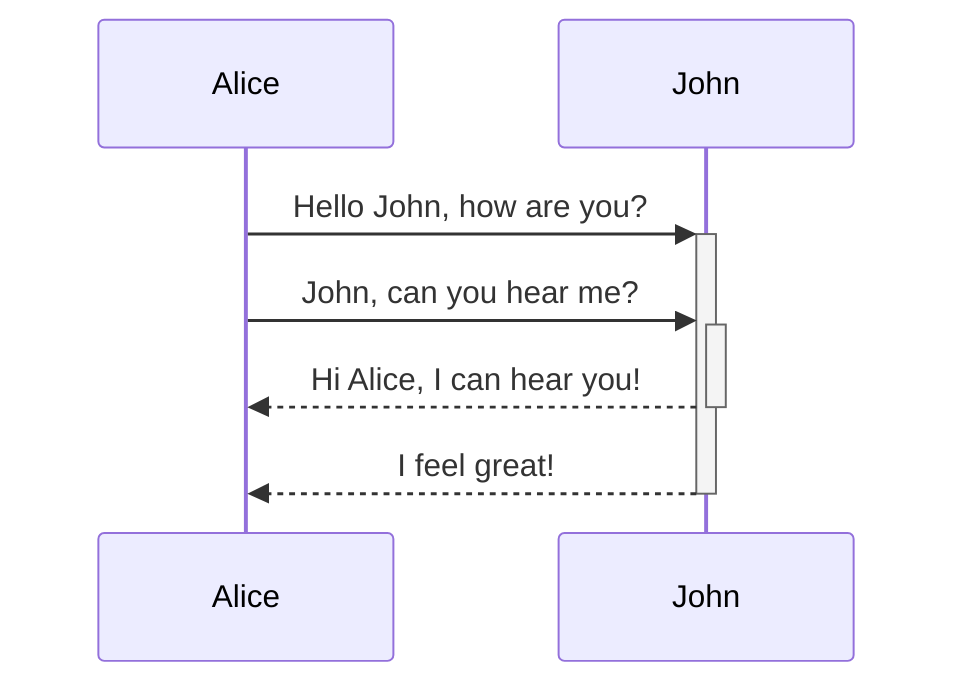
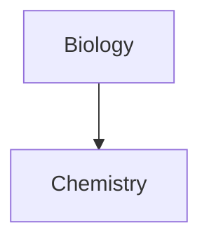

노트에 고급 서식 구문을 추가하는 방법을 알아보세요.

## 표

세로 막대(`|`)로 열을 구분하고 하이픈(`-`)으로 헤더를 정의하여 표를 만들 수 있습니다. 다음은 예시입니다:

```md
| First name | Last name |
| ---------- | --------- |
| Max        | Planck    |
| Marie      | Curie     |
```

| First name | Last name |
| ---------- | --------- |
| Max        | Planck    |
| Marie      | Curie     |

표 양쪽의 세로 막대는 선택 사항이지만, 가독성을 위해 포함하는 것을 권장합니다.

> [!tip] _실시간 미리보기_에서 표를 마우스 오른쪽 버튼으로 클릭하여 열과 행을 추가하거나 삭제할 수 있습니다. 컨텍스트 메뉴를 사용하여 정렬하거나 이동할 수도 있습니다.

**표 삽입** 명령을 [[명령어 팔레트]]에서 사용하거나, 마우스 오른쪽 버튼을 클릭하고 _삽입 → 표_를 선택하여 표를 삽입할 수 있습니다. 이렇게 하면 기본적인 편집 가능한 표가 만들어집니다:

```md
|     |     |
| --- | --- |
|     |     |
```

셀이 완벽하게 정렬될 필요는 없지만, 헤더 행에는 최소 두 개의 하이픈이 포함되어야 합니다:

```md
First name | Last name
-- | --
Max | Planck
Marie | Curie
```


### 표 안의 콘텐츠 서식 지정

[[기본 서식 구문]]을 사용하여 표 안의 콘텐츠에 스타일을 적용할 수 있습니다.

| 첫 번째 열             | 두 번째 열                                |
| ------------------ | --------------------------------------- |
| [[내부 링크]] | **보관함** _내의_ 파일로 링크합니다. |
| [[파일 임베드]]    | ![[Engelbart.jpg\|100]]                 |

> [!note] 표에서의 세로 막대
> 표에서 [[별칭]]을 사용하거나, [[기본 서식 구문#외부 이미지|이미지 크기를 조정]]하려면 세로 막대 앞에 `\`를 추가해야 합니다.
>
> ```md
> First column | Second column
> -- | --
> [[기본 서식 구문\|Markdown 구문]] | ![[Engelbart.jpg\|200]]
> ```
>
> First column | Second column
> -- | --
> [[기본 서식 구문\|Markdown 구문]] | ![[Engelbart.jpg\|200]]

헤더 행에 콜론(`:`)을 추가하여 열의 텍스트 정렬을 설정할 수 있습니다. _실시간 미리보기_에서 컨텍스트 메뉴를 통해서도 콘텐츠를 정렬할 수 있습니다.

```md
Left-aligned text | Center-aligned text | Right-aligned text
:-- | :--: | --:
Content | Content | Content
```

Left-aligned text | Center-aligned text | Right-aligned text
:-- | :--: | --:
Content | Content | Content

## 다이어그램

[Mermaid](https://mermaid-js.github.io/)를 사용하여 노트에 다이어그램과 차트를 추가할 수 있습니다. Mermaid는 [플로우차트](https://mermaid.js.org/syntax/flowchart.html), [시퀀스 다이어그램](https://mermaid.js.org/syntax/sequenceDiagram.html), [타임라인](https://mermaid.js.org/syntax/timeline.html) 등 다양한 다이어그램을 지원합니다.

> [!tip] 팁
> 노트에 포함하기 전에 Mermaid의 [라이브 에디터](https://mermaid-js.github.io/mermaid-live-editor)를 사용하여 다이어그램을 미리 만들어 볼 수도 있습니다.

Mermaid 다이어그램을 추가하려면 `mermaid` [[기본 서식 구문#코드 블록|코드 블록]]을 만드세요.

````md

````


````md

````


### 다이어그램에서 파일 연결하기

노드에 `internal-link` [클래스](https://mermaid.js.org/syntax/flowchart.html#classes)를 추가하여 다이어그램에서 [[내부 링크]]를 만들 수 있습니다.

````md

````


> [!note] 참고
> 다이어그램의 내부 링크는 [[그래프 뷰]]에 표시되지 않습니다.

다이어그램에 노드가 많은 경우, 다음 스니펫을 사용할 수 있습니다.

````md

````

이렇게 하면 각 문자 노드가 내부 링크가 되며, [노드 텍스트](https://mermaid.js.org/syntax/flowchart.html#a-node-with-text)가 링크 텍스트로 사용됩니다.

> [!note] 참고
> 노트 이름에 특수 문자를 사용하는 경우, 노트 이름을 큰따옴표로 감싸야 합니다.
>
> ```
> class "⨳ special character" internal-link
> ```
>
> 또는 `A["⨳ special character"]`와 같이 사용합니다.

다이어그램 만들기에 대한 자세한 내용은 [공식 Mermaid 문서](https://mermaid.js.org/intro/)를 참조하세요.

## 수식

[MathJax](http://docs.mathjax.org/en/latest/basic/mathjax.html)와 LaTeX 표기법을 사용하여 노트에 수학 표현식을 추가할 수 있습니다.

노트에 MathJax 표현식을 추가하려면 이중 달러 기호(`$$`)로 감싸세요.

```md
$$
\begin{vmatrix}a & b\\
c & d
\end{vmatrix}=ad-bc
$$
```

$$
\begin{vmatrix}a & b\\
c & d
\end{vmatrix}=ad-bc
$$

`$` 기호로 감싸서 인라인 수학 표현식을 사용할 수도 있습니다.

```md
인라인 수학 표현식입니다 $e^{2i\pi} = 1$.
```

인라인 수학 표현식입니다 $e^{2i\pi} = 1$.

구문에 대한 자세한 내용은 [MathJax 기본 튜토리얼 및 빠른 참조](https://math.meta.stackexchange.com/questions/5020/mathjax-basic-tutorial-and-quick-reference)를 참조하세요.

지원되는 MathJax 패키지 목록은 [TeX/LaTeX 확장 목록](http://docs.mathjax.org/en/latest/input/tex/extensions/index.html)을 참조하세요.
