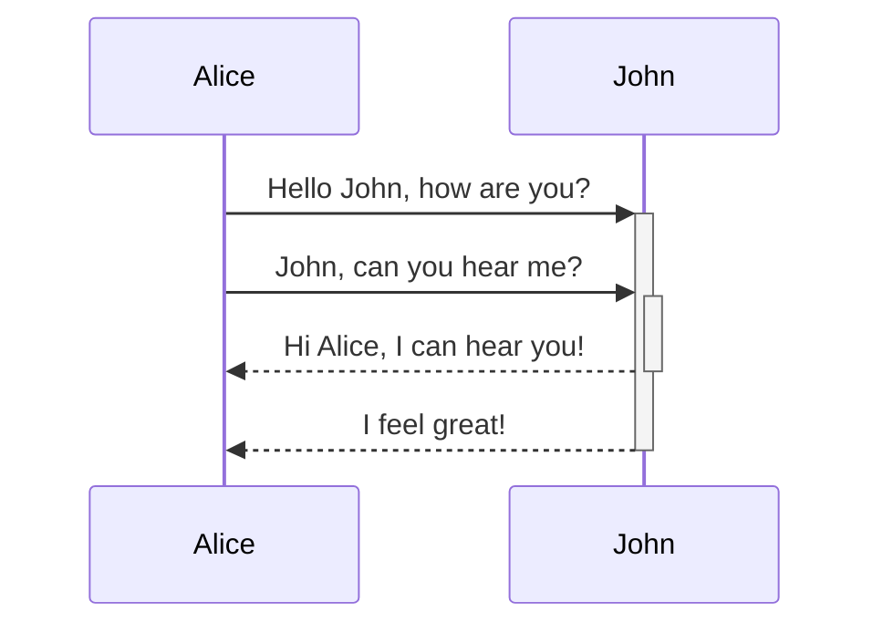
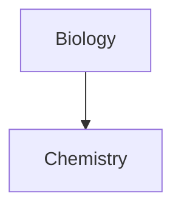

Leer hoe je geavanceerde opmaaksyntaxis aan je notities kunt toevoegen.

## Tabellen

Je kunt tabellen maken met verticale strepen (`|`) om kolommen te scheiden en koppeltekens (`-`) om koppen te definiëren. Hier is een voorbeeld:

```md
| Voornaam | Achternaam |
| -------- | ---------- |
| Max      | Planck     |
| Marie    | Curie      |
```

| Voornaam | Achternaam |
| -------- | ---------- |
| Max      | Planck     |
| Marie    | Curie      |

Hoewel de verticale strepen aan weerszijden van de tabel optioneel zijn, wordt het voor de leesbaarheid aanbevolen om ze op te nemen.

> [!tip] In _Live voorbeeld_ kun je met de rechtermuisknop op een tabel klikken om kolommen en rijen toe te voegen of te verwijderen. Je kunt ze ook sorteren en verplaatsen via het contextmenu.

Je kunt een tabel invoegen met de opdracht **Tabel invoegen** vanuit het [[Opdrachtenpaneel|opdrachtenpalet]] of door met de rechtermuisknop te klikken en _Invoegen → Tabel_ te selecteren. Dit geeft je een eenvoudige, bewerkbare tabel:

```md
|     |     |
| --- | --- |
|     |     |
```

Let op: cellen hoeven niet perfect uitgelijnd te zijn, maar de koprij moet minstens twee koppeltekens bevatten:

```md
Voornaam | Achternaam
-- | --
Max | Planck
Marie | Curie
```


### Inhoud binnen een tabel opmaken

Je kunt [[Basis opmaaksyntaxis|basis opmaaksyntaxis]] gebruiken om inhoud binnen een tabel op te maken.

| Eerste kolom                | Tweede kolom                                      |
| --------------------------- | ------------------------------------------------- |
| [[Interne koppelingen]]     | Koppeling naar een bestand _binnen_ je **kluis**. |
| [[Bestanden insluiten]]     | ![[Engelbart.jpg\|100]]                           |

> [!note] Verticale strepen in tabellen
> Als je [[Aliassen|aliassen]] wilt gebruiken, of een [[Basis opmaaksyntaxis#Externe afbeeldingen|afbeelding wilt verkleinen]] in je tabel, moet je een `\` voor de verticale streep plaatsen.
>
> ```md
> Eerste kolom | Tweede kolom
> -- | --
> [[Basis opmaaksyntaxis\|Markdown-syntaxis]] | ![[Engelbart.jpg\|200]]
> ```
>
> Eerste kolom | Tweede kolom
> -- | --
> [[Basis opmaaksyntaxis\|Markdown-syntaxis]] | ![[Engelbart.jpg\|200]]

Lijn tekst in kolommen uit door dubbele punten (`:`) aan de koprij toe te voegen. Je kunt inhoud in _Live voorbeeld_ ook uitlijnen via het contextmenu.

```md
Links uitgelijnde tekst | Gecentreerde tekst | Rechts uitgelijnde tekst
:-- | :--: | --:
Inhoud | Inhoud | Inhoud
```

Links uitgelijnde tekst | Gecentreerde tekst | Rechts uitgelijnde tekst
:-- | :--: | --:
Inhoud | Inhoud | Inhoud

## Diagrammen

Je kunt diagrammen en grafieken aan je notities toevoegen met behulp van [Mermaid](https://mermaid-js.github.io/). Mermaid ondersteunt diverse diagrammen, zoals [stroomdiagrammen](https://mermaid.js.org/syntax/flowchart.html), [sequentiediagrammen](https://mermaid.js.org/syntax/sequenceDiagram.html) en [tijdlijnen](https://mermaid.js.org/syntax/timeline.html).

> [!tip] Tip
> Je kunt ook Mermaids [Live Editor](https://mermaid-js.github.io/mermaid-live-editor) proberen om diagrammen te maken voordat je ze in je notities opneemt.

Om een Mermaid-diagram toe te voegen, maak je een `mermaid` [[Basis opmaaksyntaxis#Codeblokken|codeblok]] aan.

````md

````


````md

````


### Bestanden koppelen in een diagram

Je kunt [[Interne koppelingen|interne koppelingen]] in je diagrammen maken door de `internal-link` [class](https://mermaid.js.org/syntax/flowchart.html#classes) aan je knooppunten toe te voegen.

````md

````


> [!note] Opmerking
> Interne koppelingen vanuit diagrammen worden niet weergegeven in de [[Grafiek weergave]].

Als je veel knooppunten in je diagrammen hebt, kun je het volgende snippet gebruiken.

````md

````

Op deze manier wordt elk letterknooppunt een interne koppeling, met de [knooppunttekst](https://mermaid.js.org/syntax/flowchart.html#a-node-with-text) als koppelingstekst.

> [!note] Opmerking
> Als je speciale tekens in je notitienamen gebruikt, moet je de notitienaam tussen dubbele aanhalingstekens plaatsen.
>
> ```
> class "⨳ special character" internal-link
> ```
>
> Of, `A["⨳ special character"]`.

Voor meer informatie over het maken van diagrammen, raadpleeg de [officiële Mermaid-documentatie](https://mermaid.js.org/intro/).

## Wiskunde

Je kunt wiskundige uitdrukkingen aan je notities toevoegen met behulp van [MathJax](http://docs.mathjax.org/en/latest/basic/mathjax.html) en LaTeX-notatie.

Om een MathJax-uitdrukking aan je notitie toe te voegen, omsluit je deze met dubbele dollartekens (`$$`).

```md
$$
\begin{vmatrix}a & b\\
c & d
\end{vmatrix}=ad-bc
$$
```

$$
\begin{vmatrix}a & b\\
c & d
\end{vmatrix}=ad-bc
$$

Je kunt wiskundige uitdrukkingen ook inline plaatsen door ze met `$`-symbolen te omgeven.

```md
Dit is een inline wiskundige uitdrukking $e^{2i\pi} = 1$.
```

Dit is een inline wiskundige uitdrukking $e^{2i\pi} = 1$.

Voor meer informatie over de syntaxis, raadpleeg [MathJax basic tutorial and quick reference](https://math.meta.stackexchange.com/questions/5020/mathjax-basic-tutorial-and-quick-reference).

Voor een lijst met ondersteunde MathJax-pakketten, raadpleeg [The TeX/LaTeX Extension List](http://docs.mathjax.org/en/latest/input/tex/extensions/index.html).
