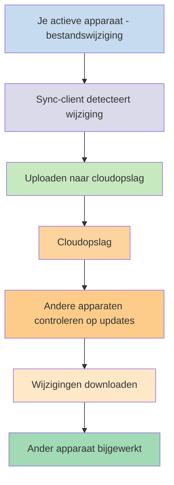
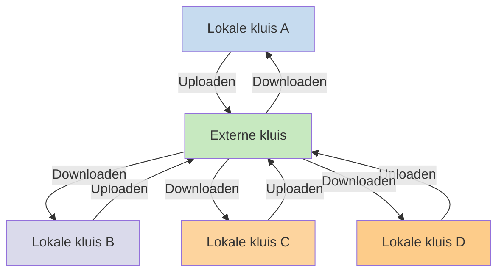

Als je je notities op verschillende apparaten wilt gebruiken, is een van de mogelijkheden om je [[Notities synchroniseren tussen apparaten|notities tussen apparaten te synchroniseren]]. Obsidian biedt een dergelijke dienst aan, [[Introductie tot Obsidian Sync|Obsidian Sync]], die anders werkt dan andere synchronisatiediensten, zoals [[Notities synchroniseren tussen apparaten#iCloud|iCloud]] en [[Notities synchroniseren tussen apparaten#OneDrive|OneDrive]].

Hier zijn enkele belangrijke termen:

- Een **kluis** is een map in je bestandssysteem die notities bevat en een `.obsidian`-map met Obsidian-specifieke configuratie.
- Een **lokale kluis** is de kopie van je kluis die op elk van je apparaten bestaat. Bij het gebruik van synchronisatiediensten verbind je deze lokale kluizen om synchronisatie mogelijk te maken.
- Een **externe kluis** is gecentraliseerde opslag waarmee lokale kluizen rechtstreeks verbinding maken via Obsidian Sync.

Er zijn twee veelvoorkomende benaderingen voor synchronisatie:

- **[[#Bestandsgebaseerde synchronisatiediensten]]**: Lokale kluizen moeten zich in gemonitorde mappen bevinden, synchronisatie vindt plaats via het bestandssysteem
- **[[#Obsidian Sync|Externe kluizen]]**: Gecentraliseerde opslag waarmee lokale kluizen rechtstreeks verbinding maken via Obsidian

## Bestandsgebaseerde synchronisatiediensten

Diensten zoals Dropbox, Google Drive, iCloud en OneDrive zijn mapgebaseerd. Deze diensten monitoren specifieke mappen en synchroniseren automatisch alle bestanden die erin worden geplaatst. Bestanden moeten zich in de aangewezen clouddienst-mappen bevinden om te synchroniseren. Bij bestandsgebaseerde synchronisatiediensten fungeert je lokale kluis als gewoon een andere gemonitorde map. Er is geen speciale externe kluis - in plaats daarvan dient de cloudopslag als doorgeefluik, waarbij bestanden tussen lokale kluizen op verschillende apparaten worden gekopieerd.

Het onderstaande diagram toont een vereenvoudigde versie van hoe deze diensten werken:

Als de clouddienst achtergrondsynchronisatie heeft, kunnen sommige van deze processen plaatsvinden zelfs wanneer je de applicaties niet actief gebruikt om de bestanden te bekijken. Deze diensten monitoren specifieke mappen en synchroniseren automatisch alle bestanden die erin worden geplaatst. Bestanden moeten zich in de aangewezen clouddienst-mappen bevinden om te synchroniseren.

## Obsidian Sync

Obsidian Sync stelt je in staat een externe kluis aan te maken die als gecentraliseerde opslag dient via de [[Introductie tot Obsidian Sync|Obsidian Sync]]-dienst. Hierdoor kun je bijna elke map op elk van je apparaten kiezen om je bestanden op te slaan - of het nu op een externe harde schijf is, in `C:\`, of in appopslag op Android.

We hebben echter een lijst met aanbevolen locaties voor je lokale kluis als je ook [[#Bestandsgebaseerde synchronisatiediensten]] op hetzelfde apparaat gebruikt - voornamelijk overal dat niet in een [[Overstappen naar Obsidian Sync#Verplaats je kluis uit je synchronisatiedienst van derden of cloudopslag|synchronisatiedienst van derden]] zit.

Het onderstaande diagram toont een vereenvoudigde versie van hoe Obsidian Sync werkt:

De kracht van dit systeem wordt duidelijker naarmate je meer apparaattypen gebruikt. [[#Bestandsgebaseerde synchronisatiediensten]] kunnen inconsistent geïmplementeerd zijn over verschillende besturingssystemen, en mobiele apparaten hebben hun eigen regels voor hoe applicaties kunnen worden gesandboxed en in stroomverbruik beperkt, wat het veel moeilijker maakt voor traditionele bestandsgebaseerde diensten om naadloos te werken.

Met Obsidian Sync handelt de dienst synchronisatie rechtstreeks via de applicatie af, wat consistent gedrag biedt ongeacht apparaattype of beperkingen van het besturingssysteem, terwijl het prioriteit geeft aan het bewaren van een lokale kopie van je gegevens als [[Back-up maken van je Obsidian-bestanden|zachte back-up]].

### Synchronisatiegedrag

Wanneer je wijzigingen aanbrengt in bestanden in je lokale kluis, detecteert Obsidian Sync deze wijzigingen en uploadt ze naar de externe kluis. Andere apparaten die verbonden zijn met dezelfde externe kluis downloaden vervolgens deze wijzigingen en passen ze toe op hun lokale kluizen. Obsidian Sync houdt wijzigingen bij op bestandsniveau en draagt alleen de bestanden over die zijn gewijzigd, in plaats van hele mappen te synchroniseren. Dit vermindert bandbreedtegebruik en synchronisatietijd.

Wanneer er conflicten optreden of wanneer je wilt bepalen welke bestanden worden gesynchroniseerd, biedt Obsidian Sync specifieke mechanismen om deze situaties af te handelen:

![[Problemen oplossen met Obsidian Sync#Conflictoplossing|Conflictoplossing]]

![[Sync-instellingen en selectieve synchronisatie#Selectieve synchronisatie#Een map uitsluiten van synchronisatie]]

### Offlinegedrag

Wijzigingen die offline worden gemaakt, worden in een wachtrij geplaatst en automatisch gesynchroniseerd wanneer je apparaat opnieuw verbinding maakt met internet en Obsidian geopend is. Je lokale kluis blijft volledig functioneel tijdens offlineperioden.

## Volgende stappen

- [[Obsidian Sync instellen]] om aan de slag te gaan met externe kluizen.
- [[Overstappen naar Obsidian Sync]] als je momenteel bestandsgebaseerde synchronisatie gebruikt en Obsidian Sync wilt gebruiken.
- [[Notities synchroniseren tussen apparaten|Andere synchronisatieopties verkennen]] als je nog aan het beslissen bent.
