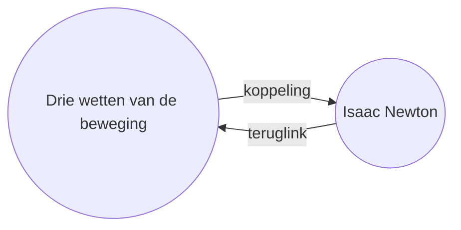

Met de [[Ingebouwde plug-ins|plug-in]] Terugverwijzing kun je alle _teruglinks_ voor de actieve notitie bekijken.

Een teruglink voor een notitie is een koppeling vanuit een andere notitie naar die notitie. In het volgende voorbeeld bevat de notitie "Drie wetten van de beweging" een koppeling naar de notitie "Isaac Newton". De bijbehorende teruglink zou van "Isaac Newton" terugverwijzen naar "Drie wetten van de beweging".

Teruglinks kunnen nuttig zijn om notities te vinden die verwijzen naar de notitie die je aan het schrijven bent. Stel je voor dat je de teruglinks voor elke website op internet zou kunnen bekijken.

## Terugverwijzingen tonen

De Terugverwijzing-plug-in toont de teruglinks voor de actieve tabbladen. Er zijn twee inklapbare secties: **Gelinkte vermeldingen** en **Ongelinkte vermeldingen**.

- **Gelinkte vermeldingen** zijn teruglinks naar notities die een interne koppeling naar de actieve notitie bevatten.
- **Ongelinkte vermeldingen** zijn teruglinks naar elke niet-gekoppelde vermelding van de naam van de actieve notitie.

De plug-in biedt de volgende opties:

- **Resultaten samenvouwen** schakelt in of elke notitie wordt uitgevouwen om de vermeldingen erin weer te geven.
- **Toon meer context** schakelt in of de volledige alinea met de vermelding wordt weergegeven of ingekort.
- **Sorteervolgorde aanpassen** bepaalt hoe de vermeldingen worden gesorteerd.
- **Toon zoekfilter** schakelt een tekstveld in waarmee je de vermeldingen kunt filteren. Raadpleeg [[Zoeken]] voor meer informatie over het opbouwen van een zoekterm.

## Terugverwijzingen bekijken voor een notitie

Om de teruglinks voor de actieve notitie te bekijken, klik je op het tabblad **Terugverwijzing** ![[obsidian-icon-links-coming-in.svg#icon]] in de rechter zijbalk.

> [!note] Opmerking
> Als je het tabblad Terugverwijzing niet kunt zien, kun je het zichtbaar maken door het [[Opdrachtenpaneel]] te openen en de opdracht **Terugverwijzing: Toon terugverwijzingen** uit te voeren.

> [!info] Uitgesloten bestanden
> Bestanden die overeenkomen met je patronen voor [[Instellingen#Uitgesloten bestanden|Uitgesloten bestanden]] verschijnen niet in Ongelinkte vermeldingen.

## Teruglinks van een specifieke notitie bekijken

Het tabblad teruglinks toont teruglinks voor de actieve notitie en wordt bijgewerkt wanneer je naar een andere notitie schakelt. Als je de teruglinks voor een specifieke notitie wilt zien, ongeacht of deze actief is of niet, kun je een _gekoppeld_ teruglinks-tabblad openen.

Om een gekoppeld teruglinks-tabblad te openen:

1. Open het [[Opdrachtenpaneel]].
2. Selecteer **Terugverwijzing: Open terugverwijzingen naar het huidige bestand**.

Er wordt een apart tabblad geopend naast je actieve notitie. Het tabblad toont een koppelingspictogram om aan te geven dat het is gekoppeld aan een notitie.

## Teruglinks in een notitie tonen

In plaats van teruglinks in een apart tabblad te tonen, kun je de teruglinks onderaan je notitie weergeven.

Om teruglinks in een notitie te tonen:

1. Open het [[Opdrachtenpaneel]].
2. Selecteer **Terugverwijzing: Terugverwijzingen in het document aan-/uitzetten**.

Of schakel **Teruglinks in document** in onder de Terugverwijzing-plug-inopties om automatisch teruglinks weer te geven wanneer je een nieuwe notitie opent.
