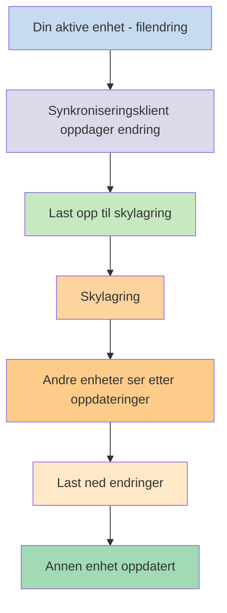
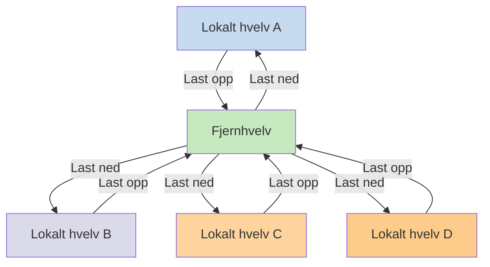

Hvis du vil bruke notatene dine på forskjellige enheter, er et av alternativene du har å [[Synkroniser notatene dine på tvers av enheter]]. Obsidian tilbyr en slik tjeneste, [[Introduksjon til Obsidian Sync|Obsidian Sync]], som fungerer annerledes enn andre synkroniseringstjenester, som [[Synkroniser notatene dine på tvers av enheter#iCloud|iCloud]] og [[Synkroniser notatene dine på tvers av enheter#OneDrive|OneDrive]].

Her er noen viktige begreper:

- Et **hvelv** er en mappe i filsystemet ditt som inneholder notater og en `.obsidian`-mappe med Obsidian-spesifikk konfigurasjon.
- Et **lokalt hvelv** er kopien av hvelvet ditt som finnes på hver av enhetene dine. Når du bruker synkroniseringstjenester, kobler du disse lokale hvelvene sammen for å aktivere synkronisering.
- Et **fjernhvelv** er sentralisert lagring som lokale hvelv kobler til direkte gjennom Obsidian Sync.

Det finnes to vanlige tilnærminger til synkronisering:

- **[[#Filbaserte synkroniseringstjenester]]**: Lokale hvelv må være i overvåkede mapper, synkronisering skjer gjennom filsystemet
- **[[#Obsidian Sync|Fjernhvelv]]**: Sentralisert lagring som lokale hvelv kobler til direkte gjennom Obsidian

## Filbaserte synkroniseringstjenester

Tjenester som Dropbox, Google Drive, iCloud og OneDrive er mappebaserte. Disse tjenestene overvåker spesifikke mapper og synkroniserer automatisk alle filer som plasseres i dem. Filer må være i de angitte skytjenestemappene for å synkroniseres. Med filbaserte synkroniseringstjenester fungerer det lokale hvelvet ditt bare som enda en mappe som overvåkes. Det finnes ikke noe dedikert fjernhvelv – i stedet fungerer skylagringen som en mellomstasjon som kopierer filer mellom lokale hvelv på forskjellige enheter.

Diagrammet nedenfor viser en forenklet versjon av hvordan disse tjenestene fungerer:

Hvis skytjenesten har bakgrunnssynkronisering, kan noen av disse prosessene skje selv når du ikke aktivt bruker applikasjonene til å se filene. Disse tjenestene overvåker spesifikke mapper og synkroniserer automatisk alle filer som plasseres i dem. Filer må være i de angitte skytjenestemappene for å synkroniseres.

## Obsidian Sync

Obsidian Sync lar deg opprette et fjernhvelv som fungerer som sentralisert lagring gjennom tjenesten [[Introduksjon til Obsidian Sync|Obsidian Sync]]. Dette lar deg velge nesten hvilken som helst mappe på hvilken som helst av enhetene dine til å lagre filene dine – enten på en ekstern harddisk, i `C:\`, eller i App-lagring på Android.

Vi har imidlertid en liste over anbefalte plasseringer for det lokale hvelvet ditt hvis du også bruker [[#Filbaserte synkroniseringstjenester]] på samme enhet – hovedsakelig hvor som helst som ikke er i en [[Bytt til Obsidian Sync#Flytt hvelvet ditt ut av tredjeparts synkroniseringstjeneste eller skylagring|tredjeparts synkroniseringstjeneste]].

Diagrammet nedenfor viser en forenklet versjon av hvordan Obsidian Sync fungerer:

Styrken til dette systemet blir tydeligere med flere enhetstyper. [[#Filbaserte synkroniseringstjenester]] kan være implementert inkonsekvent på tvers av operativsystemer, og mobile enheter har sine egne regler for hvordan applikasjoner kan sandkasselegges og strømstyres, noe som gjør det mye vanskeligere for tradisjonelle filbaserte tjenester å fungere sømløst.

Med Obsidian Sync håndterer tjenesten synkronisering direkte gjennom applikasjonen, og gir konsistent oppførsel uavhengig av enhetstype eller begrensninger i operativsystemet, samtidig som den prioriterer å beholde en lokal kopi av dataene dine som en [[Sikkerhetskopier Obsidian-filene dine|myk sikkerhetskopi]].

### Synkroniseringsatferd

Når du gjør endringer i filer i det lokale hvelvet ditt, oppdager Obsidian Sync disse endringene og laster dem opp til fjernhvelvet. Andre enheter som er koblet til det samme fjernhvelvet, vil deretter laste ned disse endringene og anvende dem på sine lokale hvelv. Obsidian Sync sporer endringer på filnivå og overfører bare filene som har blitt endret, i stedet for å synkronisere hele mapper. Dette reduserer båndbreddebruken og synkroniseringstiden.

Når konflikter oppstår eller når du trenger å kontrollere hvilke filer som synkroniseres, tilbyr Obsidian Sync spesifikke mekanismer for å håndtere disse situasjonene:

![[Feilsøk Obsidian Sync#Konfliktløsning|Konfliktløsning]]

![[Synkroniseringsinnstillinger og selektiv synkronisering#Selektiv synkronisering#Utelat en mappe fra synkronisering]]

### Frakoblet atferd

Endringer som gjøres mens du er frakoblet, settes i kø og synkroniseres automatisk når enheten din kobler til internett igjen og Obsidian er åpen. Det lokale hvelvet ditt forblir fullt funksjonelt i perioder uten tilkobling.

## Neste steg

- [[Sett opp Obsidian Sync]] for å komme i gang med fjernhvelv.
- [[Bytt til Obsidian Sync]] hvis du for øyeblikket bruker filbasert synkronisering og ønsker å bruke Obsidian Sync.
- [[Synkroniser notatene dine på tvers av enheter|Utforsk andre synkroniseringsalternativer]] hvis du fortsatt vurderer.
