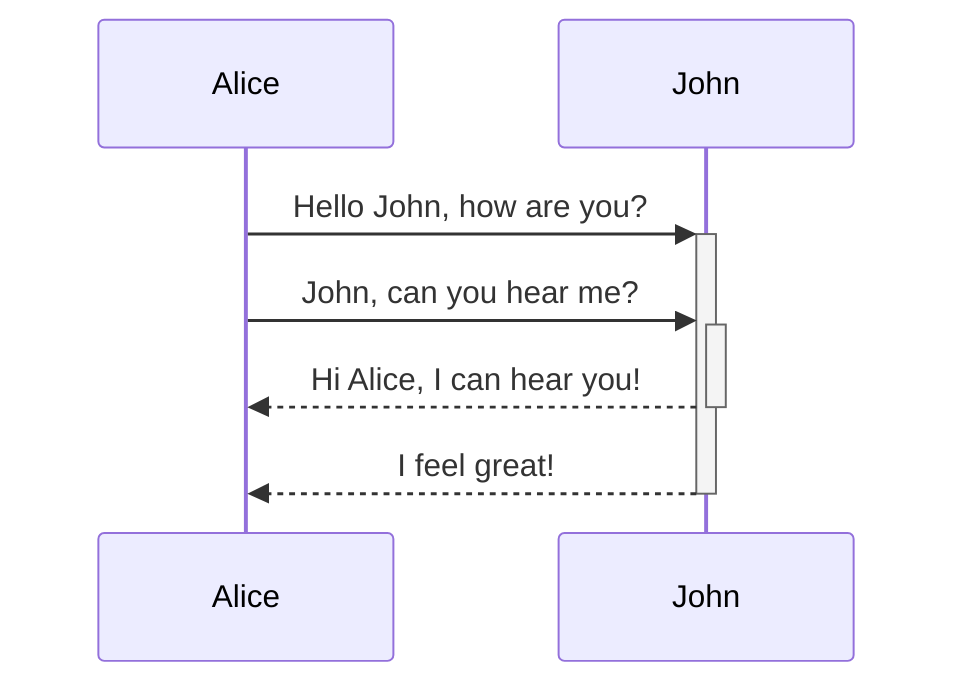
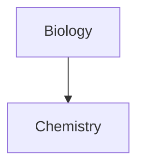

Lær hvordan du legger til avansert formateringssyntaks i notatene dine.

## Tabeller

Du kan opprette tabeller ved å bruke vertikale streker (`|`) for å skille kolonner og bindestreker (`-`) for å definere overskrifter. Her er et eksempel:

```md
| Fornavn | Etternavn |
| ------- | --------- |
| Max     | Planck    |
| Marie   | Curie     |
```

| Fornavn | Etternavn |
| ------- | --------- |
| Max     | Planck    |
| Marie   | Curie     |

Selv om de vertikale strekene på hver side av tabellen er valgfrie, anbefales det å inkludere dem for lesbarheten.

> [!tip] I _Live-forhåndsvisning_ kan du høyreklikke på en tabell for å legge til eller slette kolonner og rader. Du kan også sortere og flytte dem ved hjelp av kontekstmenyen.

Du kan sette inn en tabell ved å bruke kommandoen **Sett inn tabell** fra [[Kommandovelger|Kommandopalett]] eller ved å høyreklikke og velge _Sett inn → Tabell_. Dette gir deg en grunnleggende, redigerbar tabell:

```md
|     |     |
| --- | --- |
|     |     |
```

Merk at celler ikke trenger perfekt justering, men overskriftsraden må inneholde minst to bindestreker:

```md
Fornavn | Etternavn
-- | --
Max | Planck
Marie | Curie
```


### Formater innhold i en tabell

Du kan bruke [[Grunnleggende formateringssyntaks]] for å style innhold i en tabell.

| Første kolonne      | Andre kolonne                                |
| ------------------- | -------------------------------------------- |
| [[Interne lenker]]  | Lenke til en fil _i_ **hvelvet** ditt.       |
| [[Bygge inn filer]] | ![[Engelbart.jpg\|100]]                      |

> [!note] Vertikale streker i tabeller
> Hvis du vil bruke [[Aliaser|aliaser]], eller [[Grunnleggende formateringssyntaks#Eksterne bilder|endre størrelse på et bilde]] i tabellen din, må du legge til en `\` før den vertikale streken.
>
> ```md
> Første kolonne | Andre kolonne
> -- | --
> [[Grunnleggende formateringssyntaks\|Markdown-syntaks]] | ![[Engelbart.jpg\|200]]
> ```
>
> Første kolonne | Andre kolonne
> -- | --
> [[Grunnleggende formateringssyntaks\|Markdown-syntaks]] | ![[Engelbart.jpg\|200]]

Juster tekst i kolonner ved å legge til kolon (`:`) i overskriftsraden. Du kan også justere innhold i _Live-forhåndsvisning_ via kontekstmenyen.

```md
Venstrejustert tekst | Midtstilt tekst | Høyrejustert tekst
:-- | :--: | --:
Innhold | Innhold | Innhold
```

Venstrejustert tekst | Midtstilt tekst | Høyrejustert tekst
:-- | :--: | --:
Innhold | Innhold | Innhold

## Diagram

Du kan legge til diagrammer og grafer i notatene dine ved å bruke [Mermaid](https://mermaid-js.github.io/). Mermaid støtter en rekke diagrammer, som [flytdiagrammer](https://mermaid.js.org/syntax/flowchart.html), [sekvensdiagrammer](https://mermaid.js.org/syntax/sequenceDiagram.html) og [tidslinjer](https://mermaid.js.org/syntax/timeline.html).

> [!tip] Tips
> Du kan også prøve Mermaids [Live Editor](https://mermaid-js.github.io/mermaid-live-editor) for å hjelpe deg med å bygge diagrammer før du inkluderer dem i notatene dine.

For å legge til et Mermaid-diagram, opprett en `mermaid` [[Grunnleggende formateringssyntaks#Kodeblokker|kodeblokk]].

````md

````


````md

````


### Lenke filer i et diagram

Du kan opprette [[Interne lenker|interne lenker]] i diagrammene dine ved å legge til `internal-link`-[klassen](https://mermaid.js.org/syntax/flowchart.html#classes) til nodene dine.

````md

````


> [!note] Merk
> Interne lenker fra diagrammer vises ikke i [[Grafvisnining|grafvisningen]].

Hvis du har mange noder i diagrammene dine, kan du bruke følgende utdrag.

````md

````

På denne måten blir hver bokstavnode en intern lenke, med [nodeteksten](https://mermaid.js.org/syntax/flowchart.html#a-node-with-text) som lenketekst.

> [!note] Merk
> Hvis du bruker spesialtegn i notatnavnene dine, må du sette notatnavnet i doble anførselstegn.
>
> ```
> class "⨳ special character" internal-link
> ```
>
> Eller, `A["⨳ special character"]`.

For mer informasjon om å opprette diagrammer, se den [offisielle Mermaid-dokumentasjonen](https://mermaid.js.org/intro/).

## Matte

Du kan legge til matematiske uttrykk i notatene dine ved å bruke [MathJax](http://docs.mathjax.org/en/latest/basic/mathjax.html) og LaTeX-notasjon.

For å legge til et MathJax-uttrykk i notatet ditt, omgi det med doble dollartegn (`$$`).

```md
$$
\begin{vmatrix}a & b\\
c & d
\end{vmatrix}=ad-bc
$$
```

$$
\begin{vmatrix}a & b\\
c & d
\end{vmatrix}=ad-bc
$$

Du kan også bruke innebygde matematiske uttrykk ved å omslutte dem med `$`-symboler.

```md
Dette er et innebygd matematisk uttrykk $e^{2i\pi} = 1$.
```

Dette er et innebygd matematisk uttrykk $e^{2i\pi} = 1$.

For mer informasjon om syntaksen, se [MathJax grunnleggende veiledning og hurtigreferanse](https://math.meta.stackexchange.com/questions/5020/mathjax-basic-tutorial-and-quick-reference).

For en liste over støttede MathJax-pakker, se [TeX/LaTeX-utvidelseslisten](http://docs.mathjax.org/en/latest/input/tex/extensions/index.html).
