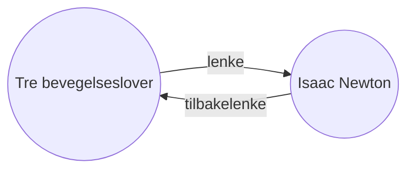

Med [[Kjerneutvidelser|Lenker tilbake]]-utvidelsen kan du se alle _tilbakelenkene_ for det aktive notatet.

En tilbakelenke for et notat er en lenke fra et annet notat til det notatet. I følgende eksempel inneholder notatet "Tre bevegelseslover" en lenke til notatet "Isaac Newton". Den tilsvarende tilbakelenken ville lenke fra "Isaac Newton" tilbake til "Tre bevegelseslover".

Tilbakelenker kan være nyttige for å finne notater som refererer til notatet du skriver. Tenk deg om du kunne liste opp tilbakelenkene for en hvilken som helst nettside på internett.

## Vis tilbakelenker

Lenker tilbake-utvidelsen viser tilbakelenkene for de aktive fanene. Det er to sammenleggbare seksjoner: **Lenker som fører hit** og **Ulenkede omtaler**.

- **Lenker som fører hit** er tilbakelenker til notatene som inneholder en intern lenke til det aktive notatet.
- **Ulenkede omtaler** er tilbakelenker til enhver ulenket forekomst av navnet på det aktive notatet.

Den gir følgende alternativer:

- **Lukk resultater** veksler om hver notat skal utvides for å vise omtalene i den.
- **Vis mer kontekst** veksler om avsnittet som inneholder omtalen skal avkortes eller vises i sin helhet.
- **Endre sorteringsrekkefølge** bestemmer hvordan omtalene skal sorteres.
- **Vis søkefilter** veksler et tekstfelt som lar deg filtrere omtalene. For mer informasjon om hvordan du bygger et søkeord, se [[Søk]].

## Vis tilbakelenker for et notat

For å se tilbakelenkene for det aktive notatet, klikk på fanen **Lenker tilbake** ![[obsidian-icon-links-coming-in.svg#icon]] i høyre sidefelt.

> [!note] Merk
> Hvis du ikke kan se fanen Lenker tilbake, kan du gjøre den synlig ved å åpne [[Kommandovelger|kommandopaletten]] og kjøre kommandoen **Lenker tilbake: Vis tilbakelenker**.

> [!info] Ekskluderte filer
> Filer som samsvarer med mønstrene under [[Innstillinger#Ekskluderte filer|Ekskluderte filer]] vil ikke vises i Ulenkede omtaler.

## Se tilbakelenker for et spesifikt notat

Fanen for tilbakelenker viser tilbakelenker for det aktive notatet og oppdateres når du bytter til et annet notat. Hvis du vil se tilbakelenkene for et spesifikt notat, uavhengig av om det er aktivt eller ikke, kan du åpne en _lenket_ tilbakelenkefane.

For å åpne en lenket tilbakelenkefane:

1. Åpne [[Kommandovelger|kommandopaletten]].
2. Velg **Lenker tilbake: Vis lenker bakover for denne filen**.

En separat fane åpnes ved siden av det aktive notatet. Fanen viser et lenkeikon for å la deg vite at den er lenket til et notat.

## Vis tilbakelenker i et notat

I stedet for å vise tilbakelenkene i en separat fane, kan du vise tilbakelenkene nederst i notatet ditt.

For å vise tilbakelenker i et notat:

1. Åpne [[Kommandovelger|kommandopaletten]].
2. Velg **Lenker tilbake: Slå av/på tilbakelenker i dokument**.

Eller aktiver **Tilbakelenker i dokument** under utvidelsesvalg for Lenker tilbake for å automatisk veksle tilbakelenker når du åpner et nytt notat.
