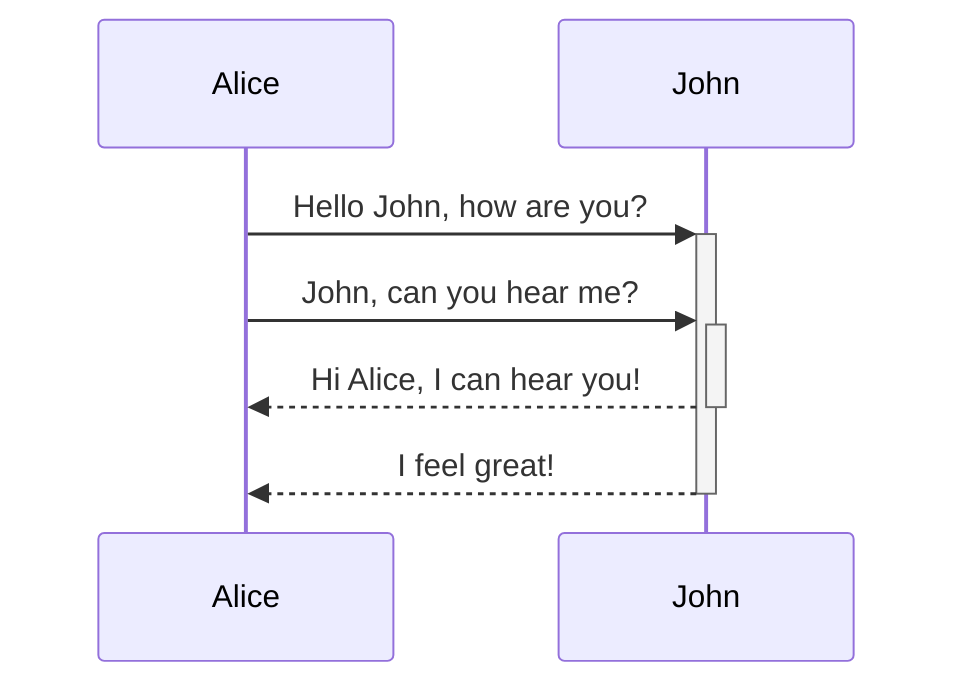
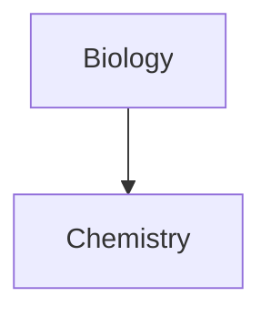

Dowiedz się, jak dodawać zaawansowaną składnię formatowania do swoich notatek.

## Tabele

Możesz tworzyć tabele, używając pionowych kresek (`|`) do rozdzielania kolumn i łączników (`-`) do definiowania nagłówków. Oto przykład:

```md
| Imię  | Nazwisko |
| ----- | -------- |
| Max   | Planck   |
| Marie | Curie    |
```

| Imię  | Nazwisko |
| ----- | -------- |
| Max   | Planck   |
| Marie | Curie    |

Chociaż pionowe kreski po obu stronach tabeli są opcjonalne, ich umieszczanie jest zalecane dla czytelności.

> [!tip] W trybie _podglądu na żywo_ możesz kliknąć prawym przyciskiem myszy na tabeli, aby dodawać lub usuwać kolumny i wiersze. Możesz je również sortować i przenosić za pomocą menu kontekstowego.

Możesz wstawić tabelę za pomocą polecenia **Tabela** z [[Lista poleceń|Palety poleceń]] lub klikając prawym przyciskiem myszy i wybierając _Wstaw → Tabela_. Spowoduje to utworzenie podstawowej, edytowalnej tabeli:

```md
|     |     |
| --- | --- |
|     |     |
```

Zwróć uwagę, że komórki nie muszą być idealnie wyrównane, ale wiersz nagłówka musi zawierać co najmniej dwa łączniki:

```md
Imię | Nazwisko
-- | --
Max | Planck
Marie | Curie
```


### Formatowanie zawartości w tabeli

Możesz używać [[Podstawowa składnia formatowania|podstawowej składni formatowania]], aby stylizować zawartość w tabeli.

| Pierwsza kolumna         | Druga kolumna                                      |
| ------------------------ | -------------------------------------------------- |
| [[Łącza wewnętrzne]]    | Link do pliku _wewnątrz_ Twojego **skarbca**.      |
| [[Osadzanie plików]]    | ![[Engelbart.jpg\|100]]                             |

> [!note] Pionowe kreski w tabelach
> Jeśli chcesz używać [[Aliasy|aliasów]] lub [[Podstawowa składnia formatowania#Obrazy zewnętrzne|zmienić rozmiar obrazu]] w tabeli, musisz dodać `\` przed pionową kreską.
>
> ```md
> Pierwsza kolumna | Druga kolumna
> -- | --
> [[Podstawowa składnia formatowania\|Składnia Markdown]] | ![[Engelbart.jpg\|200]]
> ```
>
> Pierwsza kolumna | Druga kolumna
> -- | --
> [[Podstawowa składnia formatowania\|Składnia Markdown]] | ![[Engelbart.jpg\|200]]

Wyrównuj tekst w kolumnach, dodając dwukropki (`:`) do wiersza nagłówka. Możesz również wyrównywać zawartość w trybie _podglądu na żywo_ za pomocą menu kontekstowego.

```md
Tekst wyrównany do lewej | Tekst wyrównany do środka | Tekst wyrównany do prawej
:-- | :--: | --:
Zawartość | Zawartość | Zawartość
```

Tekst wyrównany do lewej | Tekst wyrównany do środka | Tekst wyrównany do prawej
:-- | :--: | --:
Zawartość | Zawartość | Zawartość

## Diagramy

Możesz dodawać diagramy i wykresy do swoich notatek, używając [Mermaid](https://mermaid-js.github.io/). Mermaid obsługuje różne rodzaje diagramów, takie jak [diagramy przepływu](https://mermaid.js.org/syntax/flowchart.html), [diagramy sekwencji](https://mermaid.js.org/syntax/sequenceDiagram.html) i [osie czasu](https://mermaid.js.org/syntax/timeline.html).

> [!tip] Wskazówka
> Możesz również wypróbować [edytor na żywo](https://mermaid-js.github.io/mermaid-live-editor) Mermaid, aby pomóc w tworzeniu diagramów przed umieszczeniem ich w notatkach.

Aby dodać diagram Mermaid, utwórz [[Podstawowa składnia formatowania#Bloki kodu|blok kodu]] `mermaid`.

````md

````


````md

````


### Łączenie plików w diagramie

Możesz tworzyć [[Łącza wewnętrzne|łącza wewnętrzne]] w swoich diagramach, przypisując [klasę](https://mermaid.js.org/syntax/flowchart.html#classes) `internal-link` do węzłów.

````md

````


> [!note] Informacja
> Łącza wewnętrzne z diagramów nie pojawiają się w [[Podgląd grafu|widoku grafu]].

Jeśli masz wiele węzłów w diagramach, możesz użyć następującego fragmentu.

````md

````

W ten sposób każdy węzeł literowy staje się łączem wewnętrznym, a [tekst węzła](https://mermaid.js.org/syntax/flowchart.html#a-node-with-text) służy jako tekst łącza.

> [!note] Informacja
> Jeśli używasz znaków specjalnych w nazwach notatek, musisz ująć nazwę notatki w podwójne cudzysłowy.
>
> ```
> class "⨳ special character" internal-link
> ```
>
> Lub `A["⨳ special character"]`.

Więcej informacji o tworzeniu diagramów znajdziesz w [oficjalnej dokumentacji Mermaid](https://mermaid.js.org/intro/).

## Matematyka

Możesz dodawać wyrażenia matematyczne do swoich notatek, używając [MathJax](http://docs.mathjax.org/en/latest/basic/mathjax.html) i notacji LaTeX.

Aby dodać wyrażenie MathJax do notatki, otocz je podwójnymi znakami dolara (`$$`).

```md
$$
\begin{vmatrix}a & b\\
c & d
\end{vmatrix}=ad-bc
$$
```

$$
\begin{vmatrix}a & b\\
c & d
\end{vmatrix}=ad-bc
$$

Możesz również umieszczać wyrażenia matematyczne w tekście, otaczając je symbolami `$`.

```md
To jest wyrażenie matematyczne w tekście $e^{2i\pi} = 1$.
```

To jest wyrażenie matematyczne w tekście $e^{2i\pi} = 1$.

Więcej informacji o składni znajdziesz w [podstawowym samouczku i skróconej instrukcji MathJax](https://math.meta.stackexchange.com/questions/5020/mathjax-basic-tutorial-and-quick-reference).

Lista obsługiwanych pakietów MathJax jest dostępna w [liście rozszerzeń TeX/LaTeX](http://docs.mathjax.org/en/latest/input/tex/extensions/index.html).
