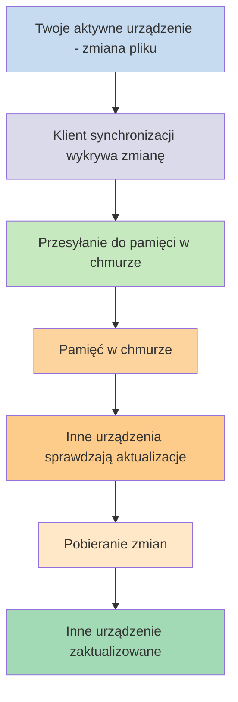
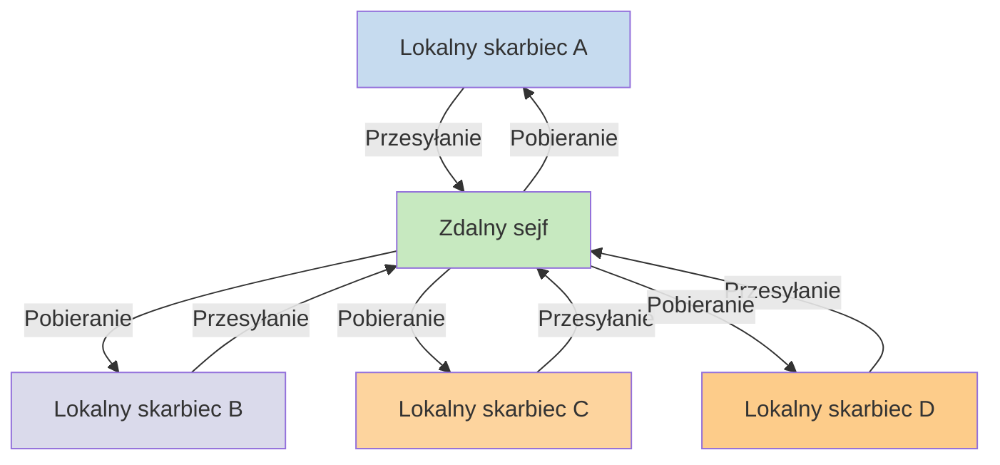

Jeśli chcesz korzystać ze swoich notatek na różnych urządzeniach, jedną z dostępnych opcji jest [[Synchronizuj notatki między urządzeniami|synchronizacja notatek między urządzeniami]]. Obsidian oferuje własną usługę, [[Wprowadzenie do Obsidian Sync|Obsidian Sync]], która działa inaczej niż inne usługi synchronizacji, takie jak [[Synchronizuj notatki między urządzeniami#iCloud|iCloud]] i [[Synchronizuj notatki między urządzeniami#OneDrive|OneDrive]].

Oto kilka kluczowych pojęć:

- **Skarbiec** to folder w systemie plików, który zawiera notatki oraz folder `.obsidian` z konfiguracją specyficzną dla Obsidian.
- **Lokalny skarbiec** to kopia skarbca istniejąca na każdym z Twoich urządzeń. Podczas korzystania z usług synchronizacji łączysz te lokalne skarbce, aby umożliwić synchronizację.
- **Zdalny sejf** to scentralizowana pamięć masowa, z którą lokalne skarbce łączą się bezpośrednio przez Obsidian Sync.

Istnieją dwa popularne podejścia do synchronizacji:

- **[[#Usługi synchronizacji oparte na plikach]]**: Lokalne skarbce muszą znajdować się w monitorowanych folderach, synchronizacja odbywa się przez system plików
- **[[#Obsidian Sync|Zdalne sejfy]]**: Scentralizowana pamięć masowa, z którą lokalne skarbce łączą się bezpośrednio przez Obsidian

## Usługi synchronizacji oparte na plikach

Usługi takie jak Dropbox, Google Drive, iCloud i OneDrive są oparte na folderach. Monitorują one określone foldery i automatycznie synchronizują wszystkie umieszczone w nich pliki. Pliki muszą znajdować się w wyznaczonych folderach usługi chmurowej, aby mogły być synchronizowane. W przypadku usług synchronizacji opartych na plikach Twój lokalny skarbiec jest po prostu kolejnym monitorowanym folderem. Nie ma dedykowanego zdalnego sejfu — zamiast tego pamięć w chmurze służy jako pośrednik, kopiując pliki między lokalnymi skarbcami na różnych urządzeniach.

Poniższy diagram przedstawia uproszczony schemat działania tych usług:

Jeśli usługa chmurowa obsługuje synchronizację w tle, niektóre z tych procesów mogą zachodzić nawet wtedy, gdy nie korzystasz aktywnie z aplikacji do przeglądania plików. Usługi te monitorują określone foldery i automatycznie synchronizują wszystkie umieszczone w nich pliki. Pliki muszą znajdować się w wyznaczonych folderach usługi chmurowej, aby mogły być synchronizowane.

## Obsidian Sync

Obsidian Sync umożliwia utworzenie zdalnego sejfu, który służy jako scentralizowana pamięć masowa za pośrednictwem usługi [[Wprowadzenie do Obsidian Sync|Obsidian Sync]]. Pozwala to wybrać niemal dowolny folder na dowolnym urządzeniu do przechowywania plików — czy to na dysku zewnętrznym, w `C:\`, czy w pamięci aplikacji na Androidzie.

Mamy jednak listę zalecanych lokalizacji dla Twojego lokalnego skarbca, jeśli korzystasz również z [[#Usługi synchronizacji oparte na plikach|usług synchronizacji opartych na plikach]] na tym samym urządzeniu — przede wszystkim powinno to być miejsce, które nie jest w [[Przejście na Obsidian Sync#Przenieś swój skarbiec z zewnętrznej usługi synchronizacji lub pamięci w chmurze|zewnętrznej usłudze synchronizacji]].

Poniższy diagram przedstawia uproszczony schemat działania Obsidian Sync:

Siła tego systemu staje się bardziej widoczna przy większej liczbie typów urządzeń. [[#Usługi synchronizacji oparte na plikach]] mogą być implementowane niespójnie w różnych systemach operacyjnych, a urządzenia mobilne mają własne zasady dotyczące sandboxowania aplikacji i ograniczania zużycia energii, co znacznie utrudnia tradycyjnym usługom opartym na plikach płynne działanie.

Dzięki Obsidian Sync usługa obsługuje synchronizację bezpośrednio przez aplikację, zapewniając spójne zachowanie niezależnie od typu urządzenia czy ograniczeń systemu operacyjnego, jednocześnie priorytetowo traktując przechowywanie lokalnej kopii danych jako [[Tworzenie kopii zapasowej plików Obsidian|kopii zapasowej]].

### Zachowanie synchronizacji

Gdy wprowadzasz zmiany w plikach w swoim lokalnym skarbcu, Obsidian Sync wykrywa te zmiany i przesyła je do zdalnego sejfu. Inne urządzenia połączone z tym samym zdalnym sejfem pobierają następnie te zmiany i stosują je w swoich lokalnych skarbcach. Obsidian Sync śledzi zmiany na poziomie plików i przesyła tylko te pliki, które zostały zmodyfikowane, zamiast synchronizować całe foldery. Zmniejsza to wykorzystanie przepustowości i czas synchronizacji.

Gdy pojawiają się konflikty lub gdy musisz kontrolować, które pliki są synchronizowane, Obsidian Sync zapewnia specjalne mechanizmy do obsługi tych sytuacji:

![[Rozwiązywanie problemów z Obsidian Sync#Rozwiązywanie konfliktów|Rozwiązywanie konfliktów]]

![[Opcje synchronizacji i synchronizacja selektywna#Synchronizacja selektywna#Pomiń folder z synchronizacji]]

### Zachowanie w trybie offline

Zmiany wprowadzone w trybie offline są kolejkowane i synchronizowane automatycznie, gdy urządzenie ponownie połączy się z internetem i Obsidian jest otwarty. Twój lokalny skarbiec pozostaje w pełni funkcjonalny w okresach bez połączenia.

## Następne kroki

- [[Konfiguracja Obsidian Sync]], aby rozpocząć korzystanie ze zdalnych sejfów.
- [[Przejście na Obsidian Sync]], jeśli obecnie korzystasz z synchronizacji opartej na plikach i chcesz przejść na Obsidian Sync.
- [[Synchronizuj notatki między urządzeniami|Poznaj inne opcje synchronizacji]], jeśli wciąż się zastanawiasz.
