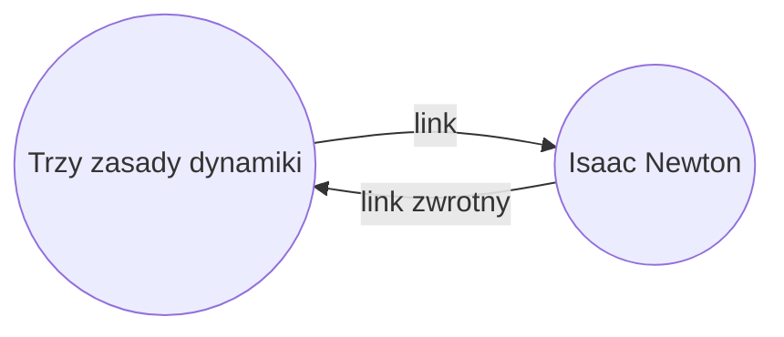

Dzięki wtyczce [[Wbudowane wtyczki|Linki zwrotne]] możesz zobaczyć wszystkie _linki zwrotne_ dla aktywnej notatki.

Link zwrotny dla notatki to link z innej notatki prowadzący do tej notatki. W poniższym przykładzie notatka „Trzy zasady dynamiki" zawiera link do notatki „Isaac Newton". Odpowiedni link zwrotny prowadziłby od „Isaac Newton" z powrotem do „Trzy zasady dynamiki".

Linki zwrotne mogą być przydatne do znajdowania notatek, które odwołują się do notatki, którą piszesz. Wyobraź sobie, że mógłbyś wyświetlić linki zwrotne dla dowolnej strony w internecie.

## Pokaż linki zwrotne

Wtyczka Linki zwrotne wyświetla linki zwrotne dla aktywnych kart. Istnieją dwie zwijane sekcje: **Powiązane wzmianki** i **Niepowiązane wzmianki**.

- **Powiązane wzmianki** to linki zwrotne do notatek, które zawierają łącze wewnętrzne do aktywnej notatki.
- **Niepowiązane wzmianki** to linki zwrotne do każdego niepowiązanego wystąpienia nazwy aktywnej notatki.

Dostępne są następujące opcje:

- **Zwiń wyniki wyszukiwania** przełącza, czy rozwijać każdą notatkę, aby wyświetlić wzmianki w niej.
- **Pokaż dodatkowy kontekst** przełącza, czy obcinać czy wyświetlać pełny akapit zawierający wzmiankę.
- **Sortowanie** określa sposób sortowania wzmianek.
- **Pokaż filtry wyszukiwania** przełącza pole tekstowe, które pozwala filtrować wzmianki. Więcej informacji o tworzeniu zapytań wyszukiwania znajdziesz w [[Szukaj]].

## Wyświetl linki zwrotne dla notatki

Aby wyświetlić linki zwrotne dla aktywnej notatki, kliknij kartę **Linki zwrotne** ![[obsidian-icon-links-coming-in.svg#icon]] w prawym pasku bocznym.

> [!note] Uwaga
> Jeśli nie widzisz karty Linki zwrotne, możesz ją wyświetlić, otwierając [[Lista poleceń|paletę poleceń]] i uruchamiając polecenie **Linki zwrotne: Pokaż linki zwrotne**.

> [!info] Pominięte pliki
> Pliki pasujące do wzorców [[Ustawienia#Pominięte pliki|Pominięte pliki]] nie będą wyświetlane w Niepowiązanych wzmiankach.

## Wyświetl linki zwrotne konkretnej notatki

Karta linków zwrotnych wyświetla linki zwrotne dla aktywnej notatki i aktualizuje się po przełączeniu na inną notatkę. Jeśli chcesz zobaczyć linki zwrotne dla konkretnej notatki, niezależnie od tego, czy jest aktywna, możesz otworzyć _powiązaną_ kartę linków zwrotnych.

Aby otworzyć powiązaną kartę linków zwrotnych:

1. Otwórz [[Lista poleceń|paletę poleceń]].
2. Wybierz **Linki zwrotne: Otwórz linki zwrotne do aktywnego pliku**.

Obok aktywnej notatki otworzy się osobna karta. Karta wyświetla ikonę linku, aby poinformować, że jest powiązana z notatką.

## Pokaż linki zwrotne w notatce

Zamiast wyświetlać linki zwrotne w osobnej karcie, możesz pokazać linki zwrotne na dole notatki.

Aby pokazać linki zwrotne w notatce:

1. Otwórz [[Lista poleceń|paletę poleceń]].
2. Wybierz **Linki zwrotne: Linki zwrotne w dokumencie**.

Możesz też włączyć opcję **Linki zwrotne w dokumencie** w opcjach wtyczki Linki zwrotne, aby automatycznie przełączać linki zwrotne po otwarciu nowej notatki.
