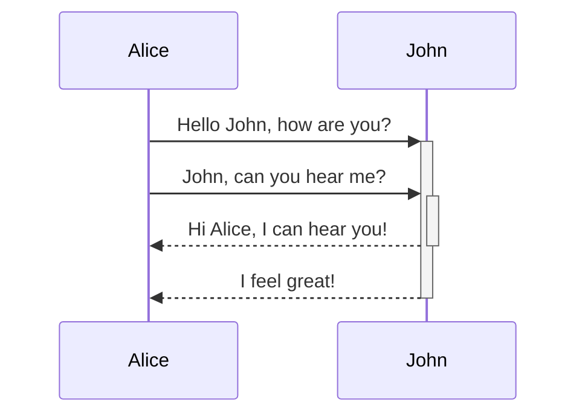
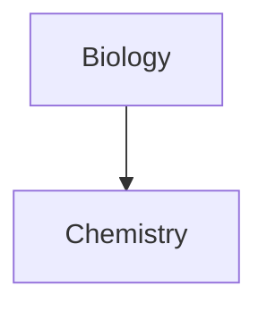

Aprenda como adicionar sintaxe de formatação avançada às suas notas.

## Tabelas

Você pode criar tabelas usando barras verticais (`|`) para separar colunas e hifens (`-`) para definir cabeçalhos. Aqui está um exemplo:

```md
| Primeiro nome | Último nome |
| ------------- | ----------- |
| Max           | Planck      |
| Marie         | Curie       |
```

| Primeiro nome | Último nome |
| ------------- | ----------- |
| Max           | Planck      |
| Marie         | Curie       |

Embora as barras verticais em cada lado da tabela sejam opcionais, incluí-las é recomendado para melhor legibilidade.

> [!tip] Na _Visualização ao vivo_, você pode clicar com o botão direito em uma tabela para adicionar ou excluir colunas e linhas. Você também pode ordená-las e movê-las usando o menu de contexto.

Você pode inserir uma tabela usando o comando **Inserir tabela** da [[Paleta de comandos]] ou clicando com o botão direito e selecionando _Inserir → Tabela_. Isso lhe dará uma tabela básica e editável:

```md
|     |     |
| --- | --- |
|     |     |
```

Note que as células não precisam estar perfeitamente alinhadas, mas a linha de cabeçalho deve conter pelo menos dois hifens:

```md
Primeiro nome | Último nome
-- | --
Max | Planck
Marie | Curie
```


### Formatar conteúdo dentro de uma tabela

Você pode usar a [[Sintaxe de formatação básica]] para estilizar o conteúdo dentro de uma tabela.

| Primeira coluna    | Segunda coluna                                       |
| ------------------ | ---------------------------------------------------- |
| [[Links internos]] | Link para um arquivo _dentro_ do seu **cofre**. |
| [[Incorporar arquivos]]    | ![[Engelbart.jpg\|100]]                         |

> [!note] Barras verticais em tabelas
> Se você quiser usar [[Apelidos|apelidos]], ou [[Sintaxe de formatação básica#Imagens externas|redimensionar uma imagem]] na sua tabela, você precisa adicionar uma `\` antes da barra vertical.
>
> ```md
> Primeira coluna | Segunda coluna
> -- | --
> [[Sintaxe de formatação básica\|Sintaxe Markdown]] | ![[Engelbart.jpg\|200]]
> ```
>
> Primeira coluna | Segunda coluna
> -- | --
> [[Sintaxe de formatação básica\|Sintaxe Markdown]] | ![[Engelbart.jpg\|200]]

Alinhe o texto nas colunas adicionando dois-pontos (`:`) à linha de cabeçalho. Você também pode alinhar o conteúdo na _Visualização ao vivo_ pelo menu de contexto.

```md
Texto alinhado à esquerda | Texto centralizado | Texto alinhado à direita
:-- | :--: | --:
Conteúdo | Conteúdo | Conteúdo
```

Texto alinhado à esquerda | Texto centralizado | Texto alinhado à direita
:-- | :--: | --:
Conteúdo | Conteúdo | Conteúdo

## Diagrama

Você pode adicionar diagramas e gráficos às suas notas, usando [Mermaid](https://mermaid-js.github.io/). O Mermaid suporta uma variedade de diagramas, como [fluxogramas](https://mermaid.js.org/syntax/flowchart.html), [diagramas de sequência](https://mermaid.js.org/syntax/sequenceDiagram.html) e [linhas do tempo](https://mermaid.js.org/syntax/timeline.html).

> [!tip] Dica
> Você também pode experimentar o [Editor ao Vivo](https://mermaid-js.github.io/mermaid-live-editor) do Mermaid para ajudá-lo a construir diagramas antes de incluí-los nas suas notas.

Para adicionar um diagrama Mermaid, crie um [[Sintaxe de formatação básica#Blocos de código|bloco de código]] `mermaid`.

````md

````


````md

````


### Vinculando arquivos em um diagrama

Você pode criar [[Links internos|links internos]] nos seus diagramas anexando a [classe](https://mermaid.js.org/syntax/flowchart.html#classes) `internal-link` aos seus nós.

````md

````


> [!note] Nota
> Links internos de diagramas não aparecem na [[Visão de grafo]].

Se você tem muitos nós nos seus diagramas, pode usar o seguinte trecho.

````md

````

Dessa forma, cada nó de letra se torna um link interno, com o [texto do nó](https://mermaid.js.org/syntax/flowchart.html#a-node-with-text) como o texto do link.

> [!note] Nota
> Se você usar caracteres especiais nos nomes das suas notas, precisa colocar o nome da nota entre aspas duplas.
>
> ```
> class "⨳ special character" internal-link
> ```
>
> Ou, `A["⨳ special character"]`.

Para mais informações sobre a criação de diagramas, consulte a [documentação oficial do Mermaid](https://mermaid.js.org/intro/).

## Equação

Você pode adicionar expressões matemáticas às suas notas usando [MathJax](http://docs.mathjax.org/en/latest/basic/mathjax.html) e a notação LaTeX.

Para adicionar uma expressão MathJax à sua nota, envolva-a com cifrões duplos (`$$`).

```md
$$
\begin{vmatrix}a & b\\
c & d
\end{vmatrix}=ad-bc
$$
```

$$
\begin{vmatrix}a & b\\
c & d
\end{vmatrix}=ad-bc
$$

Você também pode usar expressões matemáticas inline envolvendo-as com símbolos `$`.

```md
Esta é uma expressão matemática inline $e^{2i\pi} = 1$.
```

Esta é uma expressão matemática inline $e^{2i\pi} = 1$.

Para mais informações sobre a sintaxe, consulte o [tutorial básico e referência rápida do MathJax](https://math.meta.stackexchange.com/questions/5020/mathjax-basic-tutorial-and-quick-reference).

Para uma lista de pacotes MathJax suportados, consulte a [Lista de Extensões TeX/LaTeX](http://docs.mathjax.org/en/latest/input/tex/extensions/index.html).
