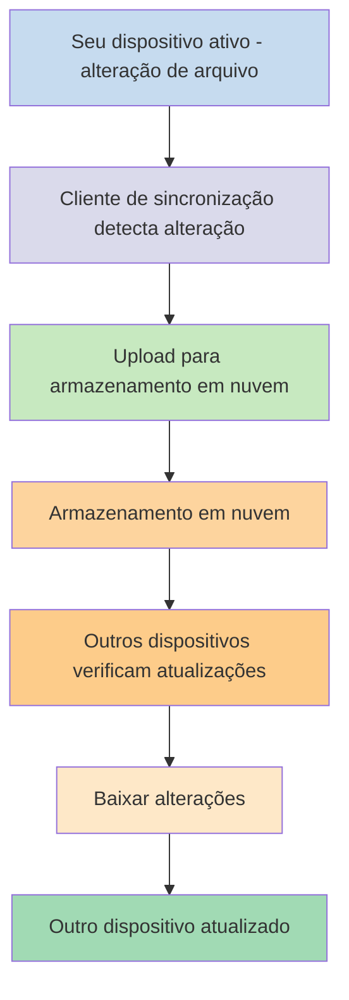
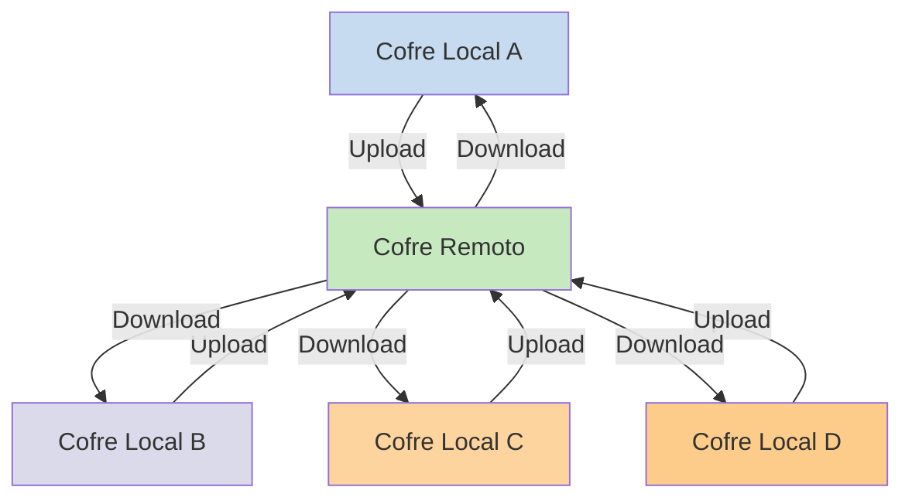

Se você deseja usar suas notas em diferentes dispositivos, uma das opções que você tem é [[Sincronizar suas notas entre dispositivos]]. O Obsidian oferece um desses serviços, [[Introdução ao Obsidian Sync|Obsidian Sync]], que funciona de maneira diferente de outros serviços de sincronização, como [[Sincronizar suas notas entre dispositivos#iCloud|iCloud]] e [[Sincronizar suas notas entre dispositivos#OneDrive|OneDrive]].

Aqui estão alguns termos-chave:

- Um **cofre** é uma pasta no seu sistema de arquivos que contém notas e uma pasta `.obsidian` com configurações específicas do Obsidian.
- Um **cofre local** é a cópia do seu cofre que existe em cada um dos seus dispositivos. Ao usar serviços de sincronização, você conecta esses cofres locais para habilitar a sincronização.
- Um **cofre remoto** é um armazenamento centralizado ao qual os cofres locais se conectam diretamente através do Obsidian Sync.

Existem duas abordagens comuns para sincronização:

- **[[#Serviços de sincronização baseados em arquivos]]**: Cofres locais devem estar em pastas monitoradas, a sincronização acontece através do sistema de arquivos
- **[[#Obsidian Sync|Cofres remotos]]**: Armazenamento centralizado ao qual os cofres locais se conectam diretamente através do Obsidian

## Serviços de sincronização baseados em arquivos

Serviços como Dropbox, Google Drive, iCloud e OneDrive são baseados em pastas. Esses serviços monitoram pastas específicas e sincronizam automaticamente quaisquer arquivos colocados dentro delas. Os arquivos devem estar nas pastas designadas do serviço de nuvem para serem sincronizados. Com serviços de sincronização baseados em arquivos, seu cofre local funciona como apenas mais uma pasta sendo monitorada. Não há um cofre remoto dedicado - em vez disso, o armazenamento em nuvem serve como um intermediário, copiando arquivos entre cofres locais em diferentes dispositivos.

O diagrama abaixo mostra uma versão simplificada de como esses serviços funcionam:

Se o serviço de nuvem tem sincronização em segundo plano, então alguns desses processos podem estar acontecendo mesmo quando você não está usando ativamente os aplicativos para visualizar os arquivos. Esses serviços monitoram pastas específicas e sincronizam automaticamente quaisquer arquivos colocados dentro delas. Os arquivos devem estar nas pastas designadas do serviço de nuvem para serem sincronizados.

## Obsidian Sync

O Obsidian Sync permite que você crie um cofre remoto que serve como armazenamento centralizado através do seu serviço [[Introdução ao Obsidian Sync|Obsidian Sync]]. Isso permite que você escolha quase qualquer pasta em qualquer um dos seus dispositivos para armazenar seus arquivos - seja em um disco rígido externo, em `C:\`, ou no armazenamento do aplicativo no Android.

No entanto, temos uma lista de locais recomendados para seu cofre local se você também usa [[#Serviços de sincronização baseados em arquivos]] no mesmo dispositivo - principalmente, em qualquer lugar que não esteja em um [[Migrar para o Obsidian Sync#Mova seu cofre para fora do seu serviço de sincronização de terceiros ou armazenamento em nuvem|serviço de sincronização de terceiros]].

O diagrama abaixo mostra uma versão simplificada de como o Obsidian Sync funciona:

A força deste sistema se torna mais aparente com mais tipos de dispositivos. Os [[#Serviços de sincronização baseados em arquivos]] podem ser implementados de forma inconsistente entre sistemas operacionais, e dispositivos móveis têm suas próprias regras sobre como os aplicativos podem ser isolados e ter energia limitada, o que torna muito mais difícil para serviços tradicionais baseados em arquivos funcionarem perfeitamente.

Com o Obsidian Sync, o serviço lida com a sincronização diretamente através do aplicativo, fornecendo um funcionamento consistente independentemente do tipo de dispositivo ou limitações do sistema operacional, enquanto prioriza manter uma cópia local dos seus dados como um [[Fazer backup dos seus arquivos do Obsidian|backup parcial]].

### Funcionamento da sincronização

Quando você faz alterações em arquivos no seu cofre local, o Obsidian Sync detecta essas alterações e as envia para o cofre remoto. Outros dispositivos conectados ao mesmo cofre remoto irão então baixar essas alterações e aplicá-las aos seus cofres locais. O Obsidian Sync rastreia alterações no nível de arquivo e transfere apenas os arquivos que foram modificados, em vez de sincronizar pastas inteiras. Isso reduz o uso de banda e o tempo de sincronização.

Quando conflitos ocorrem ou quando você precisa controlar quais arquivos sincronizar, o Obsidian Sync fornece mecanismos específicos para lidar com essas situações:

![[Solução de problemas do Obsidian Sync#Resolução de conflitos|Resolução de conflitos]]

![[Configurações do Sync e sincronização seletiva#Sincronização seletiva#Excluir uma pasta da sincronização]]

### Funcionamento offline

Alterações feitas enquanto offline são enfileiradas e sincronizam automaticamente quando seu dispositivo se reconecta à internet e o Obsidian está aberto. Seu cofre local permanece totalmente funcional durante períodos offline.

## Próximos passos

- [[Configurar o Obsidian Sync]] para começar a usar cofres remotos.
- [[Migrar para o Obsidian Sync]] se você está atualmente usando sincronização baseada em arquivos e deseja usar o Obsidian Sync.
- [[Sincronizar suas notas entre dispositivos|Explorar outras opções de sincronização]] se você ainda está decidindo.
