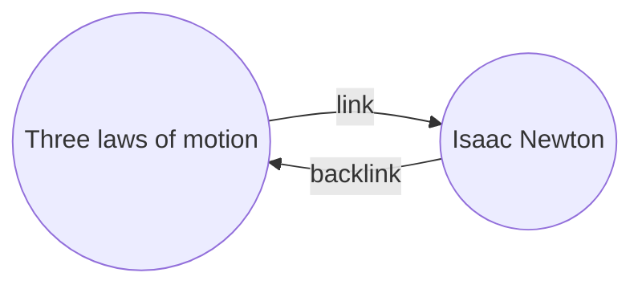

Com o plugin Backlinks, você pode ver todos os _backlinks_ da nota ativa.

Um backlink para uma nota é um link de outra nota para essa nota. No exemplo a seguir, a nota "Três leis do movimento" contém um link para a nota "Isaac Newton". O backlink correspondente seria um link de "Isaac Newton" de volta para "Três leis do movimento".

Backlinks podem ser úteis para encontrar notas que fazem referência à nota que você está escrevendo. Imagine se você pudesse listar os backlinks de qualquer site na internet.

## O painel de backlinks

Você pode ver todos os backlinks da nota ativa no painel _backlinks_. O painel de backlinks tem duas seções recolhíveis: **Menções vinculadas** e **Menções não vinculadas**.

- **Menções vinculadas** são backlinks para as notas que contêm um link interno para a nota ativa.
- **Menções não vinculadas** são backlinks para qualquer ocorrência não vinculada do nome da nota ativa.

O painel de backlinks tem as seguintes opções:

- **Recolher resultados** alterna entre expandir cada nota para exibir as menções nela.
- **Mostrar mais contexto** alterna entre truncar ou exibir o parágrafo completo que contém a menção.
- **Alterar ordem de classificação** determina como classificar as menções.
- **Mostrar filtro de pesquisa** alterna um campo de texto que permite filtrar as menções. Para obter mais informações sobre como criar uma consulta de pesquisa, consulte [[Busca]].

## Ver backlinks para uma nota

Para visualizar os backlinks da nota ativa, clique na guia **Backlinks** (link e ícone de seta) na barra lateral direita.

> [!note] Nota
> Se você não consegue ver a guia Backlinks, pode torná-la visível abrindo a [[Paleta de comandos]] e executando o comando **Backlinks: Mostrar painel de backlinks**.

## Abra um painel de backlinks vinculados

O painel de backlinks lista backlinks para a nota ativa e atualiza quando você alterna para uma nota diferente. Se você quiser ver os backlinks para uma nota específica, independentemente de estar ativa ou nota, você pode abrir um painel de backlinks _linked_.

Para abrir um painel de backlinks vinculados:

1. Abra a [[Paleta de comandos]].
2. Selecione **Backlinks: Abrir backlinks para a nota atual**.

Uma guia separada é aberta ao lado de sua nota ativa. A guia mostra um ícone de link para que você saiba que está vinculado a uma nota.

## Mostrar backlinks em uma nota

Em vez de mostrar os backlinks em uma guia separada, você pode mostrar os backlinks na parte inferior da sua nota.

Para mostrar backlinks em uma nota:

1. Abra a [[Paleta de comandos]].
2. Selecione **Backlinks: Alternar backlinks no documento**.

Ou ative **Backlink no documento** nas opções do plug-in de backlinks para alternar automaticamente os backlinks ao abrir uma nova nota.