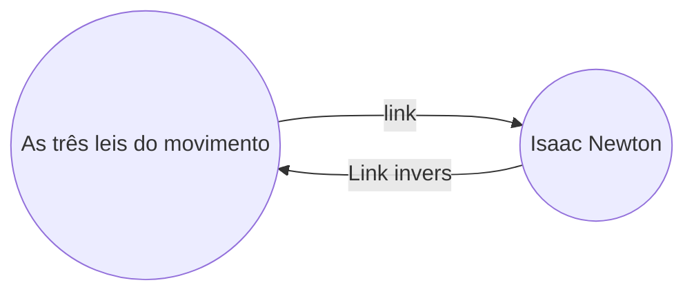

Com o plugin de links inversos você pode ver todos os links inversos da nota ativa.

Um link inverso de uma nota é um link de outra nota para a nota em questão. No exemplo a seguinte, a nota "As três leis do movimento" contém um link para a nota "Isaac Newton". O correspondente link inverso é de "Isaac Newton" de volta para "As três leis do movimento".

Os links inversos podem ser usado para encontrar notas que referenciam a nota que você está escrevendo. Imagine se você pudesse listar os links inversos de qualquer website na internet.

## O painel de links inversos

Você pode ver todos os links inversos da nota ativa no painel de links inversos. O painel de links inversos tem suas seções dobráveis: **Menções vinculadas** e **Menções não vinculadas**.

- **Menções vinculadas** são links inversos para as notas que contém um link interno para a nota ativa.
- **Menções não vinculadas** são links inversos para qualquer ocorrência não vinculada no nome da nota que está ativa.

O painél de links inversos tem as seguintes opções:

- **Esconder resultados** alterna para expandir ou esconder cada nota e mostrar as referências que estão nela.
- **Mostrar o contexto** alterna para ocultar ou mostrar o conteúdo completo do parágrafo que contém a referência.
- **Mudar ordenação** determina a ordem como as referências serão mostradas.
- **Mostrar filtro de busca** alterna um campo de texto que permite você filtrar as referências. Para mais informações sobre como construir uma consulta, veja como [[Procurar]].

## Ver links inversos para uma nota

Para ver os links inversos para a nota ativa, clique na aba de **Links inversos** (icone de link com seta) na barra lateral da direita.

> [!observação]
> Se você não estiver vendo a aba de links inversos, você pode torná-la visível abrindo a[[pt-br/Plugins/Paleta de comandos]] e executando o comando **Backlinks: Mostrar o painel de backlinks**.

## Abrir painel de links inversos vinculados

O painel de links inversos lista os links inversos na nota que está ativa e atualiza quando alternado para outra nota. Se você quer ver os links inversos de uma nota específica, independente se é a nota ativa ou não, você pode abrir painel dos links inversos.

Para abrir o painel de links inversos:

1. Abra a [[pt-br/Plugins/Paleta de comandos]].
2. selecione **Backlinks: Abrir links inversos para o arquivo atual**.

Uma nova aba abre ao lado da sua nota que está ativa. A aba mostra um icone de link para representar que está vinculada com a nota ativa.

## Mostrar links inversos na nota

Ao invés de mostrar os links inversos em uma aba separada, você pode mostrar os links inversos no final da sua nota.

Para mostrar os links inversos na nota:

1. Abra a [[pt-br/Plugins/Paleta de comandos]].
2. Selecione **Backlinks: Alternar links inversos no documento**.

Ou, habilite o **Links inversos no documento** nas opções do plugin de links inversos para mostrar automaticamente os links inversos quando você abre uma nota.
