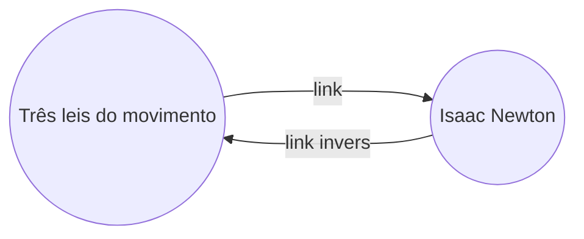

Com o [[Plugins nativos|plugin]] Links inversos, você pode ver todos os _links inversos_ da nota ativa.

Um link inverso para uma nota é um link de outra nota para essa nota. No exemplo a seguir, a nota "Três leis do movimento" contém um link para a nota "Isaac Newton". O link inverso correspondente vincularia de "Isaac Newton" de volta para "Três leis do movimento".

Links inversos podem ser úteis para encontrar notas que referenciam a nota que você está escrevendo. Imagine se você pudesse listar os links inversos de qualquer site na internet.

## Mostrar links inversos

O plugin Links inversos exibe os links inversos das abas ativas. Existem duas seções recolhíveis: **Menções vinculadas** e **Menções desvinculadas**.

- **Menções vinculadas** são links inversos para notas que contêm um link interno para a nota ativa.
- **Menções desvinculadas** são links inversos para qualquer ocorrência não vinculada do nome da nota ativa.

Ele fornece as seguintes opções:

- **Esconder resultados** alterna se deve expandir cada nota para exibir as menções nela.
- **Mostrar o contexto** alterna se deve truncar ou exibir o parágrafo completo que contém a menção.
- **Mudar ordenação** determina como ordenar as menções.
- **Mostrar filtro de busca** alterna um campo de texto que permite filtrar as menções. Para mais informações sobre como construir um termo de busca, consulte [[Pesquisa]].

## Ver links inversos de uma nota

Para ver os links inversos da nota ativa, clique na aba **Links inversos** ( ![[obsidian-icon-links-coming-in.svg#icon]] ) na barra lateral direita.

> [!note] Nota
> Se você não conseguir ver a aba Links inversos, pode torná-la visível abrindo a [[Paleta de comandos]] e executando o comando **Links inversos: Mostrar links inversos**.

> [!info] Arquivos excluídos
> Arquivos que correspondem aos seus padrões de [[Configurações#Arquivos excluídos|Arquivos excluídos]] não aparecerão em Menções desvinculadas.

## Ver links inversos de uma nota específica

A aba de links inversos lista os links inversos da nota ativa e atualiza quando você muda para uma nota diferente. Se você quiser ver os links inversos de uma nota específica, independentemente de ela estar ativa ou não, pode abrir uma aba de links inversos _vinculada_.

Para abrir uma aba de links inversos vinculada:

1. Abra a [[Paleta de comandos]].
2. Selecione **Links inversos: Abrir links inversos para o arquivo atual**.

Uma aba separada abre ao lado da sua nota ativa. A aba mostra um ícone de link para informar que está vinculada a uma nota.

## Mostrar links inversos em uma nota

Em vez de mostrar os links inversos em uma aba separada, você pode mostrar os links inversos na parte inferior da sua nota.

Para mostrar links inversos em uma nota:

1. Abra a [[Paleta de comandos]].
2. Selecione **Links inversos: Alternar links inversos no documento**.

Ou ative **Links inversos no documento** nas configurações do plugin Links inversos para alternar automaticamente os links inversos ao abrir uma nova nota.
