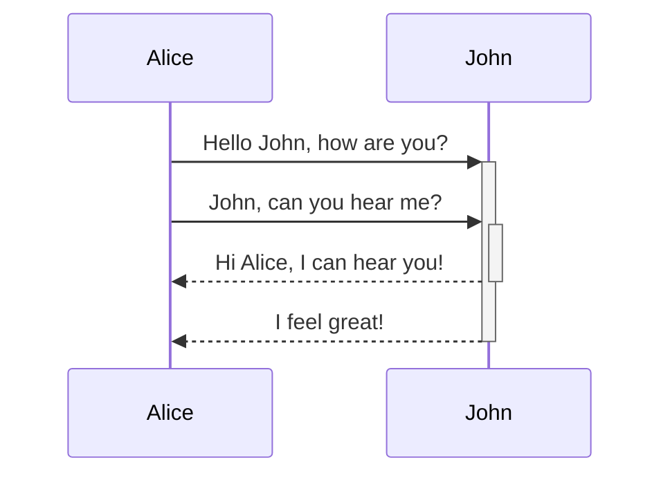
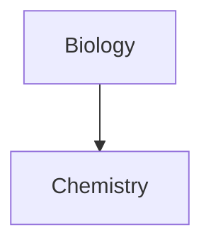

Aprenda como adicionar sintaxe de formatação avançada às suas notas.

## Tabelas

Pode criar tabelas usando barras verticais (`|`) para separar colunas e hífenes (`-`) para definir cabeçalhos. Aqui está um exemplo:

```md
| Primeiro nome | Último nome |
| ------------- | ----------- |
| Max           | Planck      |
| Marie         | Curie       |
```

| Primeiro nome | Último nome |
| ------------- | ----------- |
| Max           | Planck      |
| Marie         | Curie       |

Embora as barras verticais em ambos os lados da tabela sejam opcionais, é recomendável incluí-las para melhor legibilidade.

> [!tip] Na _Pré-visualização em direto_, pode clicar com o botão direito numa tabela para adicionar ou eliminar colunas e linhas. Também pode ordená-las e movê-las usando o menu de contexto.

Pode inserir uma tabela usando o comando **Inserir tabela** a partir da [[Paleta de comando|Paleta de Comandos]] ou clicando com o botão direito e selecionando _Inserir → Tabela_. Isto dará uma tabela básica e editável:

```md
|     |     |
| --- | --- |
|     |     |
```

Note que as células não precisam de alinhamento perfeito, mas a linha de cabeçalho deve conter pelo menos dois hífenes:

```md
Primeiro nome | Último nome
-- | --
Max | Planck
Marie | Curie
```


### Formatar conteúdo dentro de uma tabela

Pode usar a [[Sintaxe de formatação básica]] para estilizar conteúdo dentro de uma tabela.

| Primeira coluna        | Segunda coluna                                    |
| ---------------------- | ------------------------------------------------- |
| [[Ligações internas]]  | Ligação para um ficheiro _dentro_ do seu **cofre**. |
| [[Incorporar ficheiros]] | ![[Engelbart.jpg\|100]]                           |

> [!note] Barras verticais em tabelas
> Se quiser usar [[Alcunhas|alcunhas]], ou [[Sintaxe de formatação básica#Imagens externas|redimensionar uma imagem]] na sua tabela, precisa de adicionar uma `\` antes da barra vertical.
>
> ```md
> Primeira coluna | Segunda coluna
> -- | --
> [[Sintaxe de formatação básica\|Sintaxe Markdown]] | ![[Engelbart.jpg\|200]]
> ```
>
> Primeira coluna | Segunda coluna
> -- | --
> [[Sintaxe de formatação básica\|Sintaxe Markdown]] | ![[Engelbart.jpg\|200]]

Alinhe o texto nas colunas adicionando dois pontos (`:`) à linha de cabeçalho. Também pode alinhar conteúdo na _Pré-visualização em direto_ através do menu de contexto.

```md
Texto alinhado à esquerda | Texto alinhado ao centro | Texto alinhado à direita
:-- | :--: | --:
Conteúdo | Conteúdo | Conteúdo
```

Texto alinhado à esquerda | Texto alinhado ao centro | Texto alinhado à direita
:-- | :--: | --:
Conteúdo | Conteúdo | Conteúdo

## Diagramas

Pode adicionar diagramas e gráficos às suas notas, usando [Mermaid](https://mermaid-js.github.io/). O Mermaid suporta uma variedade de diagramas, como [diagramas de fluxo](https://mermaid.js.org/syntax/flowchart.html), [diagramas de sequência](https://mermaid.js.org/syntax/sequenceDiagram.html) e [linhas de tempo](https://mermaid.js.org/syntax/timeline.html).

> [!tip] Dica
> Também pode experimentar o [Editor ao Vivo](https://mermaid-js.github.io/mermaid-live-editor) do Mermaid para ajudar a construir diagramas antes de os incluir nas suas notas.

Para adicionar um diagrama Mermaid, crie um [[Sintaxe de formatação básica#Blocos de código|bloco de código]] `mermaid`.

````md

````


````md

````


### Ligar ficheiros num diagrama

Pode criar [[Ligações internas|ligações internas]] nos seus diagramas anexando a [classe](https://mermaid.js.org/syntax/flowchart.html#classes) `internal-link` aos seus nós.

````md

````


> [!note] Nota
> As ligações internas a partir de diagramas não aparecem na [[Visualização de diagrama de grafo]].

Se tiver muitos nós nos seus diagramas, pode usar o seguinte excerto.

````md

````

Desta forma, cada nó de letra torna-se uma ligação interna, com o [texto do nó](https://mermaid.js.org/syntax/flowchart.html#a-node-with-text) como texto da ligação.

> [!note] Nota
> Se usar caracteres especiais nos nomes das suas notas, precisa de colocar o nome da nota entre aspas duplas.
>
> ```
> class "⨳ special character" internal-link
> ```
>
> Ou, `A["⨳ special character"]`.

Para mais informações sobre a criação de diagramas, consulte a [documentação oficial do Mermaid](https://mermaid.js.org/intro/).

## Matemática

Pode adicionar expressões matemáticas às suas notas usando [MathJax](http://docs.mathjax.org/en/latest/basic/mathjax.html) e a notação LaTeX.

Para adicionar uma expressão MathJax à sua nota, envolva-a com cifrões duplos (`$$`).

```md
$$
\begin{vmatrix}a & b\\
c & d
\end{vmatrix}=ad-bc
$$
```

$$
\begin{vmatrix}a & b\\
c & d
\end{vmatrix}=ad-bc
$$

Também pode incorporar expressões matemáticas em linha envolvendo-as com símbolos `$`.

```md
Esta é uma expressão matemática em linha $e^{2i\pi} = 1$.
```

Esta é uma expressão matemática em linha $e^{2i\pi} = 1$.

Para mais informações sobre a sintaxe, consulte o [tutorial básico e referência rápida do MathJax](https://math.meta.stackexchange.com/questions/5020/mathjax-basic-tutorial-and-quick-reference).

Para uma lista de pacotes MathJax suportados, consulte a [Lista de Extensões TeX/LaTeX](http://docs.mathjax.org/en/latest/input/tex/extensions/index.html).
