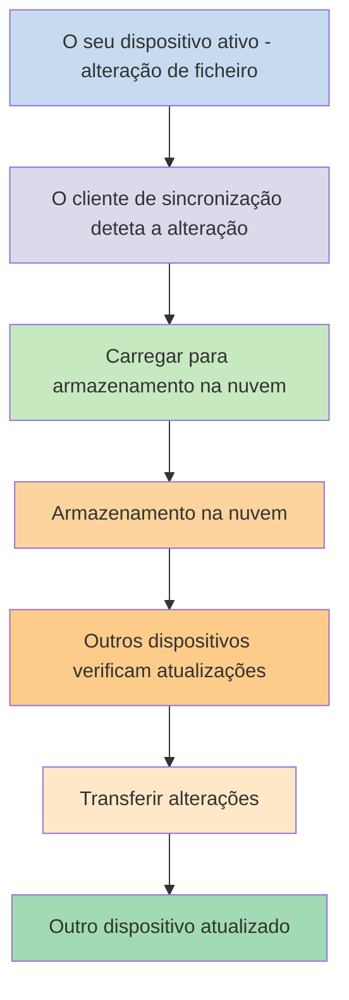
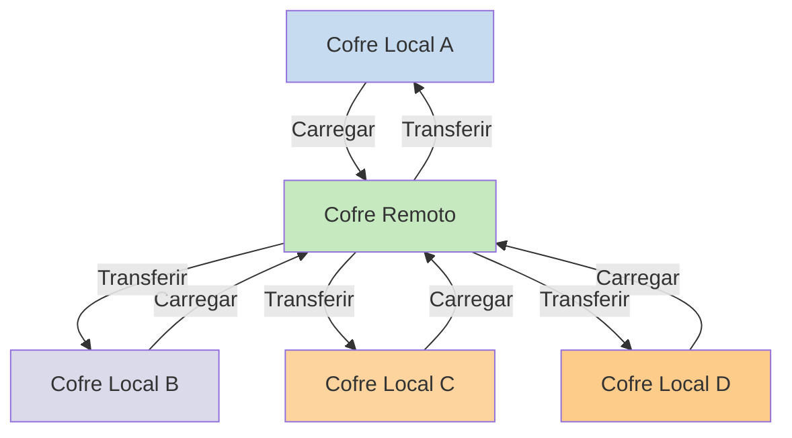

Se quiser utilizar as suas notas em diferentes dispositivos, uma das opções que tem é [[Sincronizar notas entre dispositivos]]. O Obsidian oferece um desses serviços, [[Introdução ao Obsidian Sync|Obsidian Sync]], que funciona de forma diferente de outros serviços de sincronização, como [[Sincronizar notas entre dispositivos#iCloud|iCloud]] e [[Sincronizar notas entre dispositivos#OneDrive|OneDrive]].

Aqui estão alguns termos-chave:

- Um **cofre** é uma pasta no seu sistema de ficheiros que contém notas e uma pasta `.obsidian` com configuração específica do Obsidian.
- Um **cofre local** é a cópia do seu cofre que existe em cada um dos seus dispositivos. Ao usar serviços de sincronização, liga estes cofres locais para ativar a sincronização.
- Um **cofre remoto** é armazenamento centralizado ao qual os cofres locais se ligam diretamente através do Obsidian Sync.

Existem duas abordagens comuns para a sincronização:

- **[[#Serviços de sincronização baseados em ficheiros]]**: Os cofres locais devem estar em pastas monitorizadas, a sincronização acontece através do sistema de ficheiros
- **[[#Obsidian Sync|Cofres remotos]]**: Armazenamento centralizado ao qual os cofres locais se ligam diretamente através do Obsidian

## Serviços de sincronização baseados em ficheiros

Serviços como Dropbox, Google Drive, iCloud e OneDrive são baseados em pastas. Estes serviços monitorizam pastas específicas e sincronizam automaticamente quaisquer ficheiros colocados dentro delas. Os ficheiros devem estar nas pastas designadas do serviço de nuvem para serem sincronizados. Com serviços de sincronização baseados em ficheiros, o seu cofre local funciona como mais uma pasta a ser monitorizada. Não existe um cofre remoto dedicado - em vez disso, o armazenamento na nuvem serve como passagem, copiando ficheiros entre cofres locais em diferentes dispositivos.

O diagrama abaixo mostra uma versão simplificada de como estes serviços funcionam:

Se o serviço de nuvem tiver sincronização em segundo plano, então alguns destes processos podem estar a acontecer mesmo quando não está a usar ativamente as aplicações para ver os ficheiros. Estes serviços monitorizam pastas específicas e sincronizam automaticamente quaisquer ficheiros colocados dentro delas. Os ficheiros devem estar nas pastas designadas do serviço de nuvem para serem sincronizados.

## Obsidian Sync

O Obsidian Sync permite-lhe criar um cofre remoto que serve como armazenamento centralizado através do seu serviço [[Introdução ao Obsidian Sync|Obsidian Sync]]. Isto permite-lhe escolher quase qualquer pasta em qualquer um dos seus dispositivos para armazenar os seus ficheiros - seja num disco rígido externo, em `C:\`, ou no armazenamento da aplicação no Android.

No entanto, temos uma lista de localizações recomendadas para o seu cofre local se também utilizar [[#Serviços de sincronização baseados em ficheiros]] no mesmo dispositivo - principalmente, qualquer lugar que não esteja num [[Mudar para o Obsidian Sync#Mover o seu cofre para fora do serviço de sincronização de terceiros ou armazenamento na nuvem|serviço de sincronização de terceiros]].

O diagrama abaixo mostra uma versão simplificada de como o Obsidian Sync funciona:

A força deste sistema torna-se mais evidente com mais tipos de dispositivos. Os [[#Serviços de sincronização baseados em ficheiros]] podem ser implementados de forma inconsistente entre sistemas operativos, e os dispositivos móveis têm as suas próprias regras sobre como as aplicações podem ser isoladas e limitadas em energia, o que torna muito mais difícil para os serviços tradicionais baseados em ficheiros funcionarem de forma perfeita.

Com o Obsidian Sync, o serviço gere a sincronização diretamente através da aplicação, proporcionando um comportamento consistente independentemente do tipo de dispositivo ou das limitações do sistema operativo, enquanto prioriza manter uma cópia local dos seus dados como uma [[Fazer cópia de segurança dos ficheiros do Obsidian|cópia de segurança suave]].

### Comportamento da sincronização

Quando faz alterações em ficheiros no seu cofre local, o Obsidian Sync deteta essas alterações e carrega-as para o cofre remoto. Outros dispositivos ligados ao mesmo cofre remoto irão então transferir essas alterações e aplicá-las aos seus cofres locais. O Obsidian Sync rastreia alterações ao nível do ficheiro e apenas transfere os ficheiros que foram modificados, em vez de sincronizar pastas inteiras. Isto reduz o uso de largura de banda e o tempo de sincronização.

Quando ocorrem conflitos ou quando precisa de controlar quais ficheiros são sincronizados, o Obsidian Sync fornece mecanismos específicos para lidar com essas situações:

![[Resolver problemas do Obsidian Sync#Resolução de conflitos|Resolução de conflitos]]

![[Definições do Sync e sincronização seletiva#Sincronização seletiva#Excluir uma pasta da sincronização]]

### Comportamento offline

As alterações feitas enquanto está offline são colocadas em fila e sincronizam automaticamente quando o seu dispositivo se reconecta à internet e o Obsidian está aberto. O seu cofre local permanece totalmente funcional durante períodos offline.

## Próximos passos

- [[Configurar o Obsidian Sync]] para começar com cofres remotos.
- [[Mudar para o Obsidian Sync]] se está atualmente a usar sincronização baseada em ficheiros e quer usar o Obsidian Sync.
- [[Sincronizar notas entre dispositivos|Explorar outras opções de sincronização]] se ainda está a decidir.
