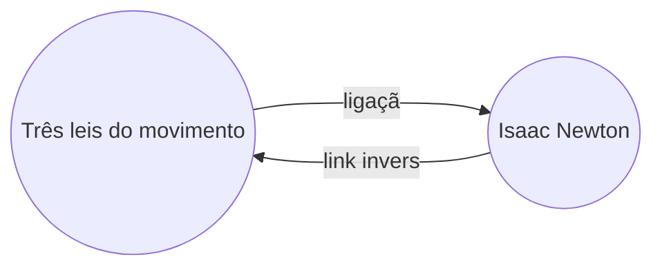

Com o [[Plugins Base|plugin]] de Links inversos, pode ver todos os _links inversos_ da nota ativa.

Um link inverso de uma nota é uma ligação de outra nota para essa nota. No exemplo seguinte, a nota "Três leis do movimento" contém uma ligação para a nota "Isaac Newton". O link inverso correspondente ligaria de "Isaac Newton" de volta a "Três leis do movimento".

Os links inversos podem ser úteis para encontrar notas que fazem referência à nota que está a escrever. Imagine se pudesse listar os links inversos de qualquer website na internet.

## Mostrar backlinks

O plugin de Links inversos apresenta os links inversos dos separadores ativos. Existem duas secções recolhíveis: **Menções vinculadas** e **Menções sem link**.

- **Menções vinculadas** são links inversos para as notas que contêm uma ligação interna para a nota ativa.
- **Menções sem link** são links inversos para qualquer ocorrência não ligada do nome da nota ativa.

Fornece as seguintes opções:

- **Recolher resultados** alterna entre expandir cada nota para mostrar as menções nela contidas.
- **Mostrar o contexto** alterna entre truncar ou mostrar o parágrafo completo que contém a menção.
- **Mudar ordem** determina como ordenar as menções.
- **Mostrar filtro de pesquisa** alterna um campo de texto que permite filtrar as menções. Para mais informações sobre como construir um termo de pesquisa, consulte [[Pesquisar]].

## Ver links inversos de uma nota

Para ver os links inversos da nota ativa, clique no separador **Links inversos** ![[obsidian-icon-links-coming-in.svg#icon]] na barra lateral direita.

> [!note] Nota
> Se não conseguir ver o separador de Links inversos, pode torná-lo visível abrindo a [[Paleta de comando]] e executando o comando **Links inversos: Mostrar backlinks**.

> [!info] Ficheiros excluídos
> Os ficheiros que correspondam aos seus padrões de [[Definições#Ficheiros excluídos|Ficheiros excluídos]] não aparecerão nas Menções sem link.

## Ver links inversos de uma nota específica

O separador de links inversos lista os links inversos da nota ativa e atualiza quando muda para uma nota diferente. Se quiser ver os links inversos de uma nota específica, independentemente de estar ativa ou não, pode abrir um separador de links inversos _vinculado_.

Para abrir um separador de links inversos vinculado:

1. Abra a [[Paleta de comando]].
2. Selecione **Links inversos: Abrir backlinks para o ficheiro atual**.

Um separador separado abre junto à sua nota ativa. O separador mostra um ícone de ligação para indicar que está vinculado a uma nota.

## Mostrar links inversos numa nota

Em vez de mostrar os links inversos num separador separado, pode mostrar os links inversos na parte inferior da sua nota.

Para mostrar links inversos numa nota:

1. Abra a [[Paleta de comando]].
2. Selecione **Links inversos: Ativar backlinks no document**.

Ou ative **Links inversos no documento** nas opções do plugin de Links inversos para ativar automaticamente os links inversos quando abre uma nova nota.
