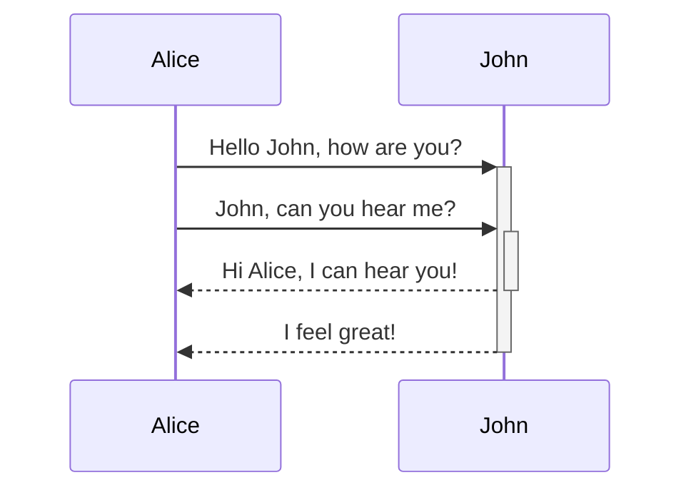
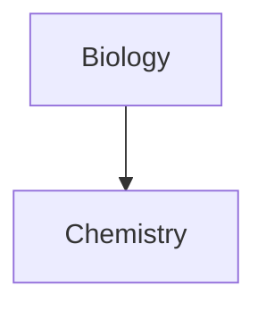

Aflați cum să adăugați sintaxă de formatare avansată în notele dvs.

## Tabele

Puteți crea tabele folosind bare verticale (`|`) pentru a separa coloanele și cratime (`-`) pentru a defini antetele. Iată un exemplu:

```md
| First name | Last name |
| ---------- | --------- |
| Max        | Planck    |
| Marie      | Curie     |
```

| First name | Last name |
| ---------- | --------- |
| Max        | Planck    |
| Marie      | Curie     |

Deși barele verticale de pe ambele părți ale tabelului sunt opționale, includerea lor este recomandată pentru lizibilitate.

> [!tip] În _Live Preview_, puteți face clic dreapta pe un tabel pentru a adăuga sau șterge coloane și rânduri. De asemenea, le puteți sorta și muta folosind meniul contextual.

Puteți insera un tabel folosind comanda **Insert Table** din [[Paleta de comenzi|Paleta de comenzi]] sau făcând clic dreapta și selectând _Insert → Table_. Astfel veți obține un tabel simplu, editabil:

```md
|     |     |
| --- | --- |
|     |     |
```

Rețineți că celulele nu trebuie să fie aliniate perfect, dar rândul de antet trebuie să conțină cel puțin două cratime:

```md
First name | Last name
-- | --
Max | Planck
Marie | Curie
```


### Formatați conținutul dintr-un tabel

Puteți folosi [[basic formatting syntax|sintaxa de formatare de bază]] pentru a stiliza conținutul dintr-un tabel.

| Prima coloană       | A doua coloană                           |
| ------------------ | --------------------------------------- |
| [[Legături interne]] | Legătură către un fișier _din interiorul_ **seifului** dvs. |
| [[Încorporează fișiere]]    | ![[Engelbart.jpg\|100]]                 |

> [!note] Bare verticale în tabele
> Dacă doriți să folosiți [[aliases]], sau să [[Sintaxă de bază pentru formatare#External images|redimensionați o imagine]] în tabelul dvs., trebuie să adăugați un `\` înaintea barei verticale.
>
> ```md
> First column | Second column
> -- | --
> [[Sintaxă de bază pentru formatare\|Markdown syntax]] | ![[Engelbart.jpg\|200]]
> ```
>
> Prima coloană | A doua coloană
> -- | --
> [[Sintaxă de bază pentru formatare\|Markdown syntax]] | ![[Engelbart.jpg\|200]]

Aliniați textul în coloane adăugând două puncte (`:`) la rândul de antet. De asemenea, puteți alinia conținutul în _Live Preview_ prin meniul contextual.

```md
Left-aligned text | Center-aligned text | Right-aligned text
:-- | :--: | --:
Content | Content | Content
```

Text aliniat la stânga | Text aliniat central | Text aliniat la dreapta
:-- | :--: | --:
Conținut | Conținut | Conținut

## Diagramă

Puteți adăuga diagrame și grafice în notele dvs., folosind [Mermaid](https://mermaid-js.github.io/). Mermaid acceptă o gamă largă de diagrame, precum [diagrame de flux](https://mermaid.js.org/syntax/flowchart.html), [diagrame de secvență](https://mermaid.js.org/syntax/sequenceDiagram.html) și [cronologii](https://mermaid.js.org/syntax/timeline.html).

> [!tip] Sfat
> Puteți încerca și [Editorul live](https://mermaid-js.github.io/mermaid-live-editor) al Mermaid pentru a vă ajuta să construiți diagrame înainte de a le include în notele dvs.

Pentru a adăuga o diagramă Mermaid, creați un [[Sintaxă de bază pentru formatare#Code blocks|bloc de cod]] `mermaid`.

````md

````


````md

````


### Conectarea fișierelor într-o diagramă

Puteți crea [[internal links|legături interne]] în diagramele dvs. atașând clasa [`internal-link`](https://mermaid.js.org/syntax/flowchart.html#classes) la nodurile dvs.

````md

````


> [!note] Notă
> Legăturile interne din diagrame nu apar în [[Afișaj grafic|afișajul grafic]].

Dacă aveți multe noduri în diagramele dvs., puteți folosi următorul fragment de cod.

````md

````

Astfel, fiecare nod-literă devine o legătură internă, cu [textul nodului](https://mermaid.js.org/syntax/flowchart.html#a-node-with-text) drept text al legăturii.

> [!note] Notă
> Dacă folosiți caractere speciale în numele notelor dvs., trebuie să puneți numele notei între ghilimele duble.
>
> ```
> class "⨳ special character" internal-link
> ```
>
> Sau, `A["⨳ special character"]`.

Pentru mai multe informații despre crearea diagramelor, consultați [documentația oficială Mermaid](https://mermaid.js.org/intro/).

## Matematică

Puteți adăuga expresii matematice în notele dvs. folosind [MathJax](http://docs.mathjax.org/en/latest/basic/mathjax.html) și notația LaTeX.

Pentru a adăuga o expresie MathJax în nota dvs., încadrați-o cu semne dolar duble (`$$`).

```md
$$
\begin{vmatrix}a & b\\
c & d
\end{vmatrix}=ad-bc
$$
```

$$
\begin{vmatrix}a & b\\
c & d
\end{vmatrix}=ad-bc
$$

Puteți include și expresii matematice în text, încadrându-le cu semne `$`.

```md
This is an inline math expression $e^{2i\pi} = 1$.
```

This is an inline math expression $e^{2i\pi} = 1$.

Pentru mai multe informații despre sintaxă, consultați [MathJax basic tutorial and quick reference](https://math.meta.stackexchange.com/questions/5020/mathjax-basic-tutorial-and-quick-reference).

Pentru o listă a pachetelor MathJax acceptate, consultați [The TeX/LaTeX Extension List](http://docs.mathjax.org/en/latest/input/tex/extensions/index.html).
