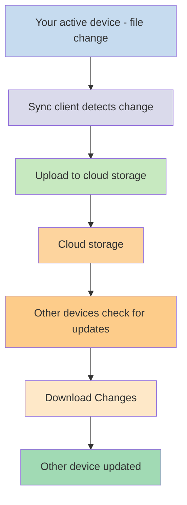
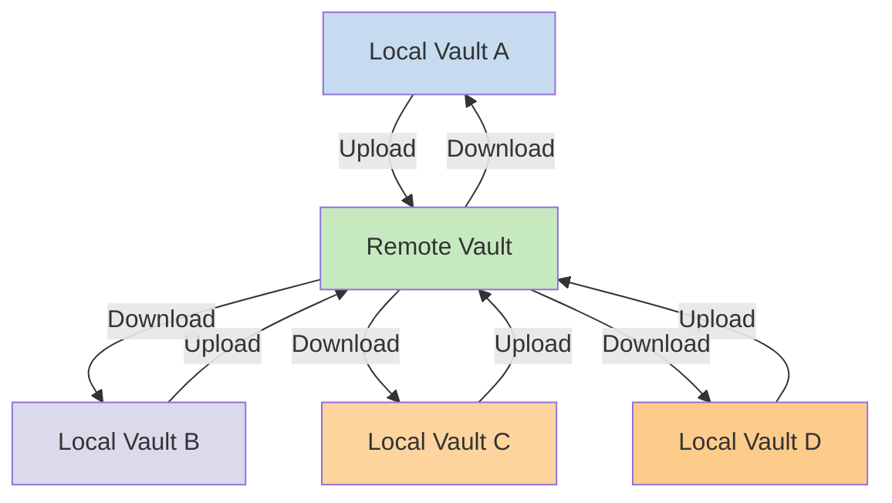

Dacă dorești să îți folosești notele pe diferite dispozitive, una dintre opțiunile pe care le ai este să [[Sync your notes across devices|îți sincronizezi notele pe toate dispozitivele]]. Obsidian oferă un astfel de serviciu, [[Introduction to Obsidian Sync|Obsidian Sync]], care funcționează diferit față de alte servicii de sincronizare, precum [[Sync your notes across devices#iCloud|iCloud]] și [[Sync your notes across devices#OneDrive|OneDrive]].

Iată câțiva termeni-cheie:

- Un **seif** este un director în sistemul tău de fișiere care conține note și un director `.obsidian` cu configurația specifică Obsidian.
- Un **seif local** este copia seifului tău care există pe fiecare dintre dispozitivele tale. Când folosești servicii de sincronizare, conectezi aceste seifuri locale pentru a activa sincronizarea.
- Un **seif la distanță** este o stocare centralizată la care seifurile locale se conectează direct prin Obsidian Sync.

Există două abordări comune ale sincronizării:

- **[[#Servicii de sincronizare bazate pe fișiere]]**: Seifurile locale trebuie să se afle în directoare monitorizate, sincronizarea are loc prin intermediul sistemului de fișiere
- **[[#Obsidian Sync|Seifuri la distanță]]**: Stocare centralizată la care seifurile locale se conectează direct prin Obsidian

## Servicii de sincronizare bazate pe fișiere

Servicii precum Dropbox, Google Drive, iCloud și OneDrive funcționează pe bază de directoare. Aceste servicii monitorizează anumite directoare și sincronizează automat orice fișiere plasate în ele. Fișierele trebuie să se afle în directoarele desemnate ale serviciului cloud pentru a fi sincronizate. La serviciile de sincronizare bazate pe fișiere, seiful tău local acționează pur și simplu ca un alt director monitorizat. Nu există un seif la distanță dedicat — în schimb, stocarea cloud funcționează ca un intermediar, copiind fișierele între seifurile locale de pe diferite dispozitive.

Diagrama de mai jos arată o versiune simplificată a modului în care funcționează aceste servicii:

Dacă serviciul cloud dispune de sincronizare în fundal, atunci unele dintre aceste procese se pot desfășura chiar și atunci când nu folosești activ aplicațiile pentru a vizualiza fișierele. Aceste servicii monitorizează anumite directoare și sincronizează automat orice fișiere plasate în ele. Fișierele trebuie să se afle în directoarele desemnate ale serviciului cloud pentru a fi sincronizate.

## Obsidian Sync

Obsidian Sync îți permite să creezi un seif la distanță care servește drept stocare centralizată prin serviciul [[Introduction to Obsidian Sync|Obsidian Sync]]. Acest lucru îți permite să alegi aproape orice director de pe oricare dintre dispozitivele tale pentru a-ți stoca fișierele — fie pe un hard disk extern, în `C:\`, fie în stocarea aplicației pe Android.

Totuși, avem o listă de locații recomandate pentru seiful tău local dacă folosești și [[#Servicii de sincronizare bazate pe fișiere|servicii de sincronizare bazate pe fișiere]] pe același dispozitiv — în principal, orice loc care nu se află într-un [[Switch to Obsidian Sync#Mută-ți seiful din serviciul tău de sincronizare terț sau din stocarea cloud|serviciu de sincronizare terț]].

Diagrama de mai jos arată o versiune simplificată a modului în care funcționează Obsidian Sync:

Punctele forte ale acestui sistem devin mai evidente pe măsură ce apar mai multe tipuri de dispozitive. [[#Servicii de sincronizare bazate pe fișiere|Serviciile de sincronizare bazate pe fișiere]] pot fi implementate inconsecvent pe diferite sisteme de operare, iar dispozitivele mobile au propriile reguli privind modul în care aplicațiile pot fi izolate (sandboxed) și limitate la nivel de consum de energie, ceea ce face mult mai dificilă funcționarea fără cusur a serviciilor tradiționale bazate pe fișiere.

Cu Obsidian Sync, serviciul gestionează sincronizarea direct prin aplicație, oferind un comportament consecvent indiferent de tipul dispozitivului sau de limitările sistemului de operare, prioritizând în același timp păstrarea unei copii locale a datelor tale ca [[Back up your Obsidian files|copie de rezervă suplimentară]].

### Comportamentul sincronizării

Când faci modificări la fișiere în seiful tău local, Obsidian Sync detectează aceste modificări și le încarcă în seiful la distanță. Celelalte dispozitive conectate la același seif la distanță vor descărca apoi aceste modificări și le vor aplica seifurilor lor locale. Obsidian Sync urmărește modificările la nivel de fișier și transferă doar fișierele care au fost modificate, în loc să sincronizeze directoare întregi. Acest lucru reduce utilizarea lățimii de bandă și timpul de sincronizare.

Când apar conflicte sau când trebuie să controlezi ce fișiere se sincronizează, Obsidian Sync oferă mecanisme specifice pentru a gestiona aceste situații:

![[Troubleshoot Obsidian Sync#Rezolvarea conflictelor|Rezolvarea conflictelor]]

![[Sync settings and selective syncing#Sincronizare selectivă#Exclude un director din sincronizare]]

### Comportamentul offline

Modificările făcute în timp ce ești offline sunt puse în așteptare și se sincronizează automat când dispozitivul tău se reconectează la internet, iar Obsidian este deschis. Seiful tău local rămâne complet funcțional în perioadele offline.

## Pașii următori

- [[Set up Obsidian Sync]] pentru a începe cu seifurile la distanță.
- [[Switch to Obsidian Sync]] dacă folosești în prezent sincronizarea bazată pe fișiere și dorești să treci la Obsidian Sync.
- [[Sync your notes across devices|Explorează alte opțiuni de sincronizare]] dacă încă te decizi.
