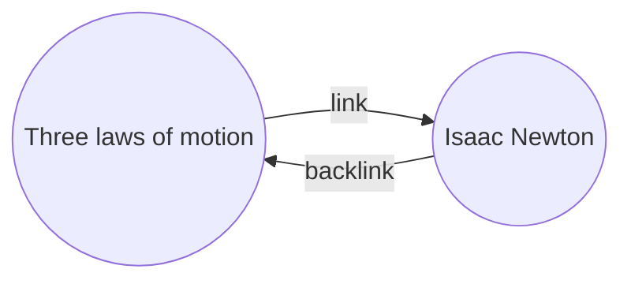

Cu modulul [[Core plugins|Referințe]], poți vedea toate _referințele_ pentru nota activă.

O referință pentru o notă este o legătură dintr-o altă notă către acea notă. În exemplul următor, nota „Cele trei legi ale mișcării” conține o legătură către nota „Isaac Newton”. Referința corespunzătoare ar face legătura de la „Isaac Newton” înapoi la „Cele trei legi ale mișcării”.

Referințele pot fi utile pentru a găsi notele care fac trimitere la nota pe care o scrii. Imaginează-ți dacă ai putea lista referințele pentru orice site de pe internet.

## Afișează referințele

Modulul Referințe afișează referințele pentru filele active. Există două secțiuni pliabile: **Mențiuni conectate** și **Mențiuni fără legături**.

- **Mențiuni conectate** sunt referințe către notele care conțin o legătură internă către nota activă.
- **Mențiuni fără legături** sunt referințe către orice apariție neconectată a numelui notei active.

Oferă următoarele opțiuni:

- **Restrânge rezultatele** comută dacă fiecare notă este extinsă pentru a afișa mențiunile din ea.
- **Extinde contextul** comută dacă paragraful care conține mențiunea este trunchiat sau afișat complet.
- **Schimbă ordinea de sortare** determină modul în care sunt sortate mențiunile.
- **Afișează filtrul de căutare** comută un câmp de text care îți permite să filtrezi mențiunile. Pentru mai multe informații despre cum să construiești un termen de căutare, consultă [[Search|Caută]].

## Vezi referințele pentru o notă

Pentru a vedea referințele pentru nota activă, dă clic pe fila **Referințe** ![[obsidian-icon-links-coming-in.svg#icon]] din bara laterală dreaptă.

> [!note] Notă
> Dacă nu vezi fila Referințe, o poți face vizibilă deschizând [[Command palette|Paleta de comenzi]] și rulând comanda **Backlinks: Show backlinks**.

> [!info] Fișiere excluse
> Fișierele care corespund tiparelor tale de [[Settings#Excluded files|Fișiere excluse]] nu vor apărea în Mențiuni fără legături.

## Vezi referințele unei anumite note

Fila de referințe listează referințele pentru nota activă și se actualizează atunci când treci la o altă notă. Dacă vrei să vezi referințele pentru o anumită notă, indiferent dacă este activă sau nu, poți deschide o filă de referințe _conectată_.

Pentru a deschide o filă de referințe conectată:

1. Deschide [[Command palette|Paleta de comenzi]].
2. Selectează **Backlinks: Open backlinks for the current note**.

Se deschide o filă separată lângă nota activă. Fila arată o pictogramă de legătură pentru a te anunța că este conectată la o notă.

## Afișează referințele într-o notă

În loc să afișezi referințele într-o filă separată, le poți afișa în partea de jos a notei tale.

Pentru a afișa referințele într-o notă:

1. Deschide [[Command palette|Paleta de comenzi]].
2. Selectează **Backlinks: Toggle backlinks in document**.

Sau, activează **Backlink in document** în opțiunile modulului Referințe pentru a comuta automat referințele atunci când deschizi o notă nouă.
