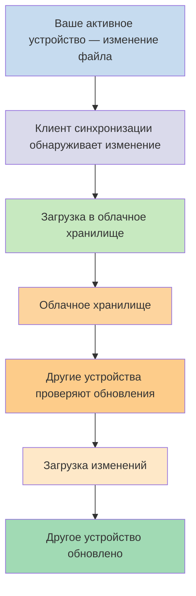
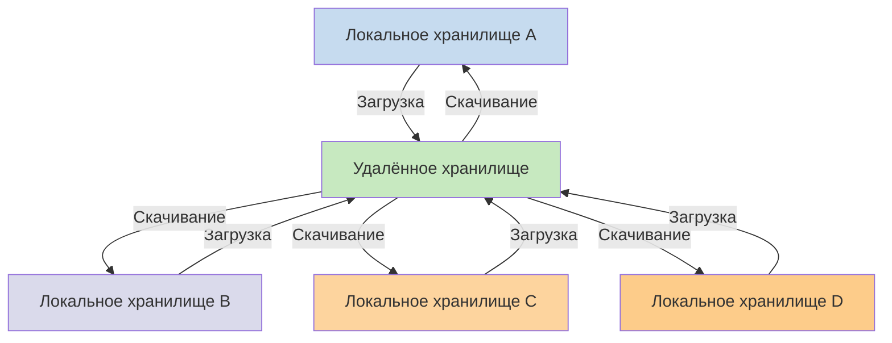

Если вы хотите использовать свои заметки на разных устройствах, один из доступных вариантов — [[Синхронизация заметок между устройствами|синхронизация заметок между устройствами]]. Obsidian предлагает собственный сервис — [[Введение в Obsidian Sync|Obsidian Sync]], — который работает иначе, чем другие сервисы синхронизации, такие как [[Синхронизация заметок между устройствами#iCloud|iCloud]] и [[Синхронизация заметок между устройствами#OneDrive|OneDrive]].

Вот несколько ключевых терминов:

- **Хранилище** — это папка в вашей файловой системе, которая содержит заметки и папку `.obsidian` с конфигурацией, специфичной для Obsidian.
- **Локальное хранилище** — это копия вашего хранилища, которая существует на каждом из ваших устройств. При использовании сервисов синхронизации вы подключаете эти локальные хранилища для обеспечения синхронизации.
- **Удалённое хранилище** — это централизованное хранилище, к которому локальные хранилища подключаются напрямую через Obsidian Sync.

Существует два распространённых подхода к синхронизации:

- **[[#Файловые сервисы синхронизации]]**: локальные хранилища должны находиться в отслеживаемых папках, синхронизация происходит через файловую систему.
- **[[#Obsidian Sync|Удалённые хранилища]]**: централизованное хранилище, к которому локальные хранилища подключаются напрямую через Obsidian.

## Файловые сервисы синхронизации

Такие сервисы, как Dropbox, Google Drive, iCloud и OneDrive, работают на основе папок. Эти сервисы отслеживают определённые папки и автоматически синхронизируют любые файлы, помещённые в них. Файлы должны находиться в указанных папках облачного сервиса для синхронизации. При использовании файловых сервисов синхронизации ваше локальное хранилище выступает просто как ещё одна отслеживаемая папка. Выделенного удалённого хранилища нет — вместо этого облачное хранилище служит посредником, копируя файлы между локальными хранилищами на разных устройствах.

На диаграмме ниже показана упрощённая схема работы этих сервисов:

Если облачный сервис поддерживает фоновую синхронизацию, то некоторые из этих процессов могут происходить даже тогда, когда вы не используете приложения для просмотра файлов. Эти сервисы отслеживают определённые папки и автоматически синхронизируют любые файлы, помещённые в них. Файлы должны находиться в указанных папках облачного сервиса для синхронизации.

## Obsidian Sync

Obsidian Sync позволяет создать удалённое хранилище, которое служит централизованным хранилищем через сервис [[Введение в Obsidian Sync|Obsidian Sync]]. Это позволяет вам выбрать практически любую папку на любом из ваших устройств для хранения файлов — будь то внешний жёсткий диск, `C:\` или хранилище приложения на Android.

Однако у нас есть список рекомендуемых расположений для вашего локального хранилища, если вы также используете [[#Файловые сервисы синхронизации]] на том же устройстве — главное, чтобы оно не находилось в [[Переход на Obsidian Sync#Переместите хранилище из стороннего сервиса синхронизации или облачного хранилища|стороннем сервисе синхронизации]].

На диаграмме ниже показана упрощённая схема работы Obsidian Sync:

Преимущества этой системы становятся более очевидными при увеличении числа типов устройств. [[#Файловые сервисы синхронизации]] могут работать непоследовательно на разных операционных системах, а мобильные устройства имеют собственные правила изоляции приложений и ограничения энергопотребления, что значительно затрудняет бесперебойную работу традиционных файловых сервисов.

С Obsidian Sync сервис обеспечивает синхронизацию непосредственно через приложение, обеспечивая согласованное поведение независимо от типа устройства или ограничений операционной системы, при этом приоритетом является сохранение локальной копии ваших данных в качестве [[Резервное копирование файлов Obsidian|мягкой резервной копии]].

### Поведение при синхронизации

Когда вы вносите изменения в файлы локального хранилища, Obsidian Sync обнаруживает эти изменения и загружает их в удалённое хранилище. Другие устройства, подключённые к тому же удалённому хранилищу, затем скачивают эти изменения и применяют их к своим локальным хранилищам. Obsidian Sync отслеживает изменения на уровне файлов и передаёт только изменённые файлы, а не синхронизирует целые папки. Это сокращает использование полосы пропускания и время синхронизации.

При возникновении конфликтов или когда вам нужно контролировать, какие файлы синхронизируются, Obsidian Sync предоставляет специальные механизмы для обработки этих ситуаций:

![[Устранение неполадок Obsidian Sync#Разрешение конфликтов|Разрешение конфликтов]]

![[Настройки синхронизации и выборочная синхронизация#Выборочная синхронизация#Исключить папку из синхронизации]]

### Поведение в автономном режиме

Изменения, сделанные в автономном режиме, помещаются в очередь и автоматически синхронизируются, когда устройство подключается к интернету и Obsidian открыт. Ваше локальное хранилище остаётся полностью функциональным в периоды отсутствия подключения.

## Следующие шаги

- [[Настройка Obsidian Sync]], чтобы начать работу с удалёнными хранилищами.
- [[Переход на Obsidian Sync]], если вы в настоящее время используете файловую синхронизацию и хотите перейти на Obsidian Sync.
- [[Синхронизация заметок между устройствами|Изучите другие варианты синхронизации]], если вы ещё выбираете.
