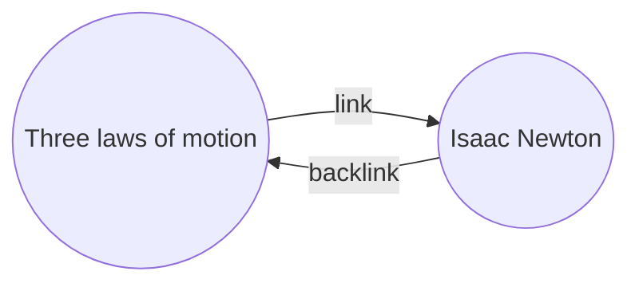

Плагин «Обратные ссылки» ([[Основные плагины|плагин]]) позволяет видеть все _обратные ссылки_ для текущей заметки.

Обратная ссылка для заметки — это ссылка из другой заметки на эту заметку. В следующем примере заметка «Три закона движения» содержит ссылку на заметку «Исаак Ньютон». Соответствующая обратная ссылка будет вести от «Исаака Ньютона» обратно к «Трём законам движения».

Обратные ссылки могут быть полезны для поиска заметок, которые ссылаются на заметку, над которой вы работаете. Представьте, что вы могли бы вывести список обратных ссылок для любого сайта в интернете.

## Отображение обратных ссылок

Плагин «Обратные ссылки» показывает обратные ссылки для активных вкладок. Есть два сворачиваемых раздела: **Упоминания со ссылкой** и **Упоминания без ссылки**.

- **Упоминания со ссылкой** — это обратные ссылки на заметки, содержащие внутреннюю ссылку на текущую заметку.
- **Упоминания без ссылки** — это обратные ссылки на любое упоминание имени текущей заметки без использования ссылки.

Доступны следующие параметры:

- **Свернуть результаты** — переключает, раскрывать ли каждую заметку для отображения упоминаний в ней.
- **Развернуть контекст** — переключает, обрезать ли или отображать полный абзац, содержащий упоминание.
- **Порядок сортировки** — определяет способ сортировки упоминаний.
- **Показать фильтр поиска** — показывает текстовое поле, позволяющее фильтровать упоминания. Подробнее о построении поисковых запросов см. в разделе [[Поиск]].

## Просмотр обратных ссылок для заметки

Чтобы просмотреть обратные ссылки для текущей заметки, нажмите на вкладку **Обратные ссылки** ![[obsidian-icon-links-coming-in.svg#icon]] на правой боковой панели.

> [!note] Примечание
> Если вы не видите вкладку «Обратные ссылки», вы можете сделать её видимой, открыв [[Палитра команд|палитру команд]] и выполнив команду **Обратные ссылки: Показать обратные ссылки**.

> [!info] Исключённые файлы и папки
> Файлы, соответствующие шаблонам в настройке [[Настройки#Исключённые файлы и папки|Исключённые файлы и папки]], не будут отображаться в упоминаниях без ссылки.

## Просмотр обратных ссылок для конкретной заметки

Вкладка обратных ссылок отображает обратные ссылки для текущей заметки и обновляется при переключении на другую заметку. Если вы хотите видеть обратные ссылки для конкретной заметки, независимо от того, активна она или нет, вы можете открыть _привязанную_ вкладку обратных ссылок.

Чтобы открыть привязанную вкладку обратных ссылок:

1. Откройте [[Палитра команд|палитру команд]].
2. Выберите **Обратные ссылки: Показать обратные ссылки для текущего файла**.

Рядом с текущей заметкой откроется отдельная вкладка. На ней отображается значок ссылки, указывающий на привязку к заметке.

## Отображение обратных ссылок в заметке

Вместо показа обратных ссылок в отдельной вкладке вы можете отображать их в нижней части заметки.

Чтобы отобразить обратные ссылки в заметке:

1. Откройте [[Палитра команд|палитру команд]].
2. Выберите **Обратные ссылки: Включить/отключить обратные ссылки в документе**.

Или включите параметр **Показывать обратные ссылки** в настройках плагина «Обратные ссылки», чтобы автоматически показывать обратные ссылки при открытии новой заметки.
