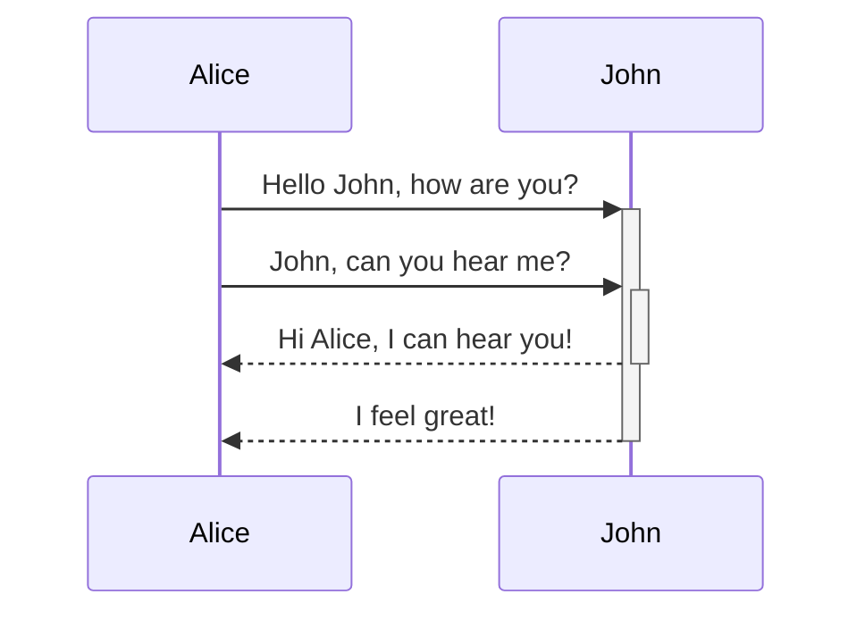
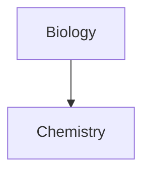

Узнайте, как использовать расширенный синтаксис форматирования в ваших заметках.

## Таблицы

Вы можете создавать таблицы, используя вертикальные черты (`|`) для разделения столбцов и дефисы (`-`) для определения заголовков. Вот пример:

```md
| First name | Last name |
| ---------- | --------- |
| Max        | Planck    |
| Marie      | Curie     |
```

| First name | Last name |
| ---------- | --------- |
| Max        | Planck    |
| Marie      | Curie     |

Хотя вертикальные черты по краям таблицы необязательны, их рекомендуется использовать для удобства чтения.

> [!tip] В _динамическом просмотре_ вы можете щёлкнуть правой кнопкой мыши по таблице, чтобы добавить или удалить столбцы и строки. Вы также можете сортировать и перемещать их с помощью контекстного меню.

Вы можете вставить таблицу с помощью команды **Вставить таблицу** из [[Палитра команд|палитры команд]] или щёлкнув правой кнопкой мыши и выбрав _Вставка → Таблица_. Это создаст базовую редактируемую таблицу:

```md
|     |     |
| --- | --- |
|     |     |
```

Обратите внимание, что ячейки не обязательно должны быть идеально выровнены, но строка заголовка должна содержать не менее двух дефисов:

```md
First name | Last name
-- | --
Max | Planck
Marie | Curie
```


### Форматирование содержимого внутри таблицы

Вы можете использовать [[Основной синтаксис форматирования|основной синтаксис форматирования]] для стилизации содержимого внутри таблицы.

| Первый столбец       | Второй столбец                                  |
| -------------------- | ------------------------------------------------ |
| [[Внутренние ссылки]] | Ссылка на файл _внутри_ вашего **хранилища**. |
| [[Встраивание файлов]]    | ![[Engelbart.jpg\|100]]                     |

> [!note] Вертикальные черты в таблицах
> Если вы хотите использовать [[Псевдонимы|псевдонимы]] или [[Основной синтаксис форматирования#Внешние изображения|изменить размер изображения]] в таблице, вам необходимо добавить `\` перед вертикальной чертой.
>
> ```md
> First column | Second column
> -- | --
> [[Основной синтаксис форматирования\|Синтаксис Markdown]] | ![[Engelbart.jpg\|200]]
> ```
>
> First column | Second column
> -- | --
> [[Основной синтаксис форматирования\|Синтаксис Markdown]] | ![[Engelbart.jpg\|200]]

Выравнивайте текст в столбцах, добавляя двоеточия (`:`) в строку заголовка. Вы также можете выровнять содержимое в _динамическом просмотре_ через контекстное меню.

```md
Left-aligned text | Center-aligned text | Right-aligned text
:-- | :--: | --:
Content | Content | Content
```

Left-aligned text | Center-aligned text | Right-aligned text
:-- | :--: | --:
Content | Content | Content

## Диаграммы

Вы можете добавлять диаграммы и графики в свои заметки, используя [Mermaid](https://mermaid-js.github.io/). Mermaid поддерживает различные типы диаграмм, такие как [блок-схемы](https://mermaid.js.org/syntax/flowchart.html), [диаграммы последовательностей](https://mermaid.js.org/syntax/sequenceDiagram.html) и [временные шкалы](https://mermaid.js.org/syntax/timeline.html).

> [!tip] Подсказка
> Вы также можете воспользоваться [онлайн-редактором](https://mermaid-js.github.io/mermaid-live-editor) Mermaid, чтобы создать диаграммы перед добавлением их в заметки.

Чтобы добавить диаграмму Mermaid, создайте [[Основной синтаксис форматирования#Блоки кода|блок кода]] `mermaid`.

````md

````


````md

````


### Ссылки на файлы в диаграммах

Вы можете создавать [[Внутренние ссылки|внутренние ссылки]] в диаграммах, прикрепляя [класс](https://mermaid.js.org/syntax/flowchart.html#classes) `internal-link` к вашим узлам.

````md

````


> [!note] Примечание
> Внутренние ссылки из диаграмм не отображаются в [[Граф|виде графа]].

Если в ваших диаграммах много узлов, вы можете использовать следующий фрагмент.

````md

````

Таким образом, каждый буквенный узел становится внутренней ссылкой, где [текст узла](https://mermaid.js.org/syntax/flowchart.html#a-node-with-text) используется в качестве текста ссылки.

> [!note] Примечание
> Если в названиях заметок используются специальные символы, необходимо заключить название заметки в двойные кавычки.
>
> ```
> class "⨳ special character" internal-link
> ```
>
> Или: `A["⨳ special character"]`.

Для получения дополнительной информации о создании диаграмм обратитесь к [официальной документации Mermaid](https://mermaid.js.org/intro/).

## Математические выражения

Вы можете добавлять математические выражения в свои заметки, используя [MathJax](http://docs.mathjax.org/en/latest/basic/mathjax.html) и нотацию LaTeX.

Чтобы добавить выражение MathJax в заметку, окружите его двойными знаками доллара (`$$`).

```md
$$
\begin{vmatrix}a & b\\
c & d
\end{vmatrix}=ad-bc
$$
```

$$
\begin{vmatrix}a & b\\
c & d
\end{vmatrix}=ad-bc
$$

Вы также можете использовать встроенные математические выражения, обернув их символами `$`.

```md
Это встроенное математическое выражение $e^{2i\pi} = 1$.
```

Это встроенное математическое выражение $e^{2i\pi} = 1$.

Для получения дополнительной информации о синтаксисе обратитесь к [базовому руководству и краткому справочнику по MathJax](https://math.meta.stackexchange.com/questions/5020/mathjax-basic-tutorial-and-quick-reference).

Список поддерживаемых пакетов MathJax можно найти в [списке расширений TeX/LaTeX](http://docs.mathjax.org/en/latest/input/tex/extensions/index.html).
