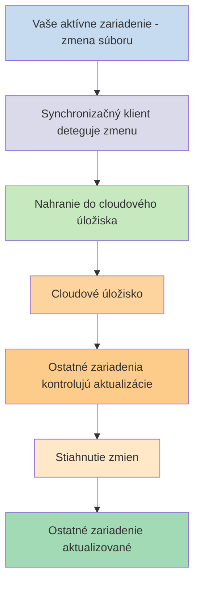
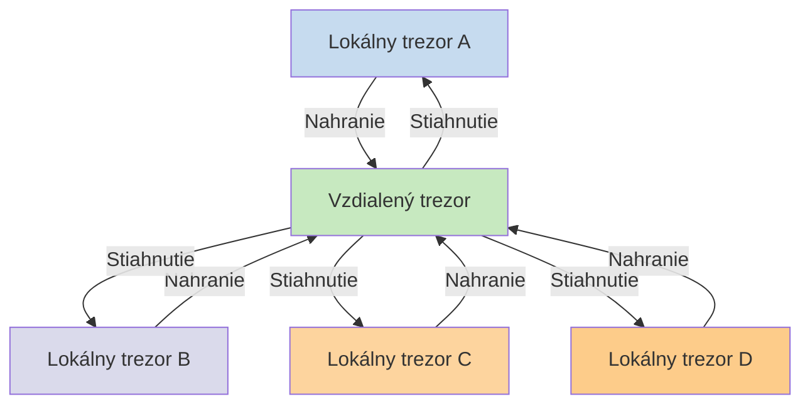

Ak chcete používať svoje poznámky na rôznych zariadeniach, jednou z možností je [[Synchronizácia poznámok medzi zariadeniami]]. Obsidian ponúka takúto službu, [[Úvod do Obsidian Sync|Obsidian Sync]], ktorá funguje odlišne od iných synchronizačných služieb, ako sú [[Synchronizácia poznámok medzi zariadeniami#iCloud|iCloud]] a [[Synchronizácia poznámok medzi zariadeniami#OneDrive|OneDrive]].

Tu sú niektoré kľúčové pojmy:

- **Trezor** je priečinok vo vašom súborovom systéme, ktorý obsahuje poznámky a priečinok `.obsidian` s konfiguráciou špecifickou pre Obsidian.
- **Lokálny trezor** je kópia vášho trezoru, ktorá existuje na každom vašom zariadení. Pri používaní synchronizačných služieb tieto lokálne trezory prepojíte, aby sa umožnila synchronizácia.
- **Vzdialený trezor** je centralizované úložisko, ku ktorému sa lokálne trezory pripájajú priamo cez Obsidian Sync.

Existujú dva bežné prístupy k synchronizácii:

- **[[#Súborové synchronizačné služby]]**: Lokálne trezory musia byť v monitorovaných priečinkoch, synchronizácia prebieha cez súborový systém
- **[[#Obsidian Sync|Vzdialené trezory]]**: Centralizované úložisko, ku ktorému sa lokálne trezory pripájajú priamo cez Obsidian

## Súborové synchronizačné služby

Služby ako Dropbox, Google Drive, iCloud a OneDrive sú založené na priečinkoch. Tieto služby monitorujú konkrétne priečinky a automaticky synchronizujú všetky súbory, ktoré sa do nich umiestnia. Súbory musia byť v určených priečinkoch cloudovej služby, aby sa synchronizovali. Pri súborových synchronizačných službách váš lokálny trezor funguje len ako ďalší monitorovaný priečinok. Neexistuje žiadny dedikovaný vzdialený trezor – namiesto toho cloudové úložisko slúži ako prostredník, ktorý kopíruje súbory medzi lokálnymi trezormi na rôznych zariadeniach.

Nižšie uvedený diagram zobrazuje zjednodušenú verziu fungovania týchto služieb:

Ak cloudová služba má synchronizáciu na pozadí, niektoré z týchto procesov môžu prebiehať aj keď aktívne nepoužívate aplikácie na prezeranie súborov. Tieto služby monitorujú konkrétne priečinky a automaticky synchronizujú všetky súbory, ktoré sa do nich umiestnia. Súbory musia byť v určených priečinkoch cloudovej služby, aby sa synchronizovali.

## Obsidian Sync

Obsidian Sync vám umožňuje vytvoriť vzdialený trezor, ktorý slúži ako centralizované úložisko prostredníctvom služby [[Úvod do Obsidian Sync|Obsidian Sync]]. To vám umožňuje vybrať takmer akýkoľvek priečinok na akomkoľvek zariadení na ukladanie súborov – či už na externom pevnom disku, v `C:\`, alebo v úložisku aplikácie na Androide.

Máme však zoznam odporúčaných umiestnení pre váš lokálny trezor, ak na tom istom zariadení používate aj [[#Súborové synchronizačné služby]] – hlavne kdekoľvek, čo nie je v [[Prechod na Obsidian Sync#Presuňte váš trezor z vašej synchronizačnej služby tretej strany alebo cloudového úložiska|synchronizačnej službe tretej strany]].

Nižšie uvedený diagram zobrazuje zjednodušenú verziu fungovania Obsidian Sync:

Sila tohto systému sa stáva zreteľnejšou s väčším počtom typov zariadení. [[#Súborové synchronizačné služby]] môžu byť implementované nekonzistentne naprieč operačnými systémami a mobilné zariadenia majú vlastné pravidlá ohľadom sandboxovania aplikácií a obmedzenia spotreby energie, čo výrazne sťažuje bezproblémové fungovanie tradičných súborových synchronizačných služieb.

S Obsidian Sync služba zabezpečuje synchronizáciu priamo cez aplikáciu, čím poskytuje konzistentné správanie bez ohľadu na typ zariadenia alebo obmedzenia operačného systému, pričom uprednostňuje uchovanie lokálnej kópie vašich dát ako [[Zálohovanie súborov Obsidian|mäkkú zálohu]].

### Správanie synchronizácie

Keď vykonáte zmeny v súboroch vo vašom lokálnom trezore, Obsidian Sync tieto zmeny deteguje a nahrá ich do vzdialeného trezoru. Ostatné zariadenia pripojené k rovnakému vzdialenému trezoru si potom tieto zmeny stiahnu a aplikujú ich do svojich lokálnych trezorov. Obsidian Sync sleduje zmeny na úrovni súborov a prenáša iba súbory, ktoré boli upravené, namiesto synchronizácie celých priečinkov. Tým sa znižuje spotreba šírky pásma a čas synchronizácie.

Keď nastanú konflikty alebo keď potrebujete kontrolovať, ktoré súbory sa synchronizujú, Obsidian Sync poskytuje špecifické mechanizmy na riešenie týchto situácií:

![[Riešenie problémov s Obsidian Sync#Riešenie konfliktov|Riešenie konfliktov]]

![[Nastavenia Sync a selektívna synchronizácia#Selektívna synchronizácia#Vylúčiť priečinok zo synchronizácie]]

### Správanie offline

Zmeny vykonané počas offline režimu sú zaradené do frontu a automaticky sa synchronizujú, keď sa vaše zariadenie znova pripojí k internetu a Obsidian je otvorený. Váš lokálny trezor zostáva plne funkčný počas offline období.

## Ďalšie kroky

- [[Nastavenie Obsidian Sync]] na začatie práce so vzdialenými trezormi.
- [[Prechod na Obsidian Sync]] ak momentálne používate súborovú synchronizáciu a chcete používať Obsidian Sync.
- [[Synchronizácia poznámok medzi zariadeniami|Preskúmajte ďalšie možnosti synchronizácie]] ak sa stále rozhodujete.
