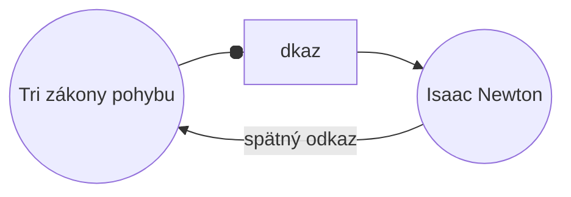

S pluginom [[Vstavané pluginy|Spätné odkazy]] môžete zobraziť všetky _spätné odkazy_ pre aktívnu poznámku.

Spätný odkaz na poznámku je odkaz z inej poznámky na danú poznámku. V nasledujúcom príklade poznámka „Tri zákony pohybu" obsahuje odkaz na poznámku „Isaac Newton". Zodpovedajúci spätný odkaz by odkazoval z „Isaac Newton" späť na „Tri zákony pohybu".

Spätné odkazy môžu byť užitočné na nájdenie poznámok, ktoré odkazujú na poznámku, ktorú práve píšete. Len si predstavte, že by ste mohli zobraziť zoznam spätných odkazov pre akúkoľvek webovú stránku na internete.

## Zobraziť spätné odkazy

Plugin Spätné odkazy zobrazuje spätné odkazy pre aktívne karty. Obsahuje dve zbaliteľné sekcie: **Prepojené zmienky** a **Neprepojené zmienky**.

- **Prepojené zmienky** sú spätné odkazy na poznámky, ktoré obsahujú interný odkaz na aktívnu poznámku.
- **Neprepojené zmienky** sú spätné odkazy na akýkoľvek neprepojený výskyt názvu aktívnej poznámky.

Poskytuje nasledujúce možnosti:

- **Zbaliť výsledky** prepína, či sa má rozbaliť každá poznámka a zobraziť zmienky v nej.
- **Zobraziť viac súvislostí** prepína, či sa má skrátiť alebo zobraziť celý odsek obsahujúci zmienku.
- **Zmena zoradenia** určuje, ako sa majú zmienky zoradiť.
- **Zobraziť filter hľadania** prepína textové pole, ktoré umožňuje filtrovať zmienky. Ďalšie informácie o tom, ako vytvoriť vyhľadávací výraz, nájdete v časti [[Hľadať]].

## Zobrazenie spätných odkazov pre poznámku

Ak chcete zobraziť spätné odkazy pre aktívnu poznámku, kliknite na kartu **Spätné odkazy** ![[obsidian-icon-links-coming-in.svg#icon]] v pravom bočnom paneli.

> [!note] Poznámka
> Ak nevidíte kartu Spätné odkazy, môžete ju zviditeľniť otvorením [[Paleta príkazov|palety príkazov]] a spustením príkazu **Spätné odkazy: Zobraziť spätné odkazy**.

> [!info] Vylúčené súbory
> Súbory zodpovedajúce vašim vzorcom [[Nastavenia#Vylúčené súbory|Vylúčené súbory]] sa nezobrazia v Neprepojených zmienkach.

## Zobrazenie spätných odkazov konkrétnej poznámky

Karta spätných odkazov zobrazuje spätné odkazy pre aktívnu poznámku a aktualizuje sa, keď prepnete na inú poznámku. Ak chcete zobraziť spätné odkazy pre konkrétnu poznámku bez ohľadu na to, či je aktívna alebo nie, môžete otvoriť _prepojenú_ kartu spätných odkazov.

Ak chcete otvoriť prepojenú kartu spätných odkazov:

1. Otvorte [[Paleta príkazov|paletu príkazov]].
2. Vyberte **Spätné odkazy: Otvoriť spätné odkazy v aktuálnom súbore**.

Vedľa aktívnej poznámky sa otvorí samostatná karta. Karta zobrazuje ikonu odkazu, aby ste vedeli, že je prepojená s poznámkou.

## Zobrazenie spätných odkazov v poznámke

Namiesto zobrazovania spätných odkazov na samostatnej karte môžete zobraziť spätné odkazy v spodnej časti poznámky.

Ak chcete zobraziť spätné odkazy v poznámke:

1. Otvorte [[Paleta príkazov|paletu príkazov]].
2. Vyberte **Spätné odkazy: Zapnúť/vypnúť spätné odkazy v dokumente**.

Prípadne aktivujte **Spätné odkazy v dokumente** v možnostiach pluginu Spätné odkazy, aby sa spätné odkazy automaticky prepínali pri otvorení novej poznámky.
