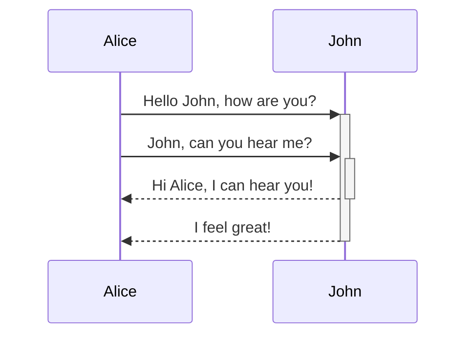
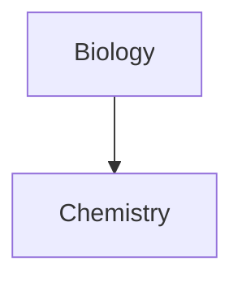

Naučte sa, ako pridať rozšírenú syntax formátovania do vašich poznámok.

## Tabuľky

Tabuľky môžete vytvárať pomocou zvislých čiar (`|`) na oddelenie stĺpcov a pomlčiek (`-`) na definovanie hlavičiek. Tu je príklad:

```md
| Meno  | Priezvisko |
| ----- | ---------- |
| Max   | Planck     |
| Marie | Curie      |
```

| Meno  | Priezvisko |
| ----- | ---------- |
| Max   | Planck     |
| Marie | Curie      |

Hoci zvislé čiary na oboch stranách tabuľky sú voliteľné, ich zahrnutie sa odporúča pre lepšiu čitateľnosť.

> [!tip] V _živom náhľade_ môžete kliknúť pravým tlačidlom myši na tabuľku a pridať alebo odstrániť stĺpce a riadky. Pomocou kontextového menu ich môžete tiež zoradiť a presúvať.

Tabuľku môžete vložiť pomocou príkazu **Vložiť tabuľku** z [[Paleta príkazov|Palety príkazov]] alebo kliknutím pravým tlačidlom myši a výberom _Vložiť → Tabuľka_. Tým získate základnú upraviteľnú tabuľku:

```md
|     |     |
| --- | --- |
|     |     |
```

Upozorňujeme, že bunky nemusia byť dokonale zarovnané, ale riadok hlavičky musí obsahovať aspoň dve pomlčky:

```md
Meno | Priezvisko
-- | --
Max | Planck
Marie | Curie
```


### Formátovanie obsahu v tabuľke

Na štýlovanie obsahu v tabuľke môžete použiť [[Základná syntax formátovania|základnú syntax formátovania]].

| Prvý stĺpec           | Druhý stĺpec                                    |
| ---------------------- | ------------------------------------------------ |
| [[Interné odkazy]]     | Odkaz na súbor _v rámci_ vášho **trezora**.      |
| [[Vkladanie súborov]]  | ![[Engelbart.jpg\|100]]                          |

> [!note] Zvislé čiary v tabuľkách
> Ak chcete použiť [[Aliasy|aliasy]] alebo [[Základná syntax formátovania#Externé obrázky|zmeniť veľkosť obrázka]] vo vašej tabuľke, musíte pred zvislú čiaru pridať `\`.
>
> ```md
> Prvý stĺpec | Druhý stĺpec
> -- | --
> [[Základná syntax formátovania\|Markdown syntax]] | ![[Engelbart.jpg\|200]]
> ```
>
> Prvý stĺpec | Druhý stĺpec
> -- | --
> [[Základná syntax formátovania\|Markdown syntax]] | ![[Engelbart.jpg\|200]]

Text v stĺpcoch zarovnáte pridaním dvojbodiek (`:`) do riadka hlavičky. Obsah môžete tiež zarovnať v _živom náhľade_ pomocou kontextového menu.

```md
Text zarovnaný vľavo | Text zarovnaný na stred | Text zarovnaný vpravo
:-- | :--: | --:
Obsah | Obsah | Obsah
```

Text zarovnaný vľavo | Text zarovnaný na stred | Text zarovnaný vpravo
:-- | :--: | --:
Obsah | Obsah | Obsah

## Diagramy

Do svojich poznámok môžete pridávať diagramy a grafy pomocou [Mermaid](https://mermaid-js.github.io/). Mermaid podporuje rôzne typy diagramov, ako napríklad [vývojové diagramy](https://mermaid.js.org/syntax/flowchart.html), [sekvenčné diagramy](https://mermaid.js.org/syntax/sequenceDiagram.html) a [časové osi](https://mermaid.js.org/syntax/timeline.html).

> [!tip] Tip
> Môžete tiež vyskúšať [živý editor](https://mermaid-js.github.io/mermaid-live-editor) Mermaid, ktorý vám pomôže vytvoriť diagramy predtým, než ich zahrniete do svojich poznámok.

Na pridanie diagramu Mermaid vytvorte `mermaid` [[Základná syntax formátovania#Bloky kódu|blok kódu]].

````md

````


````md

````


### Prepájanie súborov v diagrame

V diagramoch môžete vytvárať [[Interné odkazy|interné odkazy]] pripojením [triedy](https://mermaid.js.org/syntax/flowchart.html#classes) `internal-link` k vašim uzlom.

````md

````


> [!note] Poznámka
> Interné odkazy z diagramov sa nezobrazujú v [[Graf|zobrazení grafu]].

Ak máte v diagramoch veľa uzlov, môžete použiť nasledujúci úryvok.

````md

````

Týmto spôsobom sa každý písmenový uzol stane interným odkazom, pričom [text uzla](https://mermaid.js.org/syntax/flowchart.html#a-node-with-text) slúži ako text odkazu.

> [!note] Poznámka
> Ak v názvoch poznámok používate špeciálne znaky, musíte názov poznámky vložiť do dvojitých úvodzoviek.
>
> ```
> class "⨳ special character" internal-link
> ```
>
> Alebo `A["⨳ special character"]`.

Ďalšie informácie o vytváraní diagramov nájdete v [oficiálnej dokumentácii Mermaid](https://mermaid.js.org/intro/).

## Matematika

Do svojich poznámok môžete pridávať matematické výrazy pomocou [MathJax](http://docs.mathjax.org/en/latest/basic/mathjax.html) a notácie LaTeX.

Na pridanie výrazu MathJax do poznámky ho obklopte dvojitými znakmi dolára (`$$`).

```md
$$
\begin{vmatrix}a & b\\
c & d
\end{vmatrix}=ad-bc
$$
```

$$
\begin{vmatrix}a & b\\
c & d
\end{vmatrix}=ad-bc
$$

Matematické výrazy môžete tiež vkladať priamo do textu obalením symbolmi `$`.

```md
Toto je inline matematický výraz $e^{2i\pi} = 1$.
```

Toto je inline matematický výraz $e^{2i\pi} = 1$.

Ďalšie informácie o syntaxi nájdete v [základnom tutoriáli a rýchlej referencii MathJax](https://math.meta.stackexchange.com/questions/5020/mathjax-basic-tutorial-and-quick-reference).

Zoznam podporovaných balíkov MathJax nájdete v [zozname rozšírení TeX/LaTeX](http://docs.mathjax.org/en/latest/input/tex/extensions/index.html).
